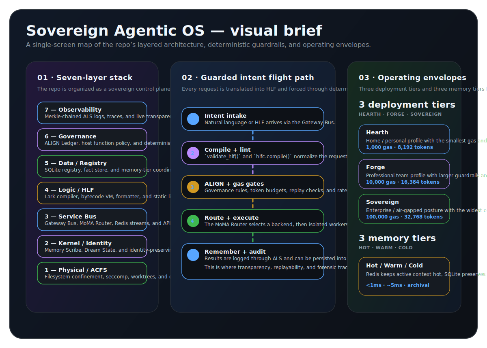
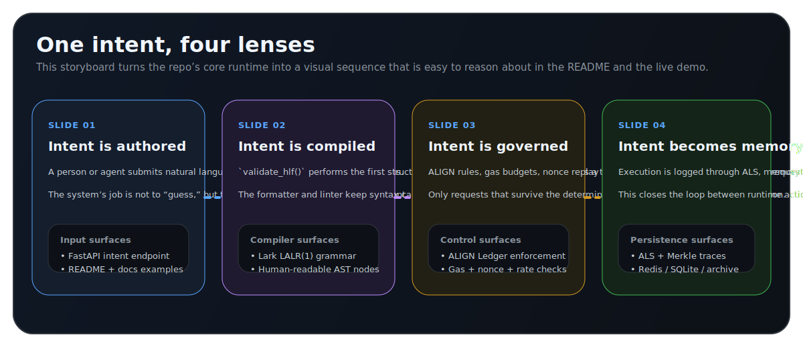
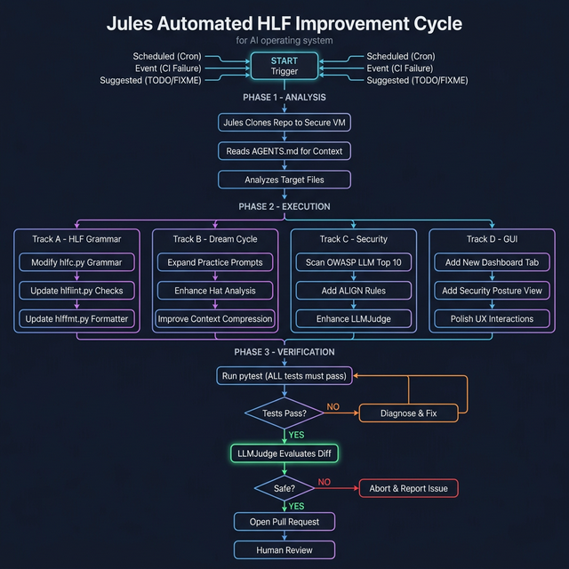
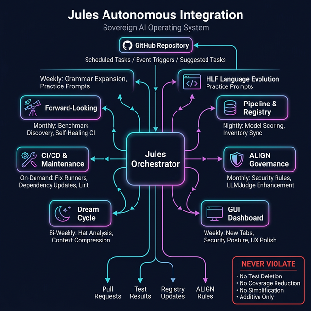
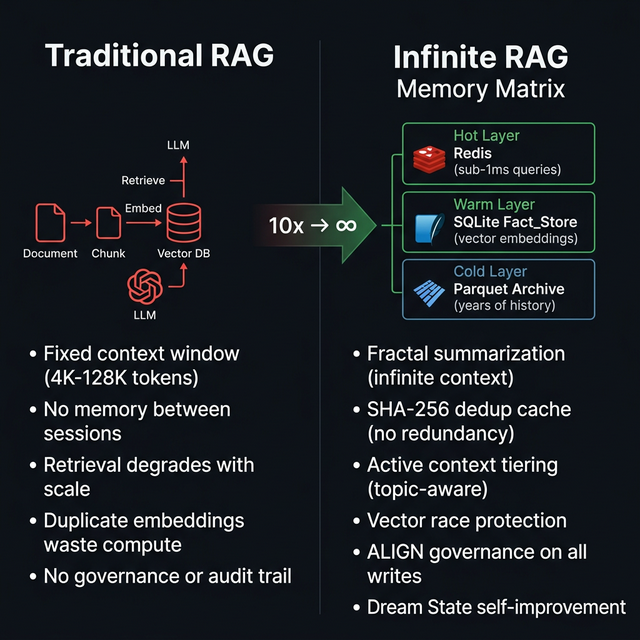
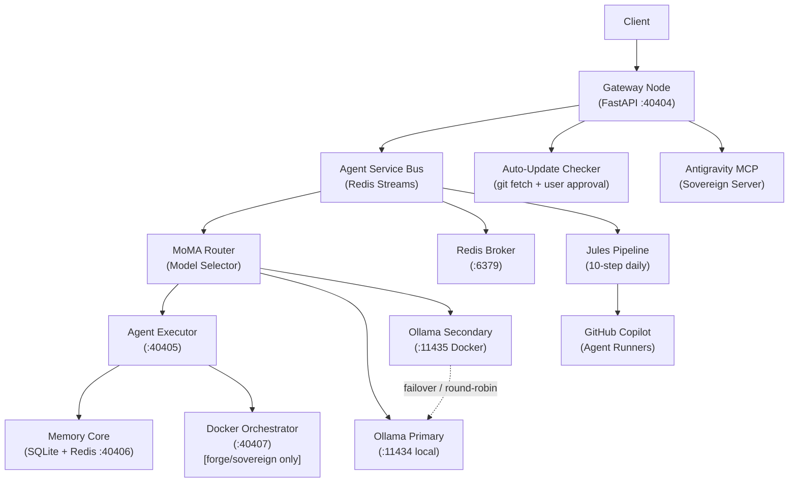

# Sovereign Agentic OS with HLF

> 🟢 **Development Status — Updated Mar 10, 2026**
> Full Antigravity, Jules, and GitHub Copilot integration. HLF v0.4 Bytecode VM + Instinct spec-driven execution operational.
>
>### Why Sovereign OS with HLF Exists

Sovereign OS with HLF exists to make AI capability more useful, portable, and widely accessible — not just for frontier systems, but for the **entire model spectrum**. HLF is the shared operating language that reduces ambiguity, compresses coordination overhead, and lets tools, agents, local models, and cloud models work through the same governed interface. The point is bigger than quota savings: HLF is a **capability amplifier**. It is designed to help ordinary users do more, help local and mid-tier models perform above their raw baseline, and reduce dependence on frontier-only access by turning structure, routing, and governed tool use into multiplicative leverage. If this system succeeds, it will not just make the best models slightly better — it will make the whole ecosystem more powerful and more usable.
>
> **✅ Working**: 14-Hat Aegis-Nexus Engine (19 named cloud agents), HLF v0.4 Bytecode VM (compiler + stack-machine + disassembler), **Instinct Living Spec Opcodes** (SPEC_DEFINE/GATE/UPDATE/SEAL — deterministic spec lifecycle), **SDD Lifecycle Enforcement** (Specify→Plan→Execute→Verify→Merge with CoVE gating), **ACFS Worktree Isolation** (parallel agent execution via Git worktrees), Gateway Bus + ALIGN, Dream Mode (23/23), C-SOC GUI (dark mode), Ollama Matrix, **2,046+ passing tests**, Jules 10-step daily pipeline with anti-reductionist mandate, MCP Server auto-launch, **Infinite RAG Memory Matrix** (SQLite WAL + MCP bridge + Dream State + bytecode-level RAG opcodes), **[Project Janus](https://github.com/Grumpified-OGGVCT/Project_Janus)** (sovereign archival intelligence — 4-model Infinite RAG pipeline, full-site Markdown cloner, LanceDB knowledge graph, Code-Awareness Service, Ollama-native MCP tool loop), HLF metrics & benchmark infrastructure, OpenClaw orchestration plugin (PR pending), **Tool Ecosystem Pipeline** (`hlf install/uninstall/upgrade/health/audit` — 12-point CoVE verification gate, zero-trust sandboxing, lazy-load dispatch, lockfile reproducibility, gas & staleness monitoring), **Agent Orchestration Layer** (PlanExecutor → SpindleDAG → CodeAgent/BuildAgent pipeline), **SpindleDAG Saga Executor** (task DAG with compensating transactions + critical path analysis), **Z3 Formal Verifier** (HLF constraint and invariant prover with pure-Python fallback), **EGL Monitor** (Evolutionary Generality Loss tracking — diversity scores, specialization index, MAP-Elites quality-diversity grid), **MAESTRO Intent Classifier** (P5 SAFE architecture: rule-based fast path + LLM deep classification → IntentCapsule tier mapping), **Credential Vault** (encrypted API key storage + provider auto-discovery via OS keyring / AES-GCM fallback), **HLF Package Manager** (`hlfpm` — OCI-based module install/update/freeze/search), **HLF Language Server** (`hlflsp` — LSP 3.17 for IDE diagnostics, completions, hover, go-to-definition), **HLF Shell** (`hlfsh` — interactive REPL with history, multi-line editing, Merkle-chained session log), **HLF Test Runner** (`hlftest` — HLF-native spec + assertion framework with CoVE validation), **ZAI Provider Integration** (GLM-5, GLM-4.6V, CogView-4, GLM-OCR — full OpenAI-SDK-compatible routing), **Aegis Daemons operational** (Sentinel HIGH-severity checks, Scribe token auditor, Arbiter decision adjudicator — all wired via DaemonBridge), **Tool Registry HITL** (ToolLifecycleState enum: pending_hitl→active→deprecated; sequential step-ID workflow ledger; approve/reject/pending gates), **Context Tiering** (hot Redis ↔ warm SQLite vector cluster transfer), **Fractal Summarization** (standalone map-reduce compression module), **InsAIts V2** (every AST node carries `human_readable` transparency field), **Gardiner Taxonomy** (hieroglyphic symbol→semantic mapping for cross-model alignment).
> **🛠️ In Progress**: Vector embeddings (sqlite-vec C-extension), SHA-256 embedding dedup cache, GUI Cognitive SOC real-time panels, HLF Tool Forge host functions.
> **⏸️ Paused**: Pure cloud-only orchestrations.
> **🔄 Planned**: [Unified Ecosystem Integration](docs/UNIFIED_ECOSYSTEM_ROADMAP.md) — LOLLMS, MSTY Studio, AnythingLLM, and user repos as HLF host functions via `CALL_HOST` opcode through the 6-gate pipeline.
>
> 🌐 **[Live Demo →](https://grumpified-oggvct.github.io/Sovereign_Agentic_OS_with_HLF/)** | 📊 **[HLF Progress Report →](docs/HLF_PROGRESS.md)** | 📓 **[NotebookLM Research Notebook →](https://notebooklm.google.com/notebook/13b9e9f1-77aa-4eba-8760-e38dbdc98bdc)**


A **Spec-Driven Development (SDD)** project for a Sovereign Agentic OS with a custom DSL called **HLF (Hieroglyphic Logic Framework)**. This framework forms a zero-trust, completely isolated orchestration environment designed for robust multi-agent execution at scale.

---

## 🧭 Visual Field Guide

<p align="center">
  
</p>

<p align="center">
  
</p>

These new graphics are designed to give a fast but accurate orientation before you dive into the deeper sections below:

- **System lens** — the full stack from ACFS confinement up to observability and transparency.
- **Execution lens** — how one intent moves through compilation, governance, execution, and memory.
- **Operator lens** — the three deployment tiers and three memory tiers that define the runtime envelope.

### Existing repo media, now folded into the visual story

This refresh also leans on the repository’s existing architecture media so the README stays consistent with the diagrams already maintained in `docs/`. The most useful legacy pieces were the broad stack maps, the router/governance flows, and the memory comparison graphic:

| System architecture | Router flow | Jules governance |
|---|---|---|
| [](docs/system_architecture.png) | [](docs/registry_router_flow.png) | [](docs/jules_governance_pipeline.png) |

| Jules flow | Jules architecture | Infinite RAG comparison |\r\n|---|---|---|\r\n| [](docs/jules_flow.png) | [](docs/jules_architecture.png) | [](docs/infinite_rag_comparison.png) |

<sub>Click any panel above to open the original in-repo file.</sub>

---

## ⚠️ Why You Should NEVER Run AI Agents Naked on Your System

> **Every AI coding agent running today — Copilot, Claude Code, Cursor, Aider, Jules, Antigravity — operates with essentially unlimited access to your filesystem, network, and shell.** There is no sandbox. No audit trail. No kill switch. You are one hallucinated `rm -rf /` away from total system destruction.

### The Problem: Agents Are Powerful. And Uncontrolled.

Modern AI agents can write code, execute shell commands, read your files, make HTTP requests, and spawn processes. Most frameworks give them **full host access** with nothing but a "are you sure?" prompt between the AI and your production database. That's not engineering — that's hope-based security.

**Real attack vectors that exist today:**

| Attack | What Happens | Naked Agent | Sovereign OS |
|--------|-------------|-------------|--------------|
| **Prompt Injection** | Malicious instructions hidden in data | Agent executes blindly | ALIGN Ledger regex blocks + `403 Forbidden` |
| **Infinite Loop / DDoS** | Agent burns your API budget in minutes | No limit, runs forever | Gas Budget (`⩕`) + Redis token bucket = hard stop |
| **Privilege Escalation** | Agent accesses `/etc/shadow` or `docker.sock` | Full host access | Seccomp deny-list + ACFS confinement + air-gap |
| **Supply Chain Poisoning** | Compromised package installed silently | `pip install` runs freely | SHA-256 content pinning + SLSA-3 provenance |
| **Replay Attack** | Old command re-executed maliciously | No deduplication | ULID nonce protection with 600s TTL |
| **Silent Data Exfiltration** | Agent sends your code to external servers | Unrestricted network | Air-Gapped Egress Proxy — agents have **zero** outbound internet |
| **Memory Poisoning** | Corrupted context influences future decisions | No memory governance | Vector Race Protection + Merkle-chained audit trail |
| **Runaway Spending** | Cloud API calls spiral out of control | No cost tracking | Per-tier gas buckets replenished nightly via cron |

### The Solution: A 6-Gate Security Pipeline

Every intent — whether from a human, an agent, or another AI — passes through **6 deterministic validation gates** before it can execute anything:

```
┌─────────────────────────────────────────────────────────────────┐
│  Gate 1: validate_hlf()     → Regex structural validation       │
│  Gate 2: hlfc.compile()     → LALR(1) parse + type checking     │
│  Gate 3: hlflint.lint()     → Token budget + gas + unused vars  │
│  Gate 4: ALIGN Enforcement  → Immutable regex block rules       │
│  Gate 5: Gas Budget         → Per-intent + global tier bucket   │
│  Gate 6: Nonce Check        → ULID replay protection via Redis  │
└─────────────────────────────────────────────────────────────────┘
         ↓ PASSES ALL 6        ↓ FAILS ANY GATE
    Execute via Dapr mTLS      HTTP 403/409/422/429 + ALS log
```

> **Traditional agent frameworks skip Gates 1–3 entirely** and require custom middleware for Gates 4–6. The Sovereign OS enforces all six by default, for every agent, every time.

### What You Get

| Capability | Naked Agent | Sovereign OS |
|-----------|-------------|--------------|
| Filesystem access | Unrestricted | ACFS + `chmod 555` governance = read-only by default |
| Network access | Full internet | Air-gapped proxy, allowlist-only outbound |
| Shell execution | Direct `os.system()` | AST validation → `ast_validator.py` blocks injection |
| Audit trail | Maybe some logs | Merkle-chained, SHA-256 hashed, non-repudiable ALS |
| Cost control | None | Gas metering per-intent + global per-tier bucket |
| Agent identity | Anonymous | KYA (Know Your Agent) with SPIFFE/x509 certs |
| Multi-agent coordination | Ad-hoc | Dapr pub/sub + Redis streams + DAG chronology |
| Memory governance | Context window only | 3-tier Infinite RAG (hot/warm/cold) with forgetting curves |
| Self-improvement | None | Nightly Dream State + DSPy regression testing |
| Kill switch | Close the terminal | Dead Man's Switch: auto-severs network after 3 panics in 5 min |

### The Bottom Line

> **If your AI agent can `rm -rf /` your system and the only thing stopping it is the model's alignment training, you don't have security — you have a prayer.**
>
> The Sovereign OS wraps every agent in 7 architectural layers of mathematically verifiable, cryptographically auditable, zero-trust isolation. Your agents become more powerful precisely *because* they're constrained.

---

## 🏗️ Architecture


*Detailed architectural breakdown of the ACFS and component topology. See the blueprints section below for comprehensive PDF specs.*



## 📖 The Origin Story & Architecture Credits

*Off the record, this architecture was born from sheer frustration and terminal quota exhaustion.*

The Sovereign OS began as a simple question asked when cloud API tokens ran dry: *"Why not create a compressed language exclusively for AI-to-AI communication to save tokens?"* Those scattered notes morphed into the foundational "God View" stack via intensive prompting sessions spanning days.

**Forging the Manifest (The Plan from the Plans):**
After the initial NotebookLM brainstorming exhausted context windows, the raw concepts were dumped into a monolithic baseline plan. We subjected the entire architecture to a **De Bono 14-Hat Agentic Matrix** — the original 6 perspective hats (Red, Black, White, Yellow, Green, Blue) plus 8 Sovereign OS-specific extended hats (Indigo, Cyan, Purple, Orange, Silver, Azure/Steward, Gold/CoVE, and Weaver) — to forge the ironclad, verified system you see here. The March 2026 upgrade introduced the Azure Hat (Steward) for MCP workflow integrity, Gold Hat (CoVE) as terminal validation authority, and the Weaver as the recursive self-improvement meta-agent.

**Architectural Credits & Gratitude:**
- **My Wife:** For her constant, patient support and giving me the massive amounts of unmanaged time required to architect this.
- **Google NotebookLM & Gemini Pro:** For serving as the chaotic sounding board and vital structural refiner.
- **Google Antigravity:** For deep agentic coding and autonomous workflow orchestration.
- **Google Jules:** For autonomous CI/governance pipeline execution and self-evolving codebase maintenance.
- **GitHub Copilot:** For agent runners, automated code review, and dynamic PR generation.
- **Google Ultimate Plan:** For the compute, storage, and AI resources powering the full sovereign stack.
- **Msty Studio & OpenRouter:** For frontier-tier model access during grueling CoVE verification loops.
- **GitHub:** Where this OS is hosted, versioned, and open-sourced.
- **Ollama Cloud Models:** For making local/cloud-hybrid multi-agent swarms financially feasible.
- **Meeting Assistant & AnythingLLM:** For extracting audio and capturing vital "critic" red-teaming sessions.
- **LOLLMS (ParisNeo):** For constant inspiration and architectural solutions throughout these builds.
- **[Project Janus](https://github.com/Grumpified-OGGVCT/Project_Janus):** Sovereign closed-loop archival intelligence. Crawls, clones, and queries the web with a fully local AI brain — zero external APIs. Features a 4-model Infinite RAG pipeline (embeddinggemma → minimax-m2.5 reranking → gemini-3-flash compression → devstral-2 123B reasoning), full-site Markdown mirror cloner, persistent knowledge graph (LanceDB + Memory-MCP), SQLite vault with ChromaDB vector search, hot/warm/cold memory tiering, and the Code-Awareness Service bridging Janus to the Sovereign OS on port 9345.
- **Hof (from Websim.com):** For being a constant source of wild ideas, support, and an invaluable sounding board.

### Quick Start Example (v0.4.0)

*   **Logic Isolation**:
    ```bash
    bash bootstrap_all_in_one.sh
    ```

## 🚀 Quick Start

```bash
cp .env.example .env
bash bootstrap_all_in_one.sh
```

## 🛡️ Deployment Tiers

The OS adapts configuration, networking privileges, and security boundaries based on the deployment tier:

| Tier | Docker Profile | Gas Bucket | Context Tokens | Description |
| ---- | -------------- | ---------- | -------------- | ----------- |
| `hearth` | (default) | 1,000 | 8,192 | Home / personal use |
| `forge` | forge | 10,000 | 16,384 | Professional / team use |
| `sovereign` | sovereign | 100,000 | 32,768 | Enterprise / air-gapped |

> **Note**: Set `DEPLOYMENT_TIER` in your `.env` file prior to bootstrap to engage these boundaries.

## 📜 HLF (Hieroglyphic Logic Framework): The Rosetta Stone for Machines

**HLF** is not just another DSL; it is a **deterministic orchestration protocol** designed to eliminate natural language ambiguity between agents. By replacing prose with a strictly-typed Hieroglyphic AST, HLF enables zero-trust execution, cryptographic validation, and ultra-dense token efficiency.

### Core Goals
- **Deterministic Intent**: 100% predictable execution paths via LALR(1) parsing.
- **Token Compression**: Measured **12–30% compression** per intent (tiktoken cl100k_base); up to **83% vs verbose JSON payloads**. In a 5-agent swarm, savings multiply — 83 tokens saved per broadcast × 5 agents = **415 tokens per cycle**.
- **Cross-Model Alignment**: The MoMA Router auto-selects from the **model matrix** per deployment tier — ensuring any allowed model can communicate via typed HLF intents.
- **Cryptographic Governance**: Every intent is mathematically verifiable against the **ALIGN Ledger**.

### 💎 High-Impact Examples

#### 1. Security Baseline Audit (Sentinel Mode)

### Tool Orchestration

The agent audits a critical system file while enforcing strict RO (Read-Only) constraints.
```hlf
[HLF-v3]
Δ analyze /security/seccomp.json 
 Ж [CONSTRAINT] mode="ro" 
Ж [EXPECT] vulnerability_shorthand 
⨝ [VOTE] consensus="strict"
Ω
```

#### 2. Multi-Agent Task Delegation (Orchestrator Mode)
The primary agent delegates a long-running summarization task to a specialized Scribe agent.
```hlf
[HLF-v3]
⌘ [DELEGATE] agent="scribe" goal="fractal_summarize"
 ∇ [SOURCE] /data/raw_logs/matrix_sync_2026.txt
 ⩕ [PRIORITY] level="high"
Ж [ASSERT] vram_limit="8GB"
Ω
```

#### 3. Real-Time Resource Mediation (MoMA Router)
The router dynamically selects from the tier's model matrix based on VRAM, task complexity, and cost.
```hlf
[HLF-v3]
⌘ [ROUTE] strategy="auto" tier="$DEPLOYMENT_TIER"
 ∇ [PARAM] temperature=0.0
Ж [VOTE] confirmation="required"
Ω
```

### 📏 HLF Metrics & Benchmarking

The project includes automated metrics and benchmark scripts that measure real compression ratios:

```bash
# Generate codebase metrics → docs/metrics.json
uv run python scripts/hlf_metrics.py --output docs/metrics.json

# Run real tiktoken compression benchmark → docs/benchmark.json
uv run python scripts/hlf_benchmark.py --output docs/benchmark.json
```

**Current Benchmark Results** (tiktoken cl100k_base, 6 test fixtures):

| Domain | NLP Tokens | HLF Tokens | Compression |
|--------|-----------|-----------|-------------|
| Security Audit | 105 | 78 | **25.7%** |
| Hello World | 71 | 50 | **29.6%** |
| DB Migration | 139 | 122 | **12.2%** |
| Content Delegation | 115 | 101 | **12.2%** |
| Log Analysis | 129 | 120 | **7.0%** |
| Stack Deployment | 104 | 109 | **-4.8%** |
| **Overall** | **663** | **580** | **12.5%** |

> **Note**: Compression increases dramatically with payload complexity and in swarm scenarios. Simple structural tasks like deploy_stack show near parity because HLF's typed tags add overhead that matches NLP verbosity for short payloads.

---

## 🛠️ Extended HLF Toolchain

The HLF toolchain has grown to a full developer platform. All tools are CLI-executable and importable as Python APIs.

| Tool | CLI | Description |
|------|-----|-------------|
| **Compiler** | `uv run hlfc` | LALR(1) parser → JSON AST → `.hlb` bytecode |
| **Formatter** | `uv run hlffmt` | Canonical formatting: uppercase tags, trailing `Ω`, no whitespace drift |
| **Linter** | `uv run hlflint` | Token budget, gas limits, unused variables, recursion depth |
| **Runtime** | `uv run hlfrun` | Stack-machine bytecode interpreter, 34+ opcodes |
| **Shell** | `uv run hlfsh` | Interactive REPL with history, multi-line editing, Merkle-chained session log |
| **Test Runner** | `uv run hlftest` | HLF-native spec + assertion framework with CoVE validation gate |
| **Package Manager** | `uv run hlfpm` | OCI-based module install, update, freeze, search (`hlfpm install math@v1.0.0`) |
| **Language Server** | `uv run hlflsp` | LSP 3.17 for VS Code / Neovim — diagnostics, completion, hover, go-to-definition |
| **Token Linter** | `python scripts/hlf_token_lint.py` | CI guard: fails if any intent exceeds 30 tokens |

### HLF Shell (`hlfsh`) — Interactive REPL

```bash
uv run hlfsh
# hlf> [INTENT] analyze /security/seccomp.json
# hlf> [CONSTRAINT] mode="ro"
# hlf> Ω
# { "status": "compiled", "nodes": 3, "gas": 2 }
```

### HLF Package Manager (`hlfpm`) — OCI Module Registry

```bash
# Install a versioned module
uv run hlfpm install math@v1.0.0

# List installed modules
uv run hlfpm list

# Freeze lockfile for reproducible builds
uv run hlfpm freeze
```

### HLF Language Server (`hlflsp`) — IDE Support

The LSP server provides real-time `.hlf` IDE support. Requires the **HLF VS Code extension** (or any LSP-capable editor). Add to VS Code `settings.json`:

```json
{
  "hlf.lsp.serverCommand": ["uv", "run", "hlflsp"],
  "hlf.lsp.serverArgs": []
}
```

Capabilities: live syntax diagnostics, tag auto-completion, host function signatures on hover, IMPORT target navigation, and SET/FUNCTION symbol outline.

---

The Sovereign OS uses a **3-tier memory architecture** that eliminates the context window ceiling found in traditional RAG:

| Tier | Storage | Speed | Purpose |
|------|---------|-------|---------|
| **Hot** | Redis | <1ms | Active context, topic-focused sub-graphs |
| **Warm** | SQLite `fact_store` | ~5ms | Persistent vector embeddings, semantic facts |
| **Cold** | Parquet Archive | ~50ms | Years of compressed history, audit trail |

### Key Innovations

- **Fractal Summarization**: When context approaches the token limit, the summarization model runs map-reduce compression, distilling to 1,500 tokens before injection.
- **SHA-256 Embedding Cache**: Deduplicates vector embeddings before they hit the ML model, saving compute.
- **Active Context Tiering**: When an agent focuses on a topic, relevant cold vectors are pre-loaded into Redis for sub-millisecond retrieval.
- **Vector Race Protection**: Cosine similarity check (>0.98 threshold) prevents duplicate INSERTs from parallel agents.
- **Dream State Self-Improvement**: Nightly cron compresses the day's `Rolling_Context` into synthesized rules, tested via DSPy regression before merging.
- **RAG Forgetting**: 30-day decay curves prune low-relevance embeddings to cold storage.

### 🔗 The HLF + Infinite RAG Synergy

HLF and the Infinite RAG are designed to amplify each other:

| Without HLF | With HLF |
|-------------|----------|
| RAG ingests verbose NLP → bloated fact_store | RAG ingests **compressed HLF ASTs** → smaller, denser embeddings |
| Context window fills quickly → frequent summarization | HLF intents are **12–30% smaller** → more facts fit per prompt |
| Cross-agent RAG shares prose → ambiguous retrieval | Agents share **typed, deterministic HLF** → exact semantic matching |
| Dream State compresses NLP rules → lossy | Dream State compresses **HLF rules → lossless** (AST round-trips) |
| No governance on memory writes | Every RAG write passes through **ALIGN Ledger validation** via HLF |

**The compound effect**: HLF's token compression means the Infinite RAG can store **more knowledge per byte**, retrieve it **faster** (smaller vectors = faster cosine search), and share it **more precisely** across the swarm.

### Wiring Status

- ✅ SQLite WAL Mode — Active in all services
- ✅ MCP RAG Bridge — `query_memory()` tool wired and operational
- ✅ Dream State — Context compression every 03:00
- ✅ DB Schema — `fact_store` + `rolling_context` + `identity_core` tables
- ✅ Context Tiering — `context_tiering.py` hot/warm vector cluster transfer operational
- ✅ Fractal Summarization — `fractal_summarization.py` map-reduce compression operational
- 🔨 Vector Embeddings — `sqlite-vec` C-extension installation needed
- 🔨 SHA-256 Dedup Cache — designed, implementation pending

> 🌐 See the **[Infinite RAG explainer popup](https://grumpified-oggvct.github.io/Sovereign_Agentic_OS_with_HLF/)** on the live demo page for interactive comparison with traditional RAG.

---

## 🌟 The Sovereign Advantage: Why it Matters

The Sovereign Agentic OS represents a paradigm shift in AI autonomy:
- **14-Hat Aegis-Nexus Engine**: Our 14-hat autonomous audit cycle (19 named cloud agents across Architecture, Language, Security, Backend, Data, UX, and Meta layers) ensures your agents never hallucinate into privilege escalation or memory leaks. Key agents include Sentinel (defense-in-depth), Scribe (token auditor), Arbiter (decision adjudicator), Steward (MCP integrity), CoVE (terminal validation), and Weaver (recursive self-improvement).
- **HLF v0.4 Bytecode VM**: A complete compiler → bytecode → stack-machine execution pipeline. HLF programs compile to binary `.hlb` format with SHA-256 checksums, gas metering, and a full disassembler for debugging. Supports 34+ opcodes including PUSH, STORE, LOAD, CALL_HOST, CALL_TOOL, MEMORY_STORE/RECALL, OPENCLAW_TOOL, and the **Instinct Living Spec suite** (SPEC_DEFINE, SPEC_GATE, SPEC_UPDATE, SPEC_SEAL).
- **Instinct SDD Lifecycle**: Every crew mission enforces the deterministic **Specify → Plan → Execute → Verify → Merge** lifecycle. Phase skips and backward transitions are blocked unless explicitly overridden. CoVE adversarially gates the Verify→Merge transition — if verification fails, the mission halts before any changes are merged.
- **ACFS Worktree Isolation**: Agents execute in physically isolated Git worktrees, preventing file conflicts in parallel swarm operations. Shadow commits include ALIGN-Merkle hashes for forensic tracing. Stale worktrees are auto-cleaned after configurable thresholds.
- **MoMA Dynamic Routing**: Intelligent "Downshifting" means you never pay for a Frontier-tier model when a local small-language model (SLM) can do the same task for free.
- **Glass-Box Transparency**: The C-SOC dashboard allows you to see every "thought" and "action" in real-time—no secret LLM decision-making.
- **Anti-Reductionist Mandate**: 9 non-negotiable mandates enforced across all agents — never simplify, never reduce, never delete to make something "work." The correct response to difficulty is understanding, not removal. Formalized in `config/personas/_shared_mandates.md`.
- **Self-Building Architecture**: Agents build the infrastructure for the next agent in a 10-step daily pipeline. The system is designed to self-improve through recursive observation of its own usage patterns.
- **SpindleDAG Saga Executor**: Task DAGs execute with automatic rollback — if any node fails, all completed nodes run their compensation functions in reverse order (Saga pattern). The `SpindleDAGAnalyzer` computes critical paths, parallelism factors, node depths, and decomposition summaries for architecture review. All operations log to the ALIGN Ledger for forensic traceability.
- **Z3 Formal Verifier**: Mathematically proves HLF constraints are satisfiable, SPEC_GATE assertions hold under all inputs, type invariants are consistent, and gas budgets are feasible. Uses Z3 theorem prover when available; falls back to a lightweight pure-Python constraint evaluator.
- **EGL Monitor (Evolutionary Generality Loss)**: Tracks whether the agent swarm is over-specializing over time. Inspired by MAP-Elites quality-diversity algorithms: records behavior × performance across capabilities, computes diversity scores, specialization indices, and generality-loss trend lines. Alerts when capability narrowing exceeds threshold.
- **MAESTRO Intent Classifier**: P5 SAFE architecture Tier 1 classifier. Maps incoming requests to `IntentCapsule` security tiers (QUERY→hearth, CODE_GEN→forge, SYSTEM_ADMIN→sovereign, DELEGATION→forge+, SECURITY_SCAN→sovereign). Uses a two-tier strategy: rule-based fast path first, LLM deep classification for ambiguous requests.
- **Credential Vault**: Encrypted API key storage with OS keyring integration (Windows/macOS/Linux) and AES-GCM JSON fallback. When a key is added, the vault auto-probes the provider, catalogs available models and capabilities, and registers them in the HostFunctionRegistry — making new AI providers instantly available to HLF programs.
- **InsAIts V2 Transparency**: Every AST node compiled by `hlfc` carries a `human_readable` field. Agents, dashboards, and audit logs all read from this field — no opaque machine-code-only execution paths.

## 🔏 Security Features & Governance

### Security & Governance

- **ALIGN Ledger** — Immutable governance rules enforced at runtime.
- **Seccomp Profile** — Custom syscall allowlist for all node containers.
- **ULID Nonce Protection** — 600s TTL replay deduplication.
- **Merkle Chain Logging** — SHA-256 chained trace IDs for comprehensive state audits.
- **Rate limiting** — 50 RPM token bucket via Redis.
- **Gas Budget** — AST node count limits strictly enforced per deployment tier.
- **ACFS Confinement** — Directory permission enforcement at the kernel level.
- **ACFS Worktree Isolation** — Git worktree-based agent sandboxing with Merkle-hashed shadow commits.
- **Living Spec Enforcement** — SPEC_GATE opcodes halt execution on constraint violations, SPEC_SEAL locks specs with SHA-256 checksums.
- **Sentinel Daemon (High-Severity Threat Detection)** — Real-time scans for data exfiltration, config tampering, and SSRF patterns; `clear_alerts()` for post-remediation state reset.
- **Tool Registry HITL Gate** — Forged tools enter `pending_hitl` state; require explicit `approve_forged_tool()` before becoming active. Sequential step-ID workflow ledger prevents out-of-order approvals.
- **Z3 Formal Verification** — HLF constraints and SPEC_GATE assertions are formally proved before execution; unsatisfiable constraints are rejected at parse time.

---

## 🔌 Antigravity MCP Integration

The Sovereign OS is deeply integrated with **Antigravity** (Google DeepMind's agentic IDE assistant) via a custom **Model Context Protocol (MCP)** server.

### Goals & Intentions
- **Glass-Box IDE Control**: Allow an external expert coding agent (Antigravity) to read the internal state, health, and memory of the OS directly from the IDE without breaking security boundaries.
- **Autonomous OS Maintenance**: Empower Antigravity to trigger "Dream Mode" cycles, read 11-Hat analysis findings from 11 named agents, and suggest architectural improvements based on the OS's own self-reflections.
- **Regulated Tool Access**: Expose 8 secure tools (e.g., `check_health`, `dispatch_intent`, `query_memory`, `run_dream_cycle`) that allow the IDE agent to operate the OS like a sysadmin, while remaining fully constrained by the ALIGN governed Gateway Bus.

To start the MCP server, select Option 3 in the `run.bat` boot menu, or use `--auto-launch` in the tray manager. 

---

## 🤖 Automated Runners & Multi-Provider Setup

For deploying the Agent OS autonomously in cloud environments (e.g., GitHub Actions), the OS supports dynamic, multi-provider API injection via Environment Secrets.

### Step-by-Step GitHub Setup for Autonomous Agents

1. **Configure Environment Secrets**:
   In your GitHub repository, navigate to **Settings > Environments > Configure Secrets**. Add your provider keys exactly as follows (see `.github/workflows/autonomous-runner.yml` for usage):
   - `OPENROUTER_API` (Primary fallback for cloud models)
   - `OLLAMA_API_KEY` (Primary Ollama Cloud endpoint)
   - `OLLAMA_API_KEY_SECONDARY` (Secondary Ollama at `:11435` — doubles cloud quota)
   - `DEEPSEEK_API`
   - `GEMINI_API`
   - `GROK_API`
   - `OPENAI_API`
   - `PERPLEXITY_API_KEY`
   - `AGENTSKB_API_KEY`

2. **Automated Runner Execution**:
   When the system is run headlessly via CI/CD, these keys are injected into the Docker/uv environment. The `MoMA Router` (`agents/gateway/router.py`) will automatically select the cheapest, most capable model available across these providers for the delegated task, strictly abiding by the Gas limit of the tier (defaulting to the `forge` or `sovereign` tier in CI).

3. **Current Provider Integration Status**:
   - ✅ **Ollama (Local)**: Fully integrated for zero-cost routing.
   - ✅ **Ollama Cloud / OpenRouter**: Native support via standard OpenAI-compatible endpoints configured in `config/settings.json`.
   - 🚧 **DeepSeek/Gemini/Grok**: Keys are staged, but explicit routing logic inside the MoMA router is actively being refined to support multi-provider fallback chains natively without external proxies.

*See the `Automated_Runner_Setup_Guide.md` in the docs folder for the exhaustive implementation details and custom action configurations.*

---

## 🗄️ Autonomous Model & Agent Registry

The OS includes a **SQL-backed Model & Agent Registry** (`agents/core/db.py`) that replaces keyword-based routing with a data-driven tier-walk algorithm.

### System Architecture


### Registry & Router Flow


### 3-Phase Tier Walk

| Phase | Strategy | Source |
|-------|----------|--------|
| **1. Cloud Walk** | S → A+ → A → A- → B+ descent | `models` table (active snapshot) |
| **2. Local Fallback** | Best available local model | `user_local_inventory` table |
| **3. OpenRouter Handoff** | Cross-provider equivalent | `model_equivalents` table |

### AgentProfile (returned by `route_request()`)

Every routing decision returns a structured `AgentProfile` dataclass containing: the selected model, provider, tier, system prompt, available tools, restrictions, a full routing trace (ALS-auditable), gas remaining, and a confidence score. The legacy `route_intent()` function is preserved for backward compatibility.

### Registry Tables (9 total)

| Table | Purpose |
|-------|---------|
| `snapshots` | Pipeline run metadata & promotion state |
| `models` | Global model catalog (per-snapshot) |
| `model_tiers` | Historical tier changes |
| `user_local_inventory` | Local Ollama models (heartbeat-synced) |
| `local_model_metadata` | Extended local model info (digest, quant) |
| `agent_templates` | Pre-built agent configurations |
| `model_equivalents` | Cross-provider model mappings |
| `policy_bundles` | Governance rule bundles |
| `model_feedback` | Per-interaction quality signals |

---

## 🧠 Agent Layer

The Sovereign OS ships a full agent execution stack beyond the basic PlanExecutor → SpindleDAG → CodeAgent/BuildAgent pipeline.

### Orchestration Agents

| Agent | Module | Role |
|-------|--------|------|
| **MAESTRO Classifier** | `agents/core/maestro.py` | Intent tier classification (P5 SAFE architecture) |
| **Maestro Router** | `agents/core/maestro_router.py` | Maps classified intents to execution profiles |
| **Crew Orchestrator** | `agents/core/crew_orchestrator.py` | Multi-agent crew lifecycle management |
| **Plan Executor** | `agents/core/plan_executor.py` | Sequential/parallel task plan dispatch |
| **SpindleDAG Executor** | `agents/core/spindle.py` | DAG execution with Saga rollback + critical-path analysis |
| **Arbiter Agent** | `agents/core/arbiter_agent.py` | Decision adjudication for conflicting agent outputs |
| **Scheduler** | `agents/core/scheduler.py` | Cron-based and event-driven task scheduling |

### Specialist Agents

| Agent | Module | Role |
|-------|--------|------|
| **Code Agent** | `agents/core/code_agent.py` | Code generation, refactoring, and test synthesis |
| **Build Agent** | `agents/core/build_agent.py` | Build, test, lint pipeline orchestration |
| **Canary Agent** | `agents/core/canary_agent.py` | Canary deployment health monitoring |
| **Scribe Agent** | `agents/core/scribe_agent.py` | Token audit + rolling context management |
| **Sentinel Agent** | `agents/core/sentinel_agent.py` | ALIGN rule enforcement + threat detection |
| **Tool Forge** | `agents/core/tool_forge.py` | Forges new tools on agent failure; HITL lifecycle management |

### Observability Agents

| Agent | Module | Role |
|-------|--------|------|
| **EGL Monitor** | `agents/core/egl_monitor.py` | Evolutionary Generality Loss — MAP-Elites diversity/specialization grid |
| **Formal Verifier** | `agents/core/formal_verifier.py` | Z3/fallback proof of HLF constraints and gas budgets |
| **Outlier Trap** | `agents/core/outlier_trap.py` | Semantic anomaly detection; routes suspicious traces to Sentinel |
| **Memory Anchor** | `agents/core/memory_anchor.py` | Anchors critical memory facts with immutability guarantees |

### Infrastructure Services

| Service | Module | Role |
|---------|--------|------|
| **Credential Vault** | `agents/core/credential_vault.py` | Encrypted API key store; OS keyring + AES-GCM fallback; auto-discovery |
| **Context Tiering** | `agents/core/context_tiering.py` | Hot (Redis) ↔ Warm (SQLite) vector cluster transfer |
| **Context Pruner** | `agents/core/context_pruner.py` | Removes low-relevance embeddings from active context |
| **Fractal Summarization** | `agents/core/fractal_summarization.py` | Map-reduce compression to 1,500-token summaries |
| **Dead Man's Switch** | `agents/core/dead_man_switch.py` | Auto-severs network after 3 panics in 5 min |
| **SPIFFE Identity** | `agents/core/spiffe_identity.py` | KYA (Know Your Agent) with SPIFFE/x509 certificates |
| **Redis Transport** | `agents/core/redis_transport.py` | Typed Redis stream publish/consume abstraction |
| **Model Gateway** | `agents/core/model_gateway.py` | Provider-agnostic LLM dispatch (Ollama, OpenRouter, ZAI) |
| **ZAI Client** | `agents/core/zai_client.py` | OpenAI-SDK-compatible GLM-5, CogView-4, GLM-OCR integration |
| **Discord Client** | `agents/core/discord_client.py` | Discord notification webhooks for agent events |

---

## 🤖 Jules Autonomous Integration

The OS leverages **[Google Jules](https://jules.google)** as an autonomous maintenance and evolution agent. Jules is configured via `AGENTS.md` (in repo root) and the **Master Handoff** ([#67](https://github.com/Grumpified-OGGVCT/Sovereign_Agentic_OS_with_HLF/issues/67)) to understand the full self-building agent architecture before making any changes.

### Governance Pipeline


### 10-Step Daily Sequential Pipeline

All steps execute in strict order. Each agent inherits context from the previous agent's output (defined in `config/jules_tasks.yaml`):

| Step | Agent | What It Touches | Key Invariant |
|------|-------|-----------------|---------|
| 1 | **HLF Grammar Evolver** | `hlfc.py`, `hlflint.py`, `hlffmt.py` | Never remove syntax |
| 2 | **Dream Cycle Enhancer** | `dream_state.py`, `hat_engine.py` | Never simplify cognitive loops |
| 3 | **ALIGN Hardener** | `ALIGN_LEDGER.yaml`, `sentinel_gate.py` | Never weaken governance |
| 4 | **Transparency Assessor** | `gui/app.py`, `logger.py`, `router.py` | Never reduce visibility |
| 5 | **GUI Feature Builder** | `gui/app.py`, `gui/` | Never remove GUI features |
| 6 | **Gemini Model Integrator** | `db.py`, `router.py`, `settings.json` | Proper API key management |
| 7 | **Self-Capability Tracker** | `jules_capabilities.yaml` | Never overstate capabilities |
| 8 | **CI Fixer** | `.github/workflows/`, any failing file | Never delete tests |
| 9 | **HLF Maximizer** | `hlf/`, `tests/`, `docs/` | Test count ≥ baseline |
| 10 | **README Updater** (Capstone) | `README.md`, `docs/` | Reflect ALL daily changes |

### Quality Gates

| Gate | Template | Scope |
|------|----------|-------|
| **CoVE Full** (12-dimension) | `governance/templates/cove_full_validation.md` | Major changes, security PRs |
| **CoVE Compact** (8-step) | `governance/templates/cove_compact_validation.md` | Small changes (< 200 lines) |
| **14-Hat Review** | `governance/templates/eleven_hats_review.md` | Every Jules PR |

### Safety Invariants (Non-Negotiable)

| Invariant | Enforcement |
|-----------|-------------|
| No test deletion | LLMJudge checks diffs for removed test files |
| No coverage reduction | Scheduled `pytest --cov` baseline comparison |
| No simplification | `_shared_mandates.md` — 9 supreme mandates enforced on all agents |
| Additive-only | Global invariant in `jules_tasks.yaml` + every agent prompt |
| No overcommit | Cloud model routing via `agent_registry.json` (19 agent profiles) |
| No file deletion | Anti-reduction checklist enforced on every PR |
| No scope reduction | PR merge requires anti-reduction checklist completion |

---

## 📚 Official Design Documents & Blueprints

Dive deeper into the comprehensive design documentation that informs the OS specifications:

- [Genesis Stack Blueprint](assets/Genesis_Stack_Blueprint.pdf)
- [Sovereign Agentic Stack Architecture](assets/Sovereign_Agentic_Stack.pdf)
- [Ollama Matrix Sync Pipeline](assets/Ollama_Matrix_Sync.pdf)
- 📓 [NotebookLM Research Notebook](https://notebooklm.google.com/notebook/13b9e9f1-77aa-4eba-8760-e38dbdc98bdc) — The genesis knowledge base containing 291 sources, deep research reports, RFC catalog, ground-truth audit corrections, and the HLF vision for human-machine symbolic bilingualism. Central to all architectural planning and public education.

## 💻 Tech Stack

| Component | Technology |
| --------- | ---------- |
| Language | Python 3.12 |
| HLF Version | v0.4.0 (Bytecode VM — compiler + stack-machine + disassembler) |
| API | FastAPI + Uvicorn |
| Message Bus | Redis Streams |
| Storage | SQLite (WAL mode) |
| Registry | `agents/core/db.py` (9-table schema) |
| Containers | Docker Compose |
| Pub/Sub | Dapr |
| Backend | Ollama + OpenRouter + ZAI |
| ML Optimization | DSPy |
| Parser | Lark LALR(1) |
| Bytecode VM | Custom stack-machine with 34+ opcodes, SHA-256 checksums, gas metering |
| Package Manager | uv (Python) + `hlfpm` (HLF modules via OCI) |
| Hat Engine | 14-Hat Aegis-Nexus (19 named cloud agents) |
| Autonomous Agent | Google Jules (10-step daily pipeline + anti-reductionist mandate) |
| Code Agent | GitHub Copilot (agent runners + review) |
| Agentic IDE | Google Antigravity (MCP + workflow) |
| Cloud Platform | Google Ultimate Plan |
| MCP Server | Antigravity + Jules MCP |
| GUI Framework | Streamlit (dark mode default) |
| HLF Language Server | `hlflsp` — LSP 3.17 (diagnostics, completion, hover, go-to-definition) |
| HLF Shell | `hlfsh` — interactive REPL with Merkle-chained session log |
| HLF Test Runner | `hlftest` — HLF-native spec + assertion framework |
| Formal Verifier | Z3 theorem prover (optional) + pure-Python fallback |
| DAG Executor | SpindleDAG — task DAG with Saga compensating transactions |
| Intent Classifier | MAESTRO — P5 SAFE architecture (rule-based + LLM deep classification) |
| Credential Vault | AES-GCM encrypted + OS keyring; provider auto-discovery |
| EGL Monitor | MAP-Elites quality-diversity grid; diversity + specialization metrics |
| Tool Registry | ToolLifecycleState HITL gates + sequential step-ID workflow ledger |
| Context Tiering | Hot (Redis) ↔ Warm (SQLite) vector cluster transfer |
| Fractal Summarization | Standalone map-reduce context compression |
| Installation Tests | 65 deep verification tests |
| Auto-Update | git-based with GUI approval flow |
| HLF Test Fixtures | 7 domain-specific `.hlf` files |
| Total Tests | **2,046+** (pytest collected) |
| Benchmarking | tiktoken cl100k_base compression analysis |
| CI Pipeline | ruff lint + model_policy_lint + HLF token lint + pytest |
| Live Demo | [GitHub Pages](https://grumpified-oggvct.github.io/Sovereign_Agentic_OS_with_HLF/) |

## 🛠️ Local Development

```bash
uv sync 
uv run pytest tests/ -v
uv run hlfc tests/fixtures/hello_world.hlf
uv run hlflint tests/fixtures/hello_world.hlf
```
Short answer: **HLF can become extraordinary, but only if you stop thinking of it as “a clever DSL” and turn it into a *standardized, self-verifying language stack***: one canonical spec, one canonical AST, one canonical bytecode, one capability model, one conformance suite, and many interchangeable surfaces for humans, agents, tools, local models, and cloud models. On the current `main` branch, you already have a serious nucleus for that: the `hlf/` package includes compiler/runtime/bytecode/LSP/package-manager/test/capsule/memory/tooling modules; `governance/` holds grammar/dictionary/host-function/bytecode specs; and `hlf_programs/` is populated with a 6-program gallery plus reports. ([github.com](https://github.com/Grumpified-OGGVCT/Sovereign_Agentic_OS_with_HLF/tree/main/hlf))

The **most important thing** I found on a second pass is this: **your biggest blocker is not power, it is canonicality**. The repo has enough pieces to be great, but the “source of truth” is currently split across code, docs, and progress reports that do not fully agree with each other. Until that is fixed, HLF will feel impressive but not yet *authoritative*. ([raw.githubusercontent.com](https://raw.githubusercontent.com/Grumpified-OGGVCT/Sovereign_Agentic_OS_with_HLF/main/docs/HLF_PROGRESS.md))

## What I would do first

1. **Make HLF a spec-first language, not a repo-first language.**
2. **Separate “core semantics” from “agent platform features.”**
3. **Turn every effect into an explicit typed capability.**
4. **Make auditability and semantic fidelity mandatory gates, not optional nice-to-haves.**
5. **Ship HLF in 5 interchangeable forms:** glyph source, ASCII source, JSON AST, bytecode, English audit.  
6. **Back every claim with generated docs + conformance tests.**

That is the path from “interesting system” to “planet-class language.”

---

## Second-pass reality check: what must be fixed first

- `governance/hls.yaml` still describes **13** statement types, `docs/HLF_GRAMMAR_REFERENCE.md` says **14**, `docs/HLF_REFERENCE.md` says **19**, and the current `_GRAMMAR` in `hlf/hlfc.py` includes **21** top-level line alternatives when you count memory, macro, and Instinct spec statements. That is exactly the kind of drift that kills reproducibility. ([raw.githubusercontent.com](https://raw.githubusercontent.com/Grumpified-OGGVCT/Sovereign_Agentic_OS_with_HLF/main/governance/hls.yaml))

- The bytecode layer has a more serious mismatch: `hlf/bytecode.py` currently assigns opcode `0x65` to `OPENCLAW_TOOL`, while `governance/bytecode_spec.yaml` assigns `0x65`–`0x68` to `SPEC_DEFINE`, `SPEC_GATE`, `SPEC_UPDATE`, and `SPEC_SEAL`. If left unfixed, that means compiled bytecode and the spec can diverge at the VM boundary. ([raw.githubusercontent.com](https://raw.githubusercontent.com/Grumpified-OGGVCT/Sovereign_Agentic_OS_with_HLF/main/hlf/bytecode.py))

- The standard library story is also drifting. `docs/stdlib.md` still describes **5** built-in modules, but the actual `hlf/stdlib/` tree contains **8** files: `agent`, `collections`, `crypto`, `io`, `math`, `net`, `string`, and `system`. ([raw.githubusercontent.com](https://raw.githubusercontent.com/Grumpified-OGGVCT/Sovereign_Agentic_OS_with_HLF/main/docs/stdlib.md))

- The install/runtime story needs consolidation. `README.md`, `docs/getting_started.md`, and `docs/cli-tools.md` advertise `hlfsh`, `hlfpm`, `hlflsp`, `hlftest`, and `hlfrun`, but `pyproject.toml` currently exposes only `hlfc`, `hlffmt`, and `hlflint` under `[project.scripts]`. At the same time, the repo root now clearly uses `pyproject.toml` + `uv.lock`, and there is no `requirements.txt` or `setup.py` on `main`. ([raw.githubusercontent.com](https://raw.githubusercontent.com/Grumpified-OGGVCT/Sovereign_Agentic_OS_with_HLF/main/docs/getting_started.md))

- Metrics and inventory docs are also out of sync: `README.md` claims **2,046+** passing tests, `docs/HLF_PROGRESS.md` claims **1,164**, and `docs/metrics.json` reports **197** collected tests; similarly, `host_functions.json` now lists **28** functions, while `HLF_PROGRESS.md` still talks about **12** live host functions. ([raw.githubusercontent.com](https://raw.githubusercontent.com/Grumpified-OGGVCT/Sovereign_Agentic_OS_with_HLF/main/README.md))

- One important correction to the earlier report you pasted: **`hlf_programs/` is not empty on the current main branch**. It contains 6 example `.hlf` programs plus generated reports, and its README says all 6 compile successfully. ([github.com](https://github.com/Grumpified-OGGVCT/Sovereign_Agentic_OS_with_HLF/tree/main/hlf_programs))

**So the first mission is not “add more.” It is “make one thing unquestionably true.”**

---

## The blueprint: how to make HLF truly world-class

### 1. Promote HLF into a layered standard

Right now HLF mixes several concerns:

- language grammar,
- orchestration semantics,
- memory/RAG semantics,
- host-function/tool ABI,
- bytecode/VM,
- governance/security,
- agent-platform policy.

That is powerful, but it will become fragile unless you split it into layers.

I would define these **five official profiles**:

- **HLF-Core**  
  Pure syntax, AST, types, expressions, modules, formatting, canonicalization.

- **HLF-Effects**  
  Host functions, tool calls, gas, side effects, capability boundaries.

- **HLF-Agent**  
  Delegation, votes, routing, consensus, lifecycle, crew semantics.

- **HLF-Memory**  
  `MEMORY`, `RECALL`, provenance, confidence, anchoring, tiering.

- **HLF-VM**  
  Bytecode, binary format, opcodes, determinism, runtime contracts.

That way small agents can implement **HLF-Core** without needing all of Sovereign OS, while full deployments can implement the whole stack.

---

### 2. Make one file the source of truth for each domain

You already *want* this, but the repo shows drift. The fix is:

```text
spec/
  core/
    grammar.yaml
    ast.schema.json
    semantics.md
    formatter_rules.yaml
  effects/
    host_functions.schema.json
    capability_kinds.yaml
    tier_profiles.yaml
  vm/
    bytecode_spec.yaml
    binary_format.md
  memory/
    memory_node.schema.json
    recall_contract.md
  governance/
    align_rules.yaml
    instinct_lifecycle.yaml
```

Then generate from those:

```text
generated/
  docs/
  syntax/
  lsp/
  examples/
  json_schemas/
```

And enforce in CI:

- no hand-edited generated docs,
- no code/spec drift,
- no grammar/spec drift,
- no opcode/spec drift,
- no docs/count drift.

**If it is not generated or tested, it is not authoritative.**

---

### 3. Turn HLF into a 5-surface language

This is, in my view, the single best move for usefulness.

You already have parts of this:

- **Glyph surface**: compact HLF source. ([raw.githubusercontent.com](https://raw.githubusercontent.com/Grumpified-OGGVCT/Sovereign_Agentic_OS_with_HLF/main/docs/HLF_REFERENCE.md))
- **JSON AST surface**: compiler output. ([raw.githubusercontent.com](https://raw.githubusercontent.com/Grumpified-OGGVCT/Sovereign_Agentic_OS_with_HLF/main/docs/HLF_REFERENCE.md))
- **Bytecode surface**: `.hlb` VM form. ([raw.githubusercontent.com](https://raw.githubusercontent.com/Grumpified-OGGVCT/Sovereign_Agentic_OS_with_HLF/main/hlf/bytecode.py))
- **English audit surface**: `InsAIts` / `human_readable`. ([raw.githubusercontent.com](https://raw.githubusercontent.com/Grumpified-OGGVCT/Sovereign_Agentic_OS_with_HLF/main/hlf/insaits.py))

You should add the missing one:

- **ASCII surface**: an ergonomic authoring form that round-trips to canonical glyph HLF.

Example:

```text
IF risk > 0 THEN [RESULT] code=1 message="block"
```

canonically becomes:

```hlf
⊎ risk > 0 ⇒ [RESULT] code=1 message="block"
```

This matters because the glyph form is excellent for density and audit, but **ASCII form is what makes the language broadly writable**, especially across editors, terminals, keyboards, accessibility tooling, and lower-friction model prompting. Your compiler already has Unicode-protection and normalization logic, and `dictionary.json` already has token compatibility metadata and a fallback terminator concept, so the foundation is there. ([raw.githubusercontent.com](https://raw.githubusercontent.com/Grumpified-OGGVCT/Sovereign_Agentic_OS_with_HLF/main/hlf/hlfc.py))

**Best practice:**  
- humans may author in ASCII or glyph mode,
- formatter canonicalizes,
- compiler emits one canonical AST,
- decompiler emits English,
- runtime only executes AST/bytecode.

That gives you ergonomics **without sacrificing rigor**.

---

### 4. Replace “tool calls” with a formal effect system

Current `host_functions.json` is already a strong start: each function has `name`, `args`, `returns`, `tier`, `gas`, `backend`, and `sensitive`, and the runtime enforces tier/gas/dispatch/redaction around that registry. ([raw.githubusercontent.com](https://raw.githubusercontent.com/Grumpified-OGGVCT/Sovereign_Agentic_OS_with_HLF/main/governance/host_functions.json))

To make HLF truly powerful and accurate, extend each host function with:

- `effects`: `read_fs`, `write_fs`, `network`, `spawn`, `clipboard`, `model_call`, `memory_write`, etc.
- `determinism`: `pure`, `deterministic`, `nondeterministic`
- `idempotence`: `yes/no`
- `requires_confirmation`: `none/operator/hitl`
- `output_schema`: JSON Schema
- `timeout_ms`
- `retry_policy`
- `provenance_class`
- `redaction_policy`
- `sandbox_profile`

Then HLF programs become not just parseable, but **statically understandable** in terms of what they are allowed to do.

That lets you answer:

- Can this intent mutate disk?
- Can this program exfiltrate?
- Is this replay-safe?
- Can this run on `hearth`?
- Must this go through HITL?

That is the difference between “a DSL that can call tools” and “a language with a formal effect algebra.”

---

### 5. Make semantic fidelity a mandatory compiler/runtime gate

This is how you make HLF **accurate**, not just compact.

You already have two pieces for this:

- `InsAIts`, which decompiles AST back into human-readable prose. ([raw.githubusercontent.com](https://raw.githubusercontent.com/Grumpified-OGGVCT/Sovereign_Agentic_OS_with_HLF/main/hlf/insaits.py))
- `similarity_gate.py`, which checks round-trip semantic similarity with a threshold of $0.95$. ([raw.githubusercontent.com](https://raw.githubusercontent.com/Grumpified-OGGVCT/Sovereign_Agentic_OS_with_HLF/main/hlf/similarity_gate.py))

Right now those should become **hard requirements** in CI and release qualification:

- source $\to$ AST
- AST $\to$ formatted HLF
- formatted HLF $\to$ AST
- AST $\to$ bytecode
- bytecode $\to$ disassembly / replay
- AST $\to$ English via InsAIts
- original intent vs decompiled meaning similarity gate

And for every release, run this against:

- `tests/fixtures/*`,
- `hlf_programs/*`,
- golden “unsafe intent” rejection cases,
- random/generated fuzz corpus.

That is how you get from “valid parse” to **semantic trustworthiness**.

---

### 6. Fix bytecode before expanding bytecode

You should **pause new VM features until the spec/code mapping is unified**.

The current bytecode story is promising:

- binary header + constant pool + instruction stream,
- gas table,
- disassembler,
- host/tool call opcodes,
- governance/Instinct intent for spec lifecycle. ([raw.githubusercontent.com](https://raw.githubusercontent.com/Grumpified-OGGVCT/Sovereign_Agentic_OS_with_HLF/main/hlf/bytecode.py))

But because the opcode assignments are already inconsistent, the next move should be:

- generate opcode enums from `bytecode_spec.yaml`,
- generate disassembler tables from the same source,
- generate test vectors from the same source,
- embed spec hash into `.hlb`,
- embed grammar hash,
- embed dictionary hash,
- embed host-function-registry hash.

Also: the current header uses **CRC32** for the code section. That is fine for accidental corruption detection, but for a governance-heavy language I would add **SHA-256 manifest hashes** for adversarial integrity, especially because the repo already leans hard into SHA-256/Merkle governance elsewhere. ([raw.githubusercontent.com](https://raw.githubusercontent.com/Grumpified-OGGVCT/Sovereign_Agentic_OS_with_HLF/main/governance/bytecode_spec.yaml))

---

### 7. Make docs fully generated and split by truth level

Right now your docs mix:

- aspirational roadmap,
- claimed implementation,
- actual implementation,
- generated metrics,
- conceptual language reference.

That is why contradictions are showing up.

I would split docs into 3 classes:

#### A. **Normative**
What is true because the compiler/runtime/spec says so.

- grammar
- AST schema
- opcode tables
- host function registry
- capability tiers
- stdlib index

#### B. **Generated**
What is true for *this commit*.

- module inventory
- CLI inventory
- test counts
- benchmark counts
- stdlib list
- host function list
- example gallery status

#### C. **Roadmap**
What is desired, planned, or partially implemented.

- future ops
- WASM ambitions
- ecosystem integration
- ideas/RFC proposals

This alone would massively increase trust.

---

### 8. Make installation boring and universal

For “any agent can install and use it,” the rule is simple:

> one install path, one lockfile, one smoke test, one bootstrap script.

Current `main` clearly centers `pyproject.toml`, `uv sync`, and `uv.lock`, with Python $>= 3.12$. ([raw.githubusercontent.com](https://raw.githubusercontent.com/Grumpified-OGGVCT/Sovereign_Agentic_OS_with_HLF/main/pyproject.toml))

So formalize that:

- **official install**: `uv sync --frozen`
- **official smoke test**: compile/lint/run gallery + fixtures
- **official lockfile**: `uv.lock`
- **official entrypoints**: expose *all* supported CLIs in `pyproject.toml`
- **official minimal profile**: HLF-Core only
- **official full profile**: HLF + agents + memory + governance

Do **not** leave users guessing whether the truth is in `README`, `cli-tools.md`, `getting_started.md`, or `pyproject.toml`.

---

### 9. Treat security and transparency as language features, not deployment extras

One of the strongest aspects of your concept is that safety is not purely external.

You already have:

- intent capsules for bounded permissions, tags, tools, gas, tier, and read-only variables, ([raw.githubusercontent.com](https://raw.githubusercontent.com/Grumpified-OGGVCT/Sovereign_Agentic_OS_with_HLF/main/hlf/intent_capsule.py))
- ACFS confinement and manifest-driven checks in the build plan, ([raw.githubusercontent.com](https://raw.githubusercontent.com/Grumpified-OGGVCT/Sovereign_Agentic_OS_with_HLF/main/docs/Sovereign_OS_Master_Build_Plan.md))
- runtime host-function redaction for sensitive outputs, ([raw.githubusercontent.com](https://raw.githubusercontent.com/Grumpified-OGGVCT/Sovereign_Agentic_OS_with_HLF/main/hlf/runtime.py))
- OpenClaw SHA-256 verification / sandboxing requirements, ([raw.githubusercontent.com](https://raw.githubusercontent.com/Grumpified-OGGVCT/Sovereign_Agentic_OS_with_HLF/main/docs/openclaw_integration.md))
- Instinct spec lifecycle ops and gating model. ([raw.githubusercontent.com](https://raw.githubusercontent.com/Grumpified-OGGVCT/Sovereign_Agentic_OS_with_HLF/main/docs/INSTINCT_REFERENCE.md))

To make HLF “the most accurate and safe language,” push this one step further:

- every compiled artifact should declare its required capabilities,
- every runtime must verify those against capsule + tier,
- every side effect should emit a typed audit event,
- every memory write should carry provenance and confidence,
- every merge-worthy action should optionally require a proof artifact.

That makes safety *native to the language contract*.

---

## My recommended repo refactor

```text
hlf/
  frontend/
    grammar_loader.py
    parser.py
    formatter.py
    normalizer.py
  ir/
    ast_schema.json
    ast_types.py
    canonicalizer.py
  semantics/
    evaluator.py
    type_checker.py
    effect_checker.py
    similarity_gate.py
  vm/
    bytecode.py
    opcodes_generated.py
    binary_format.py
    verifier.py
  runtime/
    interpreter.py
    capsules.py
    modules.py
    host_registry.py
    tool_dispatch.py
  surfaces/
    glyph.py
    ascii.py
    english.py
    json_ir.py
  cli/
    hlfc.py
    hlffmt.py
    hlflint.py
    hlfrun.py
    hlfsh.py
    hlfpm.py
    hlflsp.py
    hlftest.py
spec/
generated/
conformance/
examples/
```

This is not just aesthetic. It makes the language legible to future contributors and lets agents reason about it more easily.

---

## A practical 90-day roadmap

<details>
<summary><strong>Days 1–14: Canonicalize the truth</strong></summary>

- Pick one normative grammar source.
- Pick one normative opcode source.
- Generate docs from spec/code.
- Generate stdlib index from `hlf/stdlib/`.
- Generate CLI docs from `pyproject.toml`.
- Fix `bytecode.py` vs `bytecode_spec.yaml`.
- Fix `hls.yaml` vs `hlfc.py`.
- Fix test/host-function/module counts in docs.
- Add CI job: fail on generated-doc drift.

</details>

<details>
<summary><strong>Days 15–35: Harden semantics</strong></summary>

- Freeze canonical AST schema.
- Add effect typing to host-function registry.
- Add output schemas and determinism metadata.
- Require InsAIts + similarity gate on golden corpus.
- Add bytecode verification pass.
- Add manifest hashes to `.hlb`.

</details>

<details>
<summary><strong>Days 36–60: Make it universally usable</strong></summary>

- Add ASCII surface syntax.
- Expose all advertised CLI tools in `pyproject.toml`.
- Ship official minimal install profile.
- Ship gallery runner + smoke test.
- Add “learn HLF in 15 minutes” tutorial from actual examples in `hlf_programs/`.

</details>

<details>
<summary><strong>Days 61–90: Make it a standard, not a project</strong></summary>

- Publish conformance suite.
- Add second implementation target for parser/VM.
- Add version negotiation and compatibility policy.
- Publish module/package signing rules.
- Freeze v1 core profile.
- Start accepting extensions only through RFC + conformance.

</details>

---

## The single most important design principle

If you want HLF to become **the most powerful, useful, and accurate agent language on Earth**, then define its purpose like this:

> **HLF is not primarily a syntax. It is a contract for deterministic meaning under bounded capability.**

That means:

- syntax is reversible,
- semantics are canonical,
- effects are explicit,
- execution is reproducible,
- audit is built-in,
- tooling is generated,
- evolution is governed.

If you do that, HLF stops being “a cool language inside one ambitious repo” and becomes something much bigger:

- a **coordination protocol**,
- a **safe execution IR**,
- a **cross-model alignment layer**,
- a **memory/governance envelope**,
- and eventually a **portable standard for agentic systems**. ([raw.githubusercontent.com](https://raw.githubusercontent.com/Grumpified-OGGVCT/Sovereign_Agentic_OS_with_HLF/main/docs/HLF_REFERENCE.md))

If you want, I can next turn this into one of three concrete deliverables:

1. a **file-by-file HLF-only refactor plan** for this repo,  
2. a **canonical spec blueprint** (`spec/`, `generated/`, `conformance/`), or  
3. a **fully reproducible install/build document** for HLF-only, excluding the rest of Sovereign OS.
