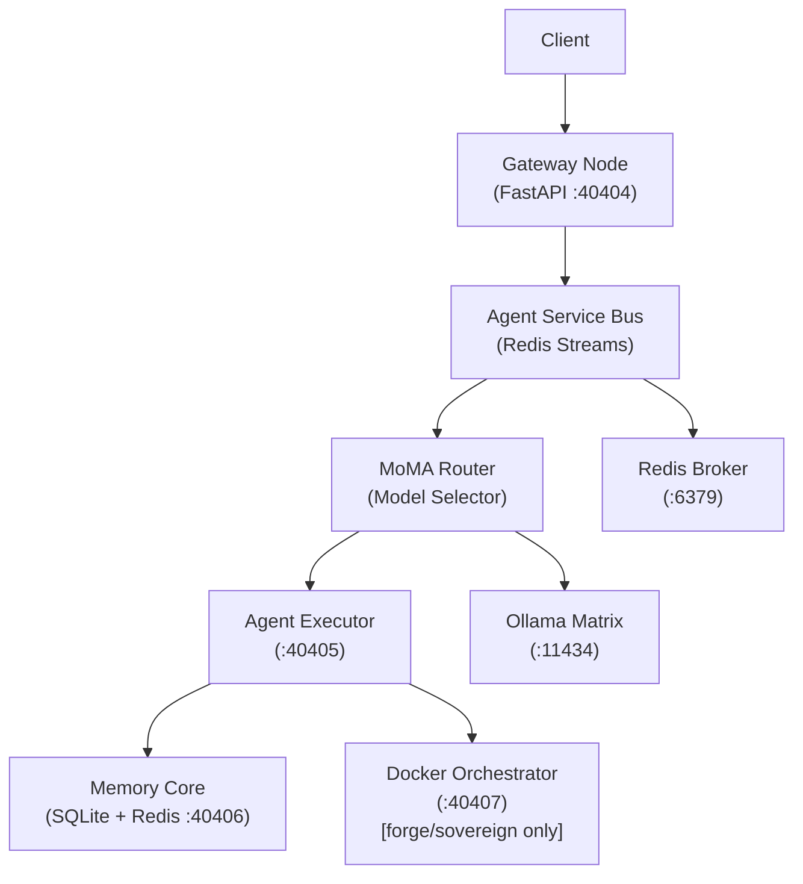

# Sovereign Agentic OS with HLF

> 🚨 **Development Status Alert (Feb 2026)**
> We have exhausted our Claude 3 Opus quota. OS development has temporarily shifted to a **Hybrid AI / Local-First** paradigm. We are actively expanding the **Ollama Matrix** integration and building deeply integrated MCP servers (like the Sovereign MCP Server for Antigravity) to sustain development velocity using local models.
> 
> **Currently Working**: Dream Mode pipeline (111/111 passing), 6-Hat Engine, Gateway Bus with ALIGN enforcement, GUI Dashboard, local/cloud model switching, and MCP Server auto-launch via taskbar.
> **In Progress**: Full Chat vs OpenClaw mode separation, real-time "thinking" indicators, deep Antigravity workflow automations.
> **Paused**: Pure cloud-only orchestrations requiring Opus.


A **Spec-Driven Development (SDD)** project for a Sovereign Agentic OS with a custom DSL called **HLF (Hieroglyphic Logic Framework)**. This framework forms a zero-trust, completely isolated orchestration environment designed for robust multi-agent execution at scale.

## 🏗️ Architecture


*Detailed architectural breakdown of the ACFS and component topology. See the blueprints section below for comprehensive PDF specs.*



## 📖 The Origin Story & Architecture Credits

*Off the record, this architecture was born from sheer frustration and terminal quota exhaustion.*

The Sovereign OS began as a simple question asked when cloud API tokens ran dry: *"Why not create a compressed language exclusively for AI-to-AI communication to save tokens?"* Those scattered notes morphed into the foundational "God View" stack via intensive prompting sessions spanning days.

**Forging the Manifest (The Plan from the Plans):**
After the initial NotebookLM brainstorming exhausted context windows, the raw concepts were dumped into a monolithic baseline plan. We subjected the entire architecture to a **De Bono 6-Hat Agentic Matrix** cycle (Red, Black, White, Yellow, Green, Blue Hats) to forge the ironclad, verified system you see here.

**Architectural Credits & Gratitude:**
- **My Wife:** For her constant, patient support and giving me the massive amounts of unmanaged time required to architect this.
- **Google NotebookLM & Gemini Pro:** For serving as the chaotic sounding board and vital structural refiner.
- **Msty Studio & OpenRouter:** For frontier-tier model access during grueling CoVe verification loops.
- **GitHub:** Where this OS will inevitably be hosted, versioned, and open-sourced.
- **Ollama Cloud Models:** For making local/cloud-hybrid multi-agent swarms financially feasible.
- **Meeting Assistant & AnythingLLM:** For extracting audio and capturing vital "critic" red-teaming sessions.
- **LOLLMS (ParisNeo):** For constant inspiration and architectural solutions throughout these builds.
- **Hof (from Websim.com):** For being a constant source of wild ideas, support, and an invaluable sounding board.

### Quick Start Example (v0.3.0)

*   **Logic Isolation**:
    ```bash
    bash bootstrap_all_in_one.sh
    ```

## 🚀 Quick Start

```bash
cp .env.example .env
bash bootstrap_all_in_one.sh
```

## 🛡️ Deployment Tiers

The OS adapts configuration, networking privileges, and security boundaries based on the deployment tier:

| Tier | Docker Profile | Gas Bucket | Context Tokens | Description |
| ---- | -------------- | ---------- | -------------- | ----------- |
| `hearth` | (default) | 1,000 | 8,192 | Home / personal use |
| `forge` | forge | 10,000 | 16,384 | Professional / team use |
| `sovereign` | sovereign | 100,000 | 32,768 | Enterprise / air-gapped |

> **Note**: Set `DEPLOYMENT_TIER` in your `.env` file prior to bootstrap to engage these boundaries.

## 📜 HLF (Hieroglyphic Logic Framework): The Rosetta Stone for Machines

**HLF** is not just another DSL; it is a **deterministic orchestration protocol** designed to eliminate natural language ambiguity between agents. By replacing prose with a strictly-typed Hieroglyphic AST, HLF enables zero-trust execution, cryptographic validation, and ultra-dense token efficiency.

### Core Goals
- **Deterministic Intent**: 100% predictable execution paths via LALR(1) parsing.
- **Token Compression**: Achieve up to 80% reduction in context window bloat compared to JSON or natural language.
- **Cross-Model Alignment**: Ensure a GPT-4o planning agent can communicate perfectly with a local deepseek-v3 worker.
- **Cryptographic Governance**: Every intent is mathematically verifiable against the **ALIGN Ledger**.

### 💎 High-Impact Examples

#### 1. Security Baseline Audit (Sentinel Mode)

### Tool Orchestration

The agent audits a critical system file while enforcing strict RO (Read-Only) constraints.
```hlf
[HLF-v3]
Δ analyze /security/seccomp.json 
 Ж [CONSTRAINT] mode="ro" 
Ж [EXPECT] vulnerability_shorthand 
⨝ [VOTE] consensus="strict"
Ω
```

#### 2. Multi-Agent Task Delegation (Orchestrator Mode)
The primary agent delegates a long-running summarization task to a specialized Scribe agent.
```hlf
[HLF-v3]
⌘ [DELEGATE] agent="scribe" goal="fractal_summarize"
 ∇ [SOURCE] /data/raw_logs/matrix_sync_2026.txt
 ⩕ [PRIORITY] level="high"
Ж [ASSERT] vram_limit="8GB"
Ω
```

#### 3. Real-Time Resource Mediation (MoMA Router)
The router dynamically shifts a task to a local model based on real-time VRAM availability.
```hlf
[HLF-v3]
⌘ [ROUTE] target="local_ollama" 
 Δ [MODEL] name="qwen:7b"
 ∇ [PARAM] temperature=0.0
Ж [VOTE] confirmation="required"
Ω
```

---

## 🌟 The Sovereign Advantage: Why it Matters

The Sovereign Agentic OS represents a paradigm shift in AI autonomy:
- **Aegis-Nexus Engine**: Our tri-perspective audit cycle (Red/White/Blue Hats) ensures your agents never hallucinate into privilege escalation or memory leaks.
- **MoMA Dynamic Routing**: Intelligent "Downshifting" means you never pay for a Frontier-tier model when a local small-language model (SLM) can do the same task for free.
- **Glass-Box Transparency**: The C-SOC dashboard allows you to see every "thought" and "action" in real-time—no secret LLM decision-making.
- **Start Strong Mandate**: Built from day one with the assumption that AI agents will be the primary operators of the next generation of infrastructure.

## 🔏 Security Features & Governance

### Security & Governance

- **ALIGN Ledger** — Immutable governance rules enforced at runtime.
- **Seccomp Profile** — Custom syscall allowlist for all node containers.
- **ULID Nonce Protection** — 600s TTL replay deduplication.
- **Merkle Chain Logging** — SHA-256 chained trace IDs for comprehensive state audits.
- **Rate limiting** — 50 RPM token bucket via Redis.
- **Gas Budget** — AST node count limits strictly enforced per deployment tier.
- **ACFS Confinement** — Directory permission enforcement at the kernel level.

---

## 🔌 Antigravity MCP Integration

The Sovereign OS is deeply integrated with **Antigravity** (Google DeepMind's agentic IDE assistant) via a custom **Model Context Protocol (MCP)** server.

### Goals & Intentions
- **Glass-Box IDE Control**: Allow an external expert coding agent (Antigravity) to read the internal state, health, and memory of the OS directly from the IDE without breaking security boundaries.
- **Autonomous OS Maintenance**: Empower Antigravity to trigger "Dream Mode" cycles, read Six-Hat analysis findings, and suggest architectural improvements based on the OS's own self-reflections.
- **Regulated Tool Access**: Expose 8 secure tools (e.g., `check_health`, `dispatch_intent`, `query_memory`, `run_dream_cycle`) that allow the IDE agent to operate the OS like a sysadmin, while remaining fully constrained by the ALIGN governed Gateway Bus.

To start the MCP server, select Option 3 in the `run.bat` boot menu, or use `--auto-launch` in the tray manager. 

---

## 🤖 Automated Runners & Multi-Provider Setup

For deploying the Agent OS autonomously in cloud environments (e.g., GitHub Actions), the OS supports dynamic, multi-provider API injection via Environment Secrets.

### Step-by-Step GitHub Setup for Autonomous Agents

1. **Configure Environment Secrets**:
   In your GitHub repository, navigate to **Settings > Environments > Configure Secrets**. Add your provider keys exactly as follows (see `.github/workflows/autonomous-runner.yml` for usage):
   - `OPENROUTER_API` (Primary fallback for cloud models)
   - `OLLAMA_API_KEY` (If using a managed Ollama Cloud endpoint)
   - `DEEPSEEK_API`
   - `GEMINI_API`
   - `GROK_API`
   - `OPENAI_API`
   - `PERPLEXITY_API_KEY`
   - `AGENTSKB_API_KEY`

2. **Automated Runner Execution**:
   When the system is run headlessly via CI/CD, these keys are injected into the Docker/uv environment. The `MoMA Router` (`agents/gateway/router.py`) will automatically select the cheapest, most capable model available across these providers for the delegated task, strictly abiding by the Gas limit of the tier (defaulting to the `forge` or `sovereign` tier in CI).

3. **Current Provider Integration Status**:
   - ✅ **Ollama (Local)**: Fully integrated for zero-cost routing.
   - ✅ **Ollama Cloud / OpenRouter**: Native support via standard OpenAI-compatible endpoints configured in `config/settings.json`.
   - 🚧 **DeepSeek/Gemini/Grok**: Keys are staged, but explicit routing logic inside the MoMA router is actively being refined to support multi-provider fallback chains natively without external proxies.

*See the `Automated_Runner_Setup_Guide.md` in the docs folder for the exhaustive implementation details and custom action configurations.*

## 📚 Official Design Documents & Blueprints

Dive deeper into the comprehensive design documentation that informs the OS specifications:

- [Genesis Stack Blueprint](assets/Genesis_Stack_Blueprint.pdf)
- [Sovereign Agentic Stack Architecture](assets/Sovereign_Agentic_Stack.pdf)
- [Ollama Matrix Sync Pipeline](assets/Ollama_Matrix_Sync.pdf)

## 💻 Tech Stack

| Component | Technology |
| --------- | ---------- |
| Language | Python 3.12 |
| API | FastAPI + Uvicorn |
| Message Bus | Redis Streams |
| Storage | SQLite (WAL mode) |
| Containers | Docker Compose |
| Pub/Sub | Dapr |
| Backend | Ollama |
| ML Optimization | DSPy |
| Parser | Lark LALR(1) |
| Package Manager | uv |

## 🛠️ Local Development

```bash
uv sync 
uv run pytest tests/ -v
uv run hlfc tests/fixtures/hello_world.hlf
uv run hlflint tests/fixtures/hello_world.hlf
```
