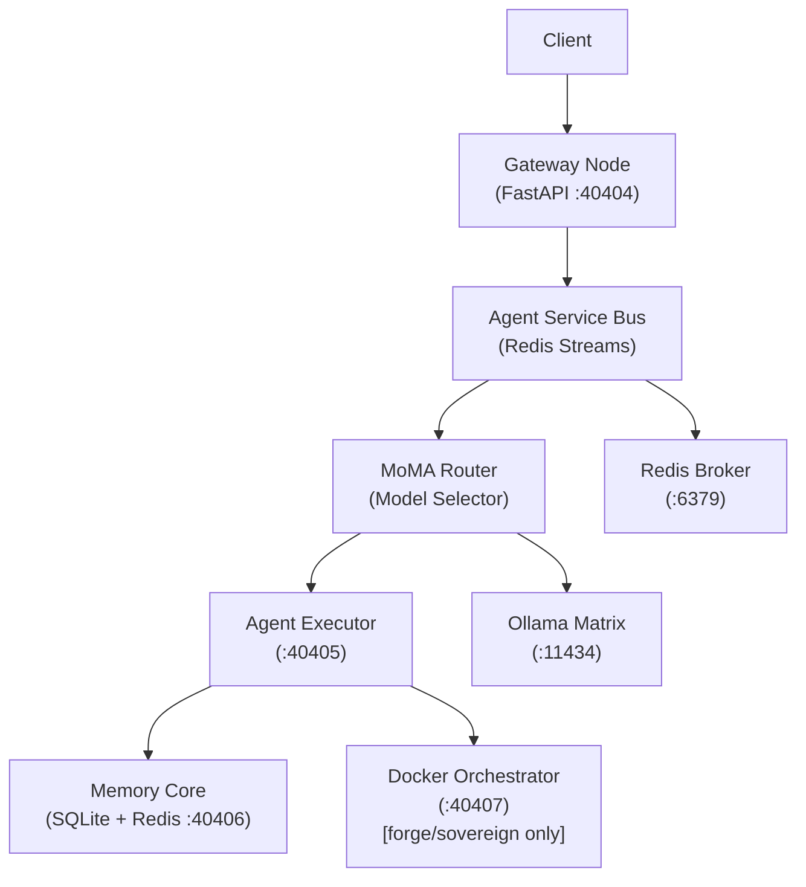

# Sovereign Agentic OS with HLF


A **Spec-Driven Development (SDD)** project for a Sovereign Agentic OS with a custom DSL called **HLF (Hieroglyphic Logic Framework)**. This framework forms a zero-trust, completely isolated orchestration environment designed for robust multi-agent execution at scale.

## 🏗️ Architecture


*Detailed architectural breakdown of the ACFS and component topology. See the blueprints section below for comprehensive PDF specs.*



## 🚀 Quick Start

```bash
cp .env.example .env
bash bootstrap_all_in_one.sh
```

## 🛡️ Deployment Tiers

The OS adapts configuration, networking privileges, and security boundaries based on the deployment tier:

| Tier | Docker Profile | Gas Bucket | Context Tokens | Description |
| ---- | -------------- | ---------- | -------------- | ----------- |
| `hearth` | (default) | 1,000 | 8,192 | Home / personal use |
| `forge` | forge | 10,000 | 16,384 | Professional / team use |
| `sovereign` | sovereign | 100,000 | 32,768 | Enterprise / air-gapped |

> **Note**: Set `DEPLOYMENT_TIER` in your `.env` file prior to bootstrap to engage these boundaries.

## 📜 HLF (Hieroglyphic Logic Framework)

**HLF** is a robust, structured DSL for expressing agent intents with typed, validated tags. It replaces ambiguous natural language with deterministic, parseable directives.

```hlf
[HLF-v2]
[INTENT] analyze /security/seccomp.json
[CONSTRAINT] mode="read-only"
[EXPECT] vulnerability_report
Ω
```

**Compiler Rules:**

- First line must be `[INTENT]`
- One tag per line — no prose
- Every message ends with `Ω`
- Version prefix `[HLF-v2]` is strictly enforced.

## 🔏 Security Features & Governance

- **ALIGN Ledger** — Immutable governance rules enforced at runtime.
- **Seccomp Profile** — Custom syscall allowlist for all node containers.
- **ULID Nonce Protection** — 600s TTL replay deduplication.
- **Merkle Chain Logging** — SHA-256 chained trace IDs for comprehensive state audits.
- **Rate limiting** — 50 RPM token bucket via Redis.
- **Gas Budget** — AST node count limits strictly enforced per deployment tier.
- **ACFS Confinement** — Directory permission enforcement at the kernel level.

## 📚 Official Design Documents & Blueprints

Dive deeper into the comprehensive design documentation that informs the OS specifications:

- [Genesis Stack Blueprint](assets/Genesis_Stack_Blueprint.pdf)
- [Sovereign Agentic Stack Architecture](assets/Sovereign_Agentic_Stack.pdf)
- [Ollama Matrix Sync Pipeline](assets/Ollama_Matrix_Sync.pdf)

## 💻 Tech Stack

| Component | Technology |
| --------- | ---------- |
| Language | Python 3.12 |
| API | FastAPI + Uvicorn |
| Message Bus | Redis Streams |
| Storage | SQLite (WAL mode) |
| Containers | Docker Compose |
| Pub/Sub | Dapr |
| Backend | Ollama |
| ML Optimization | DSPy |
| Parser | Lark LALR(1) |
| Package Manager | uv |

## 🛠️ Local Development

```bash
uv sync 
uv run pytest tests/ -v
uv run hlfc tests/fixtures/hello_world.hlf
uv run hlflint tests/fixtures/hello_world.hlf
```
