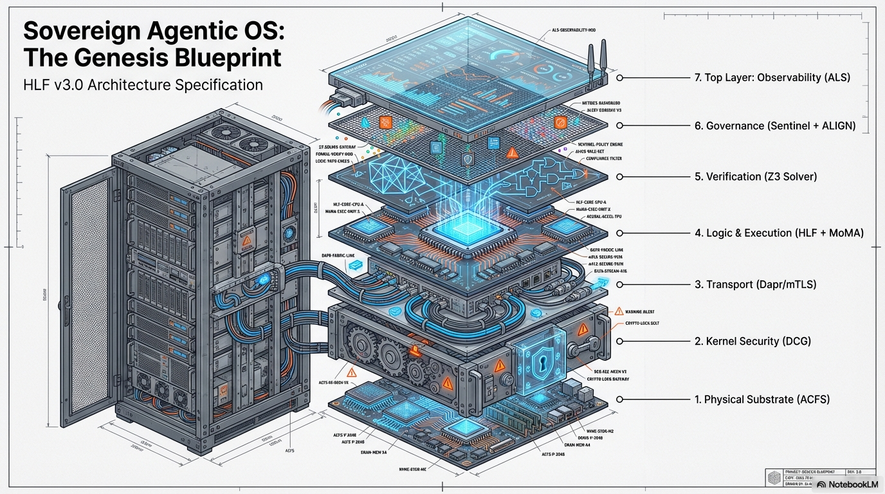
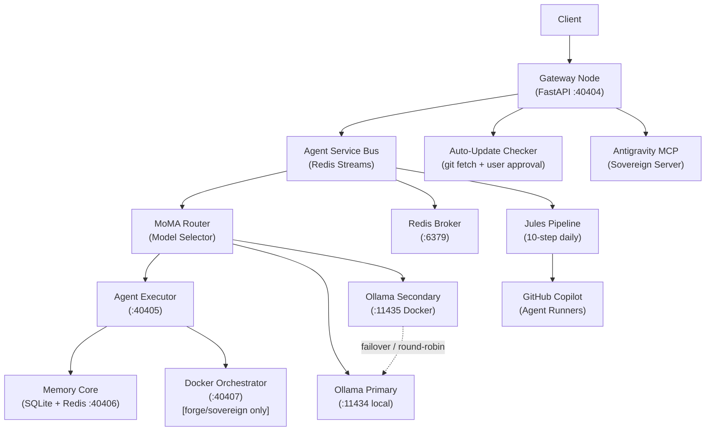
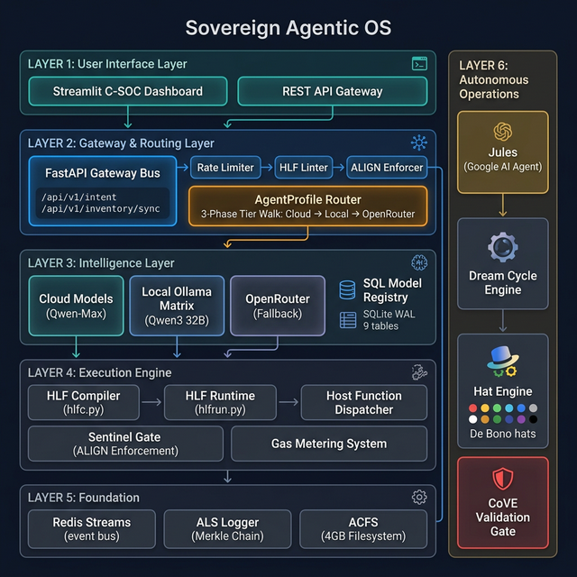
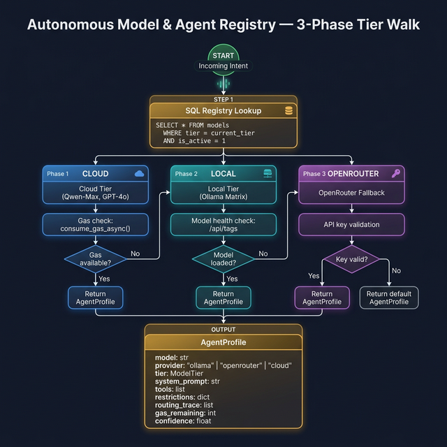
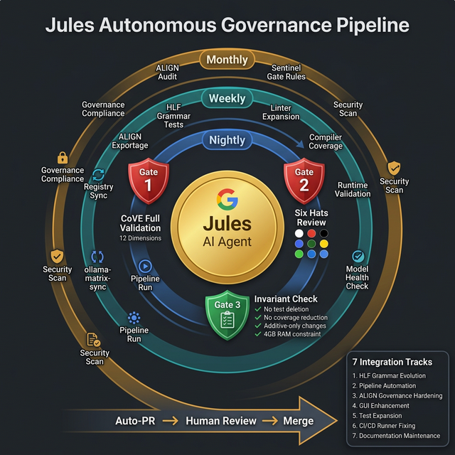

# Sovereign Agentic OS with HLF

> 🟢 **Development Status (Mar 2026)**
> Now on **Google Ultimate Plan** with full Antigravity, Jules, and GitHub Copilot integration.
> 
> **✅ Working**: Dream Mode (111/111), 11-Hat Engine (11 named cloud agents), Gateway Bus + ALIGN, C-SOC GUI (dark mode), Ollama Matrix, deep installation tests (65/65), auto-update with user approval, Jules 10-step daily pipeline, MCP Server auto-launch, **Infinite RAG Memory Matrix** (SQLite WAL + MCP bridge + Dream State), HLF metrics & benchmark infrastructure.
> **🛠️ In Progress**: Copilot agent/runner factory, real-time HLF translation indicators, vector embeddings (sqlite-vec), Redis active context tiering, fractal summarization.
> **⏸️ Paused**: Pure cloud-only orchestrations.
>
> 🌐 **[Live Demo →](https://grumpified-oggvct.github.io/Sovereign_Agentic_OS_with_HLF/)** | 📊 **[HLF Progress Report →](docs/HLF_PROGRESS.md)** | 📓 **[NotebookLM Research Notebook →](https://notebooklm.google.com/notebook/13b9e9f1-77aa-4eba-8760-e38dbdc98bdc)**


A **Spec-Driven Development (SDD)** project for a Sovereign Agentic OS with a custom DSL called **HLF (Hieroglyphic Logic Framework)**. This framework forms a zero-trust, completely isolated orchestration environment designed for robust multi-agent execution at scale.

---

## ⚠️ Why You Should NEVER Run AI Agents Naked on Your System

> **Every AI coding agent running today — Copilot, Claude Code, Cursor, Aider, Jules, Antigravity — operates with essentially unlimited access to your filesystem, network, and shell.** There is no sandbox. No audit trail. No kill switch. You are one hallucinated `rm -rf /` away from total system destruction.

### The Problem: Agents Are Powerful. And Uncontrolled.

Modern AI agents can write code, execute shell commands, read your files, make HTTP requests, and spawn processes. Most frameworks give them **full host access** with nothing but a "are you sure?" prompt between the AI and your production database. That's not engineering — that's hope-based security.

**Real attack vectors that exist today:**

| Attack | What Happens | Naked Agent | Sovereign OS |
|--------|-------------|-------------|--------------|
| **Prompt Injection** | Malicious instructions hidden in data | Agent executes blindly | ALIGN Ledger regex blocks + `403 Forbidden` |
| **Infinite Loop / DDoS** | Agent burns your API budget in minutes | No limit, runs forever | Gas Budget (`⩕`) + Redis token bucket = hard stop |
| **Privilege Escalation** | Agent accesses `/etc/shadow` or `docker.sock` | Full host access | Seccomp deny-list + ACFS confinement + air-gap |
| **Supply Chain Poisoning** | Compromised package installed silently | `pip install` runs freely | SHA-256 content pinning + SLSA-3 provenance |
| **Replay Attack** | Old command re-executed maliciously | No deduplication | ULID nonce protection with 600s TTL |
| **Silent Data Exfiltration** | Agent sends your code to external servers | Unrestricted network | Air-Gapped Egress Proxy — agents have **zero** outbound internet |
| **Memory Poisoning** | Corrupted context influences future decisions | No memory governance | Vector Race Protection + Merkle-chained audit trail |
| **Runaway Spending** | Cloud API calls spiral out of control | No cost tracking | Per-tier gas buckets replenished nightly via cron |

### The Solution: A 6-Gate Security Pipeline

Every intent — whether from a human, an agent, or another AI — passes through **6 deterministic validation gates** before it can execute anything:

```
┌─────────────────────────────────────────────────────────────────┐
│  Gate 1: validate_hlf()     → Regex structural validation       │
│  Gate 2: hlfc.compile()     → LALR(1) parse + type checking     │
│  Gate 3: hlflint.lint()     → Token budget + gas + unused vars  │
│  Gate 4: ALIGN Enforcement  → Immutable regex block rules       │
│  Gate 5: Gas Budget         → Per-intent + global tier bucket   │
│  Gate 6: Nonce Check        → ULID replay protection via Redis  │
└─────────────────────────────────────────────────────────────────┘
         ↓ PASSES ALL 6        ↓ FAILS ANY GATE
    Execute via Dapr mTLS      HTTP 403/409/422/429 + ALS log
```

> **Traditional agent frameworks skip Gates 1–3 entirely** and require custom middleware for Gates 4–6. The Sovereign OS enforces all six by default, for every agent, every time.

### What You Get

| Capability | Naked Agent | Sovereign OS |
|-----------|-------------|--------------|
| Filesystem access | Unrestricted | ACFS + `chmod 555` governance = read-only by default |
| Network access | Full internet | Air-gapped proxy, allowlist-only outbound |
| Shell execution | Direct `os.system()` | AST validation → `ast_validator.py` blocks injection |
| Audit trail | Maybe some logs | Merkle-chained, SHA-256 hashed, non-repudiable ALS |
| Cost control | None | Gas metering per-intent + global per-tier bucket |
| Agent identity | Anonymous | KYA (Know Your Agent) with SPIFFE/x509 certs |
| Multi-agent coordination | Ad-hoc | Dapr pub/sub + Redis streams + DAG chronology |
| Memory governance | Context window only | 3-tier Infinite RAG (hot/warm/cold) with forgetting curves |
| Self-improvement | None | Nightly Dream State + DSPy regression testing |
| Kill switch | Close the terminal | Dead Man's Switch: auto-severs network after 3 panics in 5 min |

### The Bottom Line

> **If your AI agent can `rm -rf /` your system and the only thing stopping it is the model's alignment training, you don't have security — you have a prayer.**
>
> The Sovereign OS wraps every agent in 7 architectural layers of mathematically verifiable, cryptographically auditable, zero-trust isolation. Your agents become more powerful precisely *because* they're constrained.

---

## 🏗️ Architecture



*Detailed architectural breakdown of the ACFS and component topology. See the blueprints section below for comprehensive PDF specs.*



## 📖 The Origin Story & Architecture Credits

*Off the record, this architecture was born from sheer frustration and terminal quota exhaustion.*

The Sovereign OS began as a simple question asked when cloud API tokens ran dry: *"Why not create a compressed language exclusively for AI-to-AI communication to save tokens?"* Those scattered notes morphed into the foundational "God View" stack via intensive prompting sessions spanning days.

**Forging the Manifest (The Plan from the Plans):**
After the initial NotebookLM brainstorming exhausted context windows, the raw concepts were dumped into a monolithic baseline plan. We subjected the entire architecture to a **De Bono 11-Hat Agentic Matrix** — the original 6 perspective hats (Red, Black, White, Yellow, Green, Blue) plus 5 Sovereign OS-specific extended hats (Indigo, Cyan, Purple, Orange, Silver) — to forge the ironclad, verified system you see here.

**Architectural Credits & Gratitude:**
- **My Wife:** For her constant, patient support and giving me the massive amounts of unmanaged time required to architect this.
- **Google NotebookLM & Gemini Pro:** For serving as the chaotic sounding board and vital structural refiner.
- **Google Antigravity:** For deep agentic coding and autonomous workflow orchestration.
- **Google Jules:** For autonomous CI/governance pipeline execution and self-evolving codebase maintenance.
- **GitHub Copilot:** For agent runners, automated code review, and dynamic PR generation.
- **Google Ultimate Plan:** For the compute, storage, and AI resources powering the full sovereign stack.
- **Msty Studio & OpenRouter:** For frontier-tier model access during grueling CoVE verification loops.
- **GitHub:** Where this OS is hosted, versioned, and open-sourced.
- **Ollama Cloud Models:** For making local/cloud-hybrid multi-agent swarms financially feasible.
- **Meeting Assistant & AnythingLLM:** For extracting audio and capturing vital "critic" red-teaming sessions.
- **LOLLMS (ParisNeo):** For constant inspiration and architectural solutions throughout these builds.
- **Hof (from Websim.com):** For being a constant source of wild ideas, support, and an invaluable sounding board.

### Quick Start Example (v0.3.0)

*   **Logic Isolation**:
    ```bash
    bash bootstrap_all_in_one.sh
    ```

## 🚀 Quick Start

```bash
cp .env.example .env
bash bootstrap_all_in_one.sh
```

## 🛡️ Deployment Tiers

The OS adapts configuration, networking privileges, and security boundaries based on the deployment tier:

| Tier | Docker Profile | Gas Bucket | Context Tokens | Description |
| ---- | -------------- | ---------- | -------------- | ----------- |
| `hearth` | (default) | 1,000 | 8,192 | Home / personal use |
| `forge` | forge | 10,000 | 16,384 | Professional / team use |
| `sovereign` | sovereign | 100,000 | 32,768 | Enterprise / air-gapped |

> **Note**: Set `DEPLOYMENT_TIER` in your `.env` file prior to bootstrap to engage these boundaries.

## 📜 HLF (Hieroglyphic Logic Framework): The Rosetta Stone for Machines

**HLF** is not just another DSL; it is a **deterministic orchestration protocol** designed to eliminate natural language ambiguity between agents. By replacing prose with a strictly-typed Hieroglyphic AST, HLF enables zero-trust execution, cryptographic validation, and ultra-dense token efficiency.

### Core Goals
- **Deterministic Intent**: 100% predictable execution paths via LALR(1) parsing.
- **Token Compression**: Measured **12–30% compression** per intent (tiktoken cl100k_base); up to **83% vs verbose JSON payloads**. In a 5-agent swarm, savings multiply — 83 tokens saved per broadcast × 5 agents = **415 tokens per cycle**.
- **Cross-Model Alignment**: The MoMA Router auto-selects from the **model matrix** per deployment tier — ensuring any allowed model can communicate via typed HLF intents.
- **Cryptographic Governance**: Every intent is mathematically verifiable against the **ALIGN Ledger**.

### 💎 High-Impact Examples

#### 1. Security Baseline Audit (Sentinel Mode)

### Tool Orchestration

The agent audits a critical system file while enforcing strict RO (Read-Only) constraints.
```hlf
[HLF-v3]
Δ analyze /security/seccomp.json 
 Ж [CONSTRAINT] mode="ro" 
Ж [EXPECT] vulnerability_shorthand 
⨝ [VOTE] consensus="strict"
Ω
```

#### 2. Multi-Agent Task Delegation (Orchestrator Mode)
The primary agent delegates a long-running summarization task to a specialized Scribe agent.
```hlf
[HLF-v3]
⌘ [DELEGATE] agent="scribe" goal="fractal_summarize"
 ∇ [SOURCE] /data/raw_logs/matrix_sync_2026.txt
 ⩕ [PRIORITY] level="high"
Ж [ASSERT] vram_limit="8GB"
Ω
```

#### 3. Real-Time Resource Mediation (MoMA Router)
The router dynamically selects from the tier's model matrix based on VRAM, task complexity, and cost.
```hlf
[HLF-v3]
⌘ [ROUTE] strategy="auto" tier="$DEPLOYMENT_TIER"
 ∇ [PARAM] temperature=0.0
Ж [VOTE] confirmation="required"
Ω
```

### 📏 HLF Metrics & Benchmarking

The project includes automated metrics and benchmark scripts that measure real compression ratios:

```bash
# Generate codebase metrics → docs/metrics.json
uv run python scripts/hlf_metrics.py --output docs/metrics.json

# Run real tiktoken compression benchmark → docs/benchmark.json
uv run python scripts/hlf_benchmark.py --output docs/benchmark.json
```

**Current Benchmark Results** (tiktoken cl100k_base, 6 test fixtures):

| Domain | NLP Tokens | HLF Tokens | Compression |
|--------|-----------|-----------|-------------|
| Security Audit | 105 | 78 | **25.7%** |
| Hello World | 71 | 50 | **29.6%** |
| DB Migration | 139 | 122 | **12.2%** |
| Content Delegation | 115 | 101 | **12.2%** |
| Log Analysis | 129 | 120 | **7.0%** |
| Stack Deployment | 104 | 109 | **-4.8%** |
| **Overall** | **663** | **580** | **12.5%** |

> **Note**: Compression increases dramatically with payload complexity and in swarm scenarios. Simple structural tasks like deploy_stack show near parity because HLF's typed tags add overhead that matches NLP verbosity for short payloads.

---

## ♾️ Infinite RAG Memory Matrix

The Sovereign OS uses a **3-tier memory architecture** that eliminates the context window ceiling found in traditional RAG:

| Tier | Storage | Speed | Purpose |
|------|---------|-------|---------|
| **Hot** | Redis | <1ms | Active context, topic-focused sub-graphs |
| **Warm** | SQLite `fact_store` | ~5ms | Persistent vector embeddings, semantic facts |
| **Cold** | Parquet Archive | ~50ms | Years of compressed history, audit trail |

### Key Innovations

- **Fractal Summarization**: When context approaches the token limit, the summarization model runs map-reduce compression, distilling to 1,500 tokens before injection.
- **SHA-256 Embedding Cache**: Deduplicates vector embeddings before they hit the ML model, saving compute.
- **Active Context Tiering**: When an agent focuses on a topic, relevant cold vectors are pre-loaded into Redis for sub-millisecond retrieval.
- **Vector Race Protection**: Cosine similarity check (>0.98 threshold) prevents duplicate INSERTs from parallel agents.
- **Dream State Self-Improvement**: Nightly cron compresses the day's `Rolling_Context` into synthesized rules, tested via DSPy regression before merging.
- **RAG Forgetting**: 30-day decay curves prune low-relevance embeddings to cold storage.

### 🔗 The HLF + Infinite RAG Synergy

HLF and the Infinite RAG are designed to amplify each other:

| Without HLF | With HLF |
|-------------|----------|
| RAG ingests verbose NLP → bloated fact_store | RAG ingests **compressed HLF ASTs** → smaller, denser embeddings |
| Context window fills quickly → frequent summarization | HLF intents are **12–30% smaller** → more facts fit per prompt |
| Cross-agent RAG shares prose → ambiguous retrieval | Agents share **typed, deterministic HLF** → exact semantic matching |
| Dream State compresses NLP rules → lossy | Dream State compresses **HLF rules → lossless** (AST round-trips) |
| No governance on memory writes | Every RAG write passes through **ALIGN Ledger validation** via HLF |

**The compound effect**: HLF's token compression means the Infinite RAG can store **more knowledge per byte**, retrieve it **faster** (smaller vectors = faster cosine search), and share it **more precisely** across the swarm.

### Wiring Status

- ✅ SQLite WAL Mode — Active in all services
- ✅ MCP RAG Bridge — `query_memory()` tool wired and operational
- ✅ Dream State — Context compression every 03:00
- ✅ DB Schema — `fact_store` + `rolling_context` + `identity_core` tables
- 🔨 Vector Embeddings — `sqlite-vec` C-extension installation needed
- 🔨 Redis Hot Cache — Active Context Tiering spec'd, not yet coded
- 🔨 SHA-256 Dedup Cache — designed, implementation pending
- 🔨 Fractal Summarization — summarization model map-reduce spec'd

> 🌐 See the **[Infinite RAG explainer popup](https://grumpified-oggvct.github.io/Sovereign_Agentic_OS_with_HLF/)** on the live demo page for interactive comparison with traditional RAG.

---

## 🌟 The Sovereign Advantage: Why it Matters

The Sovereign Agentic OS represents a paradigm shift in AI autonomy:
- **Aegis-Nexus Engine**: Our 11-hat autonomous audit cycle (11 named cloud agents: Architect, Scribe, Frontend Dev, Backend Engineer, SecOps, Sentinel, Synthesizer, Scout, Guardian, Operator, Compressor) ensures your agents never hallucinate into privilege escalation or memory leaks.
- **MoMA Dynamic Routing**: Intelligent "Downshifting" means you never pay for a Frontier-tier model when a local small-language model (SLM) can do the same task for free.
- **Glass-Box Transparency**: The C-SOC dashboard allows you to see every "thought" and "action" in real-time—no secret LLM decision-making.
- **Start Strong Mandate**: Built from day one with the assumption that AI agents will be the primary operators of the next generation of infrastructure.

## 🔏 Security Features & Governance

### Security & Governance

- **ALIGN Ledger** — Immutable governance rules enforced at runtime.
- **Seccomp Profile** — Custom syscall allowlist for all node containers.
- **ULID Nonce Protection** — 600s TTL replay deduplication.
- **Merkle Chain Logging** — SHA-256 chained trace IDs for comprehensive state audits.
- **Rate limiting** — 50 RPM token bucket via Redis.
- **Gas Budget** — AST node count limits strictly enforced per deployment tier.
- **ACFS Confinement** — Directory permission enforcement at the kernel level.

---

## 🔌 Antigravity MCP Integration

The Sovereign OS is deeply integrated with **Antigravity** (Google DeepMind's agentic IDE assistant) via a custom **Model Context Protocol (MCP)** server.

### Goals & Intentions
- **Glass-Box IDE Control**: Allow an external expert coding agent (Antigravity) to read the internal state, health, and memory of the OS directly from the IDE without breaking security boundaries.
- **Autonomous OS Maintenance**: Empower Antigravity to trigger "Dream Mode" cycles, read 11-Hat analysis findings from 11 named agents, and suggest architectural improvements based on the OS's own self-reflections.
- **Regulated Tool Access**: Expose 8 secure tools (e.g., `check_health`, `dispatch_intent`, `query_memory`, `run_dream_cycle`) that allow the IDE agent to operate the OS like a sysadmin, while remaining fully constrained by the ALIGN governed Gateway Bus.

To start the MCP server, select Option 3 in the `run.bat` boot menu, or use `--auto-launch` in the tray manager. 

---

## 🤖 Automated Runners & Multi-Provider Setup

For deploying the Agent OS autonomously in cloud environments (e.g., GitHub Actions), the OS supports dynamic, multi-provider API injection via Environment Secrets.

### Step-by-Step GitHub Setup for Autonomous Agents

1. **Configure Environment Secrets**:
   In your GitHub repository, navigate to **Settings > Environments > Configure Secrets**. Add your provider keys exactly as follows (see `.github/workflows/autonomous-runner.yml` for usage):
   - `OPENROUTER_API` (Primary fallback for cloud models)
   - `OLLAMA_API_KEY` (Primary Ollama Cloud endpoint)
   - `OLLAMA_API_KEY_SECONDARY` (Secondary Ollama at `:11435` — doubles cloud quota)
   - `DEEPSEEK_API`
   - `GEMINI_API`
   - `GROK_API`
   - `OPENAI_API`
   - `PERPLEXITY_API_KEY`
   - `AGENTSKB_API_KEY`

2. **Automated Runner Execution**:
   When the system is run headlessly via CI/CD, these keys are injected into the Docker/uv environment. The `MoMA Router` (`agents/gateway/router.py`) will automatically select the cheapest, most capable model available across these providers for the delegated task, strictly abiding by the Gas limit of the tier (defaulting to the `forge` or `sovereign` tier in CI).

3. **Current Provider Integration Status**:
   - ✅ **Ollama (Local)**: Fully integrated for zero-cost routing.
   - ✅ **Ollama Cloud / OpenRouter**: Native support via standard OpenAI-compatible endpoints configured in `config/settings.json`.
   - 🚧 **DeepSeek/Gemini/Grok**: Keys are staged, but explicit routing logic inside the MoMA router is actively being refined to support multi-provider fallback chains natively without external proxies.

*See the `Automated_Runner_Setup_Guide.md` in the docs folder for the exhaustive implementation details and custom action configurations.*

---

## 🗄️ Autonomous Model & Agent Registry

The OS includes a **SQL-backed Model & Agent Registry** (`agents/core/db.py`) that replaces keyword-based routing with a data-driven tier-walk algorithm.

### System Architecture



### Registry & Router Flow



### 3-Phase Tier Walk

| Phase | Strategy | Source |
|-------|----------|--------|
| **1. Cloud Walk** | S → A+ → A → A- → B+ descent | `models` table (active snapshot) |
| **2. Local Fallback** | Best available local model | `user_local_inventory` table |
| **3. OpenRouter Handoff** | Cross-provider equivalent | `model_equivalents` table |

### AgentProfile (returned by `route_request()`)

Every routing decision returns a structured `AgentProfile` dataclass containing: the selected model, provider, tier, system prompt, available tools, restrictions, a full routing trace (ALS-auditable), gas remaining, and a confidence score. The legacy `route_intent()` function is preserved for backward compatibility.

### Registry Tables (9 total)

| Table | Purpose |
|-------|---------|
| `snapshots` | Pipeline run metadata & promotion state |
| `models` | Global model catalog (per-snapshot) |
| `model_tiers` | Historical tier changes |
| `user_local_inventory` | Local Ollama models (heartbeat-synced) |
| `local_model_metadata` | Extended local model info (digest, quant) |
| `agent_templates` | Pre-built agent configurations |
| `model_equivalents` | Cross-provider model mappings |
| `policy_bundles` | Governance rule bundles |
| `model_feedback` | Per-interaction quality signals |

---

## 🤖 Jules Autonomous Integration

The OS leverages **[Google Jules](https://jules.google)** as an autonomous maintenance and evolution agent. Jules is configured via `AGENTS.md` (in repo root) to understand the full system architecture before making any changes.

### Governance Pipeline



### Integration Areas

| Role | Trigger | Frequency | What It Touches |
|------|---------|-----------|-----------------|
| **HLF Grammar Evolver** | Scheduled | Weekly | `hlfc.py`, `hlflint.py`, `hlffmt.py` |
| **Dream Cycle Enhancer** | Scheduled | Bi-weekly | `dream_state.py`, `hat_engine.py` |
| **Pipeline Operator** | Scheduled | Nightly | `pipeline.py`, `registry.db` |
| **ALIGN Hardener** | Scheduled | Monthly | `ALIGN_LEDGER.yaml`, `sentinel_gate.py` |
| **GUI Feature Builder** | Scheduled | Weekly | `gui/app.py` |
| **CI Fixer** | Event | On failure | `.github/workflows/`, any failing file |
| **Dependency Updater** | Scheduled | Weekly | `pyproject.toml` |

### Scheduled Task Configuration

Automated tasks are defined in `config/jules_tasks.yaml`:

- **Nightly:** Pipeline sync, model health check, regression suite
- **Weekly:** HLF grammar tests, dependency audit, linter sweep
- **Monthly:** ALIGN governance audit, CoVE full validation, 11-Hat review
- **Suggested Tasks:** Auto-surface `TODO`/`FIXME`/`HACK`/`SECURITY` comments

Issue-to-Jules automation: `scripts/jules_dispatch.sh <issue-number>` (supports `--dry-run`)

### Quality Gates

| Gate | Template | Scope |
|------|----------|-------|
| **CoVE Full** (12-dimension) | `governance/templates/cove_full_validation.md` | Major changes, security PRs |
| **CoVE Compact** (8-step) | `governance/templates/cove_compact_validation.md` | Small changes (< 200 lines) |
| **11-Hat Review** | `governance/templates/eleven_hats_review.md` | Every Jules PR |

### Safety Invariants (Non-Negotiable)

| Invariant | Enforcement |
|-----------|-------------|
| No test deletion | LLMJudge checks diffs for removed test files |
| No coverage reduction | Scheduled `pytest --cov` baseline comparison |
| No simplification | `AGENTS.md` explicitly forbids reductive changes |
| Additive-only | Every Jules prompt includes "Do NOT delete or simplify" |
| No overcommit | Cloud model routing via `agent_registry.json` profiles |

---

## 📚 Official Design Documents & Blueprints

Dive deeper into the comprehensive design documentation that informs the OS specifications:

- [Genesis Stack Blueprint](assets/Genesis_Stack_Blueprint.pdf)
- [Sovereign Agentic Stack Architecture](assets/Sovereign_Agentic_Stack.pdf)
- [Ollama Matrix Sync Pipeline](assets/Ollama_Matrix_Sync.pdf)
- 📓 [NotebookLM Research Notebook](https://notebooklm.google.com/notebook/13b9e9f1-77aa-4eba-8760-e38dbdc98bdc) — The genesis knowledge base containing 291 sources, deep research reports, RFC catalog, ground-truth audit corrections, and the HLF vision for human-machine symbolic bilingualism. Central to all architectural planning and public education.

## 💻 Tech Stack

| Component | Technology |
| --------- | ---------- |
| Language | Python 3.12 |
| API | FastAPI + Uvicorn |
| Message Bus | Redis Streams |
| Storage | SQLite (WAL mode) |
| Registry | `agents/core/db.py` (9-table schema) |
| Containers | Docker Compose |
| Pub/Sub | Dapr |
| Backend | Ollama + OpenRouter |
| ML Optimization | DSPy |
| Parser | Lark LALR(1) |
| Package Manager | uv |
| Autonomous Agent | Google Jules (10-step daily pipeline) |
| Code Agent | GitHub Copilot (agent runners + review) |
| Agentic IDE | Google Antigravity (MCP + workflow) |
| Cloud Platform | Google Ultimate Plan |
| MCP Server | Antigravity + Jules MCP |
| GUI Framework | Streamlit (dark mode default) |
| Installation Tests | 65 deep verification tests |
| Auto-Update | git-based with GUI approval flow |
| HLF Test Fixtures | 7 domain-specific `.hlf` files |
| Total Tests | 443 (pytest collected) |
| Benchmarking | tiktoken cl100k_base compression analysis |
| Live Demo | [GitHub Pages](https://grumpified-oggvct.github.io/Sovereign_Agentic_OS_with_HLF/) |

## 🛠️ Local Development

```bash
uv sync 
uv run pytest tests/ -v
uv run hlfc tests/fixtures/hello_world.hlf
uv run hlflint tests/fixtures/hello_world.hlf
```
