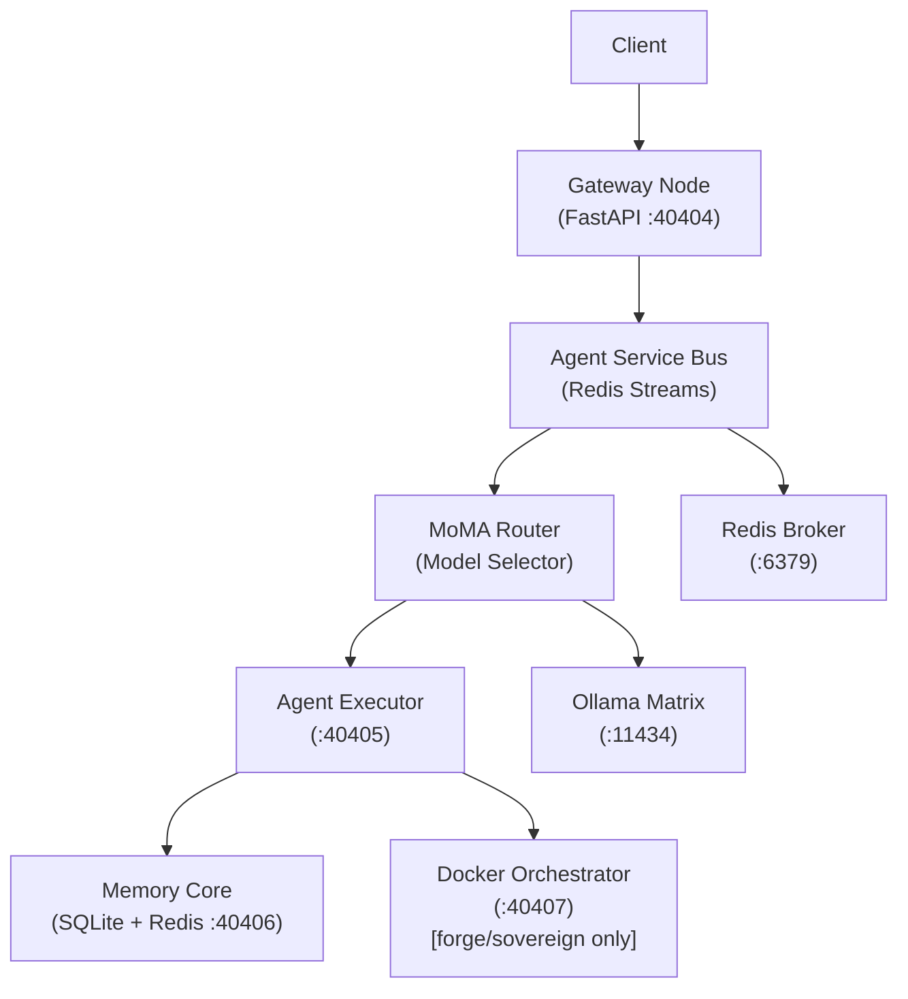

# Sovereign Agentic OS with HLF

A **Spec-Driven Development (SDD)** project for a Sovereign Agentic OS with a custom DSL called **HLF (Hieroglyphic Logic Framework)**.

## Architecture



## Quick Start

```bash
cp .env.example .env
bash bootstrap_all_in_one.sh
```

## Deployment Tiers

| Tier | Docker Profile | Gas Bucket | Context Tokens | Description |
|------|---------------|------------|----------------|-------------|
| `hearth` | (default) | 1,000 | 8,192 | Home / personal use |
| `forge` | forge | 10,000 | 16,384 | Professional / team use |
| `sovereign` | sovereign | 100,000 | 32,768 | Enterprise / air-gapped |

Set `DEPLOYMENT_TIER` in your `.env` file.

## HLF Overview

HLF (Hieroglyphic Logic Framework) is a structured DSL for expressing agent intents with typed, validated tags.

```hlf
[HLF-v2]
[INTENT] analyze /security/seccomp.json
[CONSTRAINT] mode="read-only"
[EXPECT] vulnerability_report
Ω
```

**Rules:**
- First line must be `[INTENT]`
- One tag per line — no prose
- Every message ends with `Ω`
- Version prefix `[HLF-v2]` required

## Security Features

- **ALIGN Ledger** — immutable governance rules enforced at runtime
- **Seccomp profile** — custom syscall allowlist for all containers
- **ULID nonce replay protection** — 600s TTL deduplication
- **Merkle chain logging** — SHA-256 chained trace IDs
- **Rate limiting** — 50 RPM token bucket via Redis
- **Gas budget** — AST node count limits per tier
- **ACFS confinement** — directory permission enforcement

## Tech Stack

| Component | Technology |
|-----------|-----------|
| Language | Python 3.12 |
| API | FastAPI + Uvicorn |
| Message Bus | Redis Streams |
| Storage | SQLite (WAL mode) |
| Containers | Docker Compose |
| Pub/Sub | Dapr |
| LLM Backend | Ollama |
| ML Optimization | DSPy |
| HLF Parser | Lark LALR(1) |
| Package Manager | uv |

## Development

```bash
uv sync
uv run pytest tests/ -v
uv run hlfc tests/fixtures/hello_world.hlf
uv run hlflint tests/fixtures/hello_world.hlf
```
