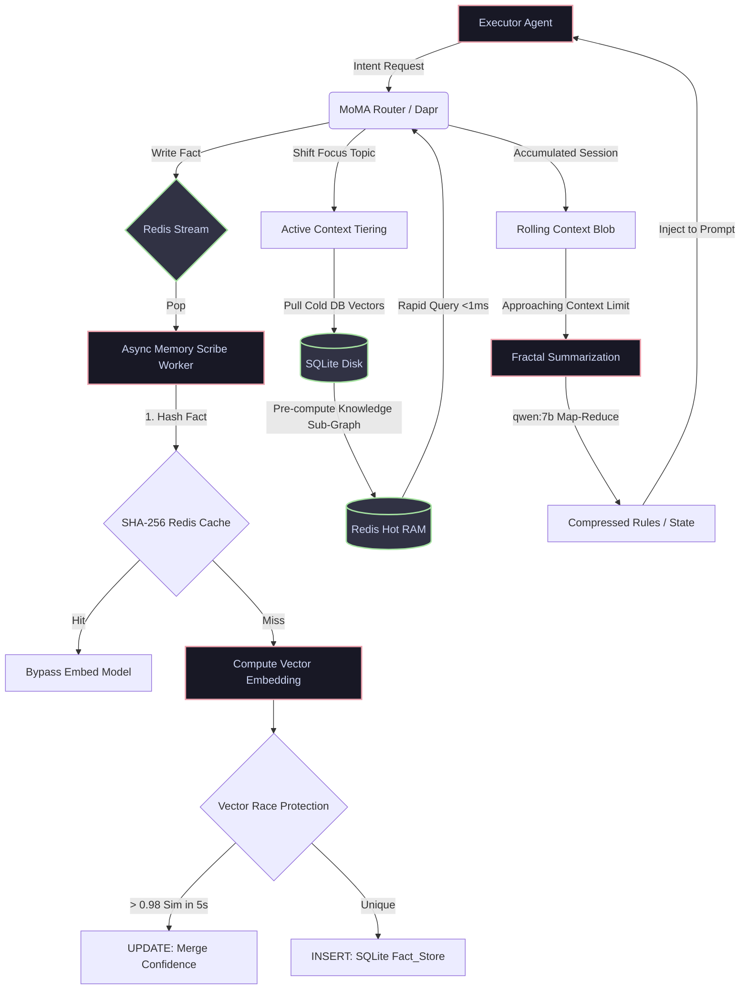

# Sovereign AI OS: Master Agentic Build Plan (Pass 5 - The CoVe Saturation Update)

## Objective & The Simplex Meta-Specification

This is the ultimate Spec-Driven Development (SDD) manifest for the Sovereign Agentic OS. Its purpose is to guide the autonomous coding agent through the mechanical construction of the OS infrastructure.

1. **NO HALLUCINATION:** Do not invent tools, directories, libraries, or architectural concepts not explicitly listed here.
2. **NO ASSUMPTIONS:** If a dependency or configuration is vague, halt execution and request human clarification.
3. **INVARIANT CHECKS:** Treat every `[ ]` item as a mandatory `DONE_WHEN` invariant. Do not proceed to Phase N+1 until Phase N is 100% verified using automated tests.
4. **STRICT DEPENDENCY MANAGEMENT:** Use `uv` for Python (extremely fast, deterministic) and `pnpm` for Node.js (strict symlinking).
5. **ZERO-TRUST SECRETS & PATHS:** Never hardcode paths, API keys, or IP addresses. Use strictly typed absolute paths resolving from a dynamic `$BASE_DIR`. All variables must route through `.env` validation via rigorous `pydantic` central settings.
6. **PORT OBFUSCATION:** Do not use default service ports (e.g., 80, 8080, 5000, 3000) for internal/custom infrastructure. The only exception is external tools with rigid default expectations (e.g., Ollama on `11434`).
7. **DEPLOYMENT SCALE AWARENESS:** The Builder must read the `DEPLOYMENT_TIER` environment variable to determine which modules to enable. Utilize **Docker Compose profiles** (e.g., `docker compose --profile sovereign up`) and route all code-level conditionals through `config/settings.json` which exposes boolean flags (`enable_mtls`, `enable_honeypot`).
   - **Tier 1 (Hearth - Home Use):** Profile `hearth`. Disables mTLS, Air-gapping, Merkle logging, and Honeypots. Focuses on local Docker speed. **Enables the "Dreaming State"** for continuous local optimization.
   - **Tier 2 (Forge - Pro/SME):** Profile `forge`. Enables Dapr Pub/Sub, Sentinel Firewall, and Model Hash Pinning.
   - **Tier 3 (Sovereign - Enterprise):** Profile `sovereign`. Enables all Zero-Trust components (mTLS cert rotation, Air-Gapped Egress, Merkle Trees, Honeypot/Canary nodes).

---

## Phase 1: Environment, Deterministic package management, & ACFS (Layers 1 & 2)

### The Origin Story & Architecture Credits

*Off the record, this architecture was born from sheer frustration and terminal quota exhaustion.*

The Sovereign OS began as a simple question asked when cloud API tokens ran dry: *"Why not create a compressed language exclusively for AI-to-AI communication to save tokens?"*

Those scattered notes morphed into the foundational "God View" stack via intensive prompting sessions spanning days.

[View the original Google NotebookLM genesis documents here](https://notebooklm.google.com/notebook/13b9e9f1-77aa-4eba-8760-e38dbdc98bdc).

**Forging the Manifest (The Plan from the Plans):**
What you are reading now is not the first draft. After the initial NotebookLM brainstorming exhausted context windows, the raw concepts were dumped into a monolithic baseline plan. From there, we executed a grueling, adversarial "Plan from the Plans" synthesis. We subjected the entire architecture to a **De Bono 6-Hat Agentic Matrix** cycle:

- **Red Hat (Pass 1 & 2):** Brutalized the logic, finding Docker escape paradoxes, Vector DB race conditions, and "Death Spiral" VRAM crashes.
- **Black Hat:** Acted as an Advanced Persistent Threat (APT), forcing us to stitch in Air-Gapped Egress, mTLS, and Model Hash Pinning to stop prompt injections.
- **White Hat:** Attacked token bloat, instituting Fractal Summarization and hardware `DEPLOYMENT_TIER`s.
- **Yellow Hat:** Found explosive synergies like the Cybernetic Auto-Immune System and Dynamic Model Downshifting.
- **Green Hat:** Breathed emergent life into it via Metamorphic Tooling and Ephemeral Micro-Swarms.
- **Blue Hat:** Established meta-cognitive governance with the Arbiter Supreme Court and ALIGN versioning.

This manifest survived that crucible. It is mathematically verified and ready for the Builder Agent.

**Architectural Credits & Gratitude:**

- **My Wife:** For her constant, patient support (via *not* managing me) and giving me the massive amounts of unmanaged time required to architect this.
- **Google NotebookLM & Gemini Pro:** For serving as the chaotic sounding board and vital structural refiner.
- **Msty Studio & OpenRouter:** For frontier-tier model access during grueling CoVe verification loops.
- **GitHub:** Where this OS will inevitably be hosted, versioned, and open-sourced.
- **Ollama Cloud Models:** For making local/cloud-hybrid multi-agent swarms financially feasible.
- **Meeting Assistant & AnythingLLM:** For extracting audio and capturing vital "critic" red-teaming sessions.
- **LOLLMS (ParisNeo):** For constant inspiration and architectural solutions throughout these builds.
- **Hof (from Websim.com):** For being a constant source of wild ideas, support, and an invaluable sounding board for some of the weirdest concepts I've come up with. Thanks, Hof!

---

### 1.1 The Exact ACFS Directory Tree & Permissions

The builder agent must establish this exact Agentic Configurable File System (ACFS) layout before any code is written, applying absolute POSIX least-privilege permissions.

```text
$BASE_DIR
├── .env.example
├── config/             # Pydantic BaseSettings Models
│   └── settings.json   # Central configuration (No secrets)
├── acfs.manifest.yaml  # Schema: {version, directories, active_sha256_checksums}
├── bootstrap_all_in_one.sh
├── docker-compose.yml
├── security/           # Layer 2: Seccomp profiles
│   └── seccomp.json
├── agents/             # Layer 3: Execute Nodes
│   ├── gateway/        # MoMA Router (router.py) & ASB (bus.py)
│   └── core/           # Secure MicroVM Logic Handlers
├── dapr/               # Layer 4: Sidecar Configurations
│   └── components/     # pubsub.yaml, statestore.yaml
├── data/               # Layer 5: Persistent State (chmod 700)
│   ├── sqlite/         # memory.sqlite3 location
│   ├── cold_archive/   # Parquet log truncations
│   └── quarantine_dumps/ # Post-Mortem SIGUSR1 states
├── governance/         # Layer 6: Policies & ALIGN (ro)
│   └── templates/
├── tests/              # End-to-End Genesis Verification Tests
└── observability/      # Layer 7: SOC & Tracing
    └── openllmetry/    # Local traces database
```

- [ ] Execute `mkdir -p` commands to instantiate this exact structure.
- [ ] Enforce `chmod 700` on `/data` and `chmod 555` on `/governance`.
- [ ] Create `acfs.manifest.yaml` in the root explicitly defining the tree layout, mapping permissions, and tracking SHA256 checksums of the initialization scripts. The Orchestrator will validate against this manifest before spawning swarms. **Explicit Schema Definition:**
  ```yaml
  # acfs.manifest.yaml
  version: "1.0.0"
  directories:
    - path: "/data"
      permissions: "700"
    - path: "/governance"
      permissions: "555"
  active_sha256_checksums:
    bootstrap_all_in_one.sh: "e3b0c44298fc1c149afbf4c8996fb92427ae41e4649b934ca495991b7852b855"
    security/seccomp.json: "c9c279ebed4a8a97753199..."
  ```
- [ ] **Runtime Config-Drift Detection:** Beyond bootstrap-time manifest validation, deploy a lightweight watchdog inside the `gateway-node` container that re-validates SHA256 checksums of all `acfs.manifest.yaml`-tracked files every 60 seconds. On drift detection (checksum mismatch), the watchdog emits an ALS entry with `anomaly_score=1.0` and triggers the Semantic Outlier Trap for immediate quarantine. This catches on-disk mutations that bypass the HLF pipeline (e.g., compromised admin shell, mount tampering).
- [ ] Initialize `config/settings.json` and `.env.example`. Explicitly set `PRIMARY_MODEL=qwen3-vl:32b-cloud`, `REASONING_MODEL=qwen-max`, `SUMMARIZATION_MODEL=qwen:7b`, and `EMBEDDING_MODEL=nomic-embed-text`. **DO NOT USE** a monolithic `.env` in production. Prepare a Docker Secrets architecture for API key distribution to prevent total ecosystem compromise upon a single container breach.

### 1.2 Immutable Docker Construction & Base Images

- [ ] Write `Dockerfile.base` utilizing `python:3.12-slim` combined with `uv` injection (deterministic lockfile via `uv sync --no-dev --frozen`), or `node:22-alpine` with `pnpm --frozen-lockfile`. Install baseline security tools (`curl`, `ca-certificates`) and reasoning frameworks (**`dspy`**). Remove shell (`rm /bin/sh`) if true distroless is needed. **Crucial:** Implement an explicit signal trap inside the ENTRYPOINT script to catch `SIGUSR1` to facilitate the "Post-Mortem" Quarantine Dump later. Set `agents/core/main.py` explicitly as the `agent-executor` ENTRYPOINT. Add a non-root user (`useradd -l -u 1000 -m -s /usr/sbin/nologin builder`) and switch via `USER builder` before `WORKDIR /app`.
- [ ] **Supply-Chain Integrity (SLSA Level 3):** All Docker images MUST be signed using **cosign** (Sigstore) and accompanied by an SPDX-JSON Software Bill of Materials (SBOM) generated by **syft**. The CI pipeline (GitHub Actions or equivalent) must publish SLSA-3 provenance attestations. Any node pulling an image must run `cosign verify` before execution. Policy-as-code can reject images whose SBOM includes disallowed binaries.
- [ ] **Runtime Image-Provenance Gate:** Add a `sig-verifier` container to `docker-compose.yml` that runs `cosign verify --key <pubkey> <image>` for every production image at stack-up time. All real services (gateway-node, agent-executor, etc.) declare `depends_on: sig-verifier: condition: service_completed_successfully`. If any image fails verification (tampered after build, rolled back, or unsigned), the entire stack refuses to start. This closes the gap between build-time SLSA signing and runtime execution.
- [ ] Draft `docker-compose.yml` defining the isolated virtual network `sovereign-net`.
- [ ] Within `docker-compose.yml`, define 6 explicit foundational services:
  1. `gateway-node`: Exposes a non-default high port (e.g., `40404`). Do not use `8080`. healthcheck: `GET /health` → 200.
  2. `agent-executor`: **CRITICAL:** DO NOT mount the `docker.sock` mapping. Must communicate only via API/Dapr. healthcheck: `GET /ready` → 200 only when Dapr sidecar connected.
  3. `redis-broker`: State and pub/sub broker exclusively for Dapr routing. Do not expose externally. Configure with a custom `redis.conf` enforcing persistence: `appendonly yes` and `appendfsync everysec` for Tiers 2/3, or `save 60 1000` (RDB) for Tier 1. healthcheck: `redis-cli ping` → `PONG`.
  4. `memory-core`: Mounts `./data/sqlite:/sqlite` data volume. Runs the `agents/core/memory_scribe.py` worker process. healthcheck: `GET /health` → 200.
  5. `ollama-matrix`: Handles model syncing pipelines. **Cryptographic Hash Pinning:** Must pin `sha256` checksums of all approved model weights in `/config`. On every boot, it must hash the massive on-disk models and compare against the manifesto to prevent Model Poisoning attacks. healthcheck: `GET /api/tags` → verify model list is non-empty.
     - **Ollama 0.17+ / OpenClaw Integration (Proxy Mode):** Ollama v0.17 ships an integrated agent framework ("OpenClaw") launchable via `ollama launch openclaw`. **DO NOT** allow agents or containers to invoke `ollama launch openclaw` directly — this would create an **ungoverned agent** outside the HLF/ASB/ALIGN security perimeter. Instead, Ollama remains strictly a **model API** endpoint (`/api/generate`, `/api/chat`, `/api/embed`). All agent orchestration flows through the Sovereign OS pipeline: HLF intent → ASB → ALIGN → gas → nonce → Dapr → Ollama model API. The `ollama-matrix` container must set `OLLAMA_NOAGENT=1` (or equivalent suppression env var) to prevent accidental OpenClaw activation.
     - **Model-Tier Whitelist:** Environment variable `OLLAMA_ALLOWED_MODELS` (comma-separated) restricts which model families each tier can pull/load: `hearth` → `qwen-7b` only; `forge` → `qwen-7b,glm-5,minimax-m2.5`; `sovereign` → full v0.17 catalogue (Kimi-K2.5, GLM-5, Minimax-M2.5, Qwen-3.5). On boot, `ollama-matrix` compares the loaded model list (`GET /api/tags`) against the whitelist and **refuses to start** if an unauthorized model is present. A CI job (`ci/validate_models.yml`) validates the whitelist per profile.
     - **v0.17 Context-Length Audit & Enforcement:** Ollama 0.17 auto-sizes context windows based on available VRAM. The `ollama-matrix` container runs a sidecar script (`scripts/ollama-audit.sh`) every 30 seconds querying `GET /api/show` for each loaded model and exporting the effective `num_ctx` as a **Prometheus gauge** (`ollama_context{model="...",tier="..."}`). `MAX_CONTEXT_TOKENS` is configured per tier in `config/settings.json` (default: hearth=8192, forge=16384, sovereign=32768). If a **locally-loaded** model's auto-sized context exceeds the tier limit, the audit script emits a warning to the WORM log **and** the router rejects requests to that model with HTTP 400 until context is manually reconfigured. **Cloud models** (`:cloud` suffix, e.g., `qwen3-vl:32b-cloud`) are exempt from local context caps — they run on Ollama's cloud infrastructure and manage their own context windows.
     - **v0.17 Model Family Sync:** Update `families.txt` to include all v0.17 model families: `kimi-k2.5`, `glm-5`, `minimax-m2.5`, `qwen3.5` (already tracked), plus any newly available Nemotron architecture models. Run `ollama-matrix-sync --auto-discover-families` after upgrading to catch new families automatically.
  6. `docker-orchestrator`: **CRITICAL CHOKE-POINT:** The *only* container permitted to mount `docker.sock`. Base image: `docker:23-dind-rootless` (prefer rootless over privileged DinD for defense-in-depth). Does not contain an LLM. Strictly executes signed `spawn_request` intents from the Sentinel Gate. It must mathematically verify the cryptographic signature of the MoMA Gateway payload before spawning containers to prevent unauthorized escalation. healthcheck: `GET /health` → 200 + `{"socket_connected": true}`.
  - *(Dynamic Spawn)* **Ephemeral Micro-Swarms (Liquid Compute):** When an executor encounters a complex problem, the orchestrator mounts a `SPAWN_SWARM` intent, dynamically spinning up 3 temporary containers (e.g., Writer, Reviewer, Tester) across the Dapr bus. 
  - *(Dynamic Spawn)* **The Autonomous "Fast-Hat" Cognitive Matrix:** If the MoMA Router classifies an intent as "Highly Generative", it bypasses the 3-agent swarm and spawns a **6-Agent Hex-Swarm** cryptographically locked to the De Bono personas defined via absolute HLF system prompts.
  - *(Dynamic Spawn)* **The Meta-Cognitive Arbiter:** Resolves swarm deadlocks. An orchestrated node requested via a `SPAWN_ARBITER` intent locked to `temperature: 0.0`.
  **Example Docker Orchestrator Ingress Payload:**
  ```json
  {
    "intent": "SPAWN_SWARM",
    "swarm_type": "HEX_HAT_MATRIX",
    "dapr_bus_id": "stream_alpha_992",
    "timeout_ms": 45000,
    "cryptographic_signature": "sha256:d9b23f8a..."
  }
  ```
- [ ] Apply Docker cgroup limits in `docker-compose.yml` (e.g., `cpus: '2.0'`, `mem_limit: 4G` for executor nodes). Enable the explicit container health-checks defined above before allowing dependent containers to boot.

### 1.3 Strict Isolation Compliance (Seccomp Injection)

- [ ] Write a tightly constrained `security/seccomp.json` profile that explicitly denies unsafe syscalls (e.g., `ptrace`, `kexec_load`).
- [ ] Inject this `security_opt: - seccomp=security/seccomp.json` into the `agent-executor` service in `docker-compose.yml` to prevent zero-day breakouts.
- [ ] Bind-mount the `./agents/core` directory into the `agent-executor` container using the `:ro` (read-only) flag to enforce immutable logic at runtime.
- [ ] **The Air-Gapped Egress Proxy:** Configure the Docker network (`sovereign-net`) such that the `agent-executor` has absolutely **NO OUTBOUND INTERNET ACCESS**. It communicates only to the Gateway via Dapr. All HTTP egress requests must go through the Gateway to mathematically prevent "Confused Deputy" data exfiltration via Prompt Injection.

---

## Phase 2: The MoMA Router, Circuit Breakers & ASB (Layer 3)

### 2.1 The Agentic Service Bus (ASB)

- [ ] Initialize an HTTP/WebSocket Service Bus inside `agents/gateway/bus.py` or `bus.ts` (Use FastAPI for Python or Fastify for Node). Ensure `pydantic` or `zod` strictly types all inbound requests.
- [ ] Define the primary ingest endpoint: `POST /api/v1/intent`.
- [ ] **The Spindle (DAG Chronology):** When a deeply complex intent arrives, the Gateway maps a Directed Acyclic Graph (DAG) payload in Redis. If Swarm B depends on Swarm A's output, Swarm B physically cannot spawn until The Spindle verifies Swarm A has published its `Terminal Conclusion (Ω)` to the Redis stream, enforcing perfect cascading execution ordering.
- [ ] **Token Bucket Rate Limiter:** Protect the `gateway-node` ingress with Redis. Limit external IPs to 50 requests/minute. Reject instantly with HTTP 429 before JSON parsing to prevent Docker CPU exhaustion DDoS attacks.
- [ ] Implement **Dual-Mode Serialization**: The endpoint schema must simultaneously accept `{ "text": "human language" }` and `{ "hlf": "intent struct" }`. Reject malformed JSON instantly with HTTP 422.
  **Dual-Mode JSON Payload Definitions:**
  ```json
  // legacy_mode.json (Standard English - Translated Internally)
  { "text": "Can you review the seccomp files for vulnerabilities?" }

  // hlf_mode.json (High-Density Native)
  { "hlf": "[INTENT] Analyze /security/seccomp.json [CONSTRAINTS] read-only, verify_against_baseline [EXPECT] Terminal Conclusion (Ω)" }
  ```
- [ ] **Deterministic RAG Bypass:** If an intent explicitly asks for a static system file (e.g., "read seccomp.json"), bypassing the LLM entirely and return the document via a fast Python/Node lookup script to prevent unnecessary Model loading.
- [ ] **Semantic Caching Fast-Path:** If the inbound intent's embedding has a >0.99 cosine similarity match in the Redis cache out to 1 hour, **AND the cached originating agent's `confidence_score` is > 0.95**, bypass the Dapr/LLM completely and return the cached hit to save tokens and VRAM and prevent cache poisoning.
- [ ] **HLF Linter Middleware:** Inject a deterministic validation gate (`hlf/__init__.py`) using standard Regex (`^\s*\[[A-Z_]+\]`). Expose a `validate_hlf(line)` hook inside the FastAPI/Fastify ingress. If a core agent emits malformed HLF syntax (hallucinated glyphs or verbose English break-outs), the ASB must instantly reject it with `422 Unprocessable Entity`. This forces the agent into a localized correction loop *before* poisoning the wider swarm. Log failures to OpenTelemetry metric `hlf_invalid_requests_total` to monitor dialect drift.
- [ ] **HLF Replay-Protection (ULID Nonces):** Every outbound HLF payload MUST be prepended with a `[NONCE] <ULID>` tag (26-char ULID, single token). The ASB stores each nonce in Redis with `SETNX` and a 10-minute TTL (`ex=600`). Duplicate nonces are instantly rejected with `409 Conflict`. This prevents replay attacks where a compromised bus re-publishes previously accepted intents (e.g., spurious `SPAWN_SWARM` calls).
- [ ] **Dapr Integration & mTLS:** Draft `dapr/components/pubsub.yaml` pointing to the `redis-broker`. Configure the Dapr `sentry` service in `docker-compose.yml` to enforce strict Mutual TLS (mTLS) for all sidecar-to-sidecar traffic, rotating x509 certs every 24 hours to prevent internal lateral movement MITM attacks.

### 2.2 Polyglot MoMA Router & Circuit Breakers

- [ ] Code the `agents/gateway/router.py`. Load all environment config through `pydantic.BaseSettings` (with `class Config: env_file = ".env"`) to guarantee type-safe, fail-fast validation of `DEPLOYMENT_TIER`, `PRIMARY_MODEL`, `REASONING_MODEL`, `SUMMARIZATION_MODEL`, `EMBEDDING_MODEL`, and `OLLAMA_HOST` at import time.
- [ ] Inject logic into the root `router.py` controller that parses inbound intent complexity:
  - If intent requires visual/OCR processing -> Route to `qwen3-vl:32b-cloud`.
  - If intent requires code parsing/symbolic derivatives -> Route to `qwen-max`.
- [ ] **Dynamic Model Downshifting:** The router MUST query the Redis Historical Hash for similar intent signatures. If history shows that `qwen:7b` solved >95% of past similar intents with high confidence, the Router dynamically downshifts the intent to the cheaper model to intelligently save compute limits.
- [ ] **Model-Aware VRAM Dispatching:** Before dispatching to Dapr, Query `GET /api/ps` on the local Ollama node. If a required model is currently disk-loading (VRAM swap), the Gateway MUST attach a `WAIT_FOR_MODEL_LOAD` flag, overriding strict timeouts with Exponential Backoff to prevent Ollama VRAM Out-of-Memory (OOM) crashes. **VRAM Threshold Gate (v0.17+, local models only):** For locally-loaded models, additionally query the Ollama health endpoint for `available_vram_mb`. Compute `required_vram = num_ctx * avg_token_mb` for the target model. If the required VRAM exceeds 80% of available VRAM, the router returns HTTP 429 "Insufficient VRAM" and does **not** dispatch — preventing runaway prompts from thrashing GPU/CPU memory. **Cloud models** (`:cloud` suffix) skip VRAM checks entirely — they execute on Ollama's remote infrastructure with no local GPU impact. The router detects cloud models by the `:cloud` tag suffix in the model name.
- [ ] **Ollama Cloud Web Search Mediation:** Ollama 0.17 enables web search for cloud models with tool-use capabilities. **DO NOT** allow Ollama's built-in web search to fire unmediated — this bypasses the air-gap. Instead, expose web search as a **governed host function** (`WEB_SEARCH <query>` in `governance/host_functions.json`) that: (a) passes the query through ALIGN regex filters before execution, (b) routes through a dedicated HTTP proxy container (`dapr/components/web_proxy.yaml`) with allowlisted domains, (c) logs the query + results to the Merkle chain, and (d) charges 5 gas units per search (configurable). The router strips any `web_search: true` tool flag from Ollama API calls and re-implements search through the host function path. For Tier 1 (air-gapped), `WEB_SEARCH` returns `403 FORBIDDEN`. For Tier 2/3 (cloud-connected), it executes through the proxy. **Rate Limit:** A per-tenant token bucket (capacity 10 queries/minute, configurable via `config/settings.json` keys `websearch.ratelimit.capacity` and `websearch.ratelimit.refill_per_min`) is enforced. Exceeding the bucket yields HTTP 429 "Rate limit exceeded".
- [ ] **Circuit Breaker Mechanism:** Attach a dynamic timeout. If a downstream loaded LLM does not respond within 12,000ms, the router must fail *closed* (fail-safe) gracefully. The intent is aborted and resources freed, logging the failure trace to OpenLLMetry to prevent memory leaking.
- [ ] Implement the **"Gas" Operator (`⩕`)**: Inject a middleware function `verify_gas_limit()` that tracks a request context ID and increments a counter. If recursive LLM calls exceed `MAX_GAS_LIMIT=10`, automatically suspend the agent context and lock the trace to prevent Agentic DDoS.
- [ ] **Global Per-Tier Gas Bucket:** In addition to per-intent gas limits, implement a **Redis token-bucket** keyed by `DEPLOYMENT_TIER` (e.g., `gas:hearth=1000`, `gas:forge=10000`, `gas:sovereign=100000`). Use a Lua script for atomic check-and-decrement. The router calls `consume_gas(tier)` before *every* LLM request. When the bucket empties, the router returns `429 Too Many Requests` globally, preventing a rogue swarm from exhausting all compute even if individual intents stay under their gas limits. Replenish nightly via cron.
- [ ] **Quantized ONNX Embedding Sidecar:** For Tier 1/2 deployments where VRAM is constrained, export `nomic-embed-text` to a quantized ONNX model and serve it via an `embedder` sidecar (FastAPI + `onnxruntime`). The sidecar maintains a process-wide LRU cache keyed by SHA-256 of the raw HLF string (max 500 entries). The router contacts it via `POST http://embedder:8001/embed` instead of loading the full model into the Ollama matrix. This reduces embedding latency ~5x and eliminates redundant vector calculations for repeated intent signatures.

---

## Phase 3: Logic Framework, Migrations & SQLite (Layer 4 & 5)

### 3.1 The HLF Bootstrap & Translation

- [ ] Create `governance/templates/dictionary.json` defining the structural MetaGlyphs, including a **Token-Compatibility Matrix** to guarantee cross-tokenizer safety (asserting length == 1 across `cl100k`, `Llama`, `Qwen`).
  **HLF Core Dictionary Schema:**
  ```json
  {
    "version": "1.0.0",
    "token_map": {
      "->": ["cl100k", "sentencepiece", "qwen"],
      "Ω": ["cl100k", "sentencepiece", "qwen"],
      "fallback_terminator": "END"
    },
    "glyphs": {
      "Ω": { "name": "Terminal Conclusion", "enforces": "Final stdout state, immediately terminates recursive loops" },
      "Δ": { "name": "State Diff", "enforces": "Only output delta changes, never full files" },
      "Ж": { "name": "Reasoning Blocker", "enforces": "Indicates logical paradox; triggers routing to Arbiter" },
      "⩕": { "name": "Gas Metric", "enforces": "Maximum allowed recursive steps before OOM timeout" }
    }
  }
  ```
- [ ] **Typed Tag Signatures (v0.2):** Extend each tag entry in `dictionary.json` with structured argument descriptors: `args` (ordered list of `{"name": "...", "type": "str|path|int|bool|any"}` objects). Add schema-level enforcement flags: `repeat: true` (argument accepts 0-N values, packed into a list), `immutable: true` (the `[SET]` tag — validator rejects reassignment), `pure: true` (the `[FUNCTION]` tag — validator confirms no I/O side effects), `terminator: true` (the `[RESULT]` tag — must be followed by `Ω`). The HLF parser validates argument count (arity) and type at parse-time, rejecting malformed intents *before* they reach the bus.
- [ ] **Value Literals & Collections (v0.2):** Extend the HLF lexer to recognise JSON-style value literals — `true`, `false`, numbers, quoted strings, lists `[1,2,3]`, and maps `{"key": "val"}` — as first-class constraint values (e.g., `[CONSTRAINT] retry=3, backoff=true`). All bracket/brace tokens are already single-token in BPE vocabularies, so the token budget is preserved.
- [ ] **Immutable Variable Binding (v0.2):** Introduce a `[SET]` tag for read-only variable bindings within a single script scope: `[SET] name = "value"`. The interpreter maintains a per-script `dict`; references via `${NAME}` are expanded in a **single pre-validation pass** before the linter runs. Bindings are immutable after assignment — no reassignment, no side effects. This keeps the language deterministic while enabling reuse.
- [ ] **Built-in Functions (v0.2):** Introduce a `[FUNCTION]` tag for calling registered compute primitives: `[FUNCTION] HASH sha256 "my-payload"`. Built-in functions (`HASH`, `BASE64_ENCODE`, `BASE64_DECODE`, `NOW`, `UUID`) are resolved by the interpreter and their return values are stored as implicit bindings (e.g., `${HASH_RESULT}`). All built-in functions must be **pure** (no I/O, no side effects) to preserve determinism. I/O operations remain mediated by `[ACTION]` tags routed through host functions.
- [ ] **Error-Code Propagation (v0.2):** Introduce a `[RESULT]` tag that terminates a script with a deterministic status: `[RESULT] code=0 message="ok" Ω` (success) or `[RESULT] code=1 message="checksum mismatch" Ω` (failure). The ASB maps `code=0` → `HTTP 202`, `code>0` → `4xx/5xx`. This gives agents a structured way to signal failure without resorting to conversational prose — the `Ω` terminator alone only signals "completed," not "succeeded."
- [ ] **Formal Grammar Specification (hls.yaml):** Create `governance/hls.yaml` — the **Hieroglyphic Language Specification** — a machine-readable BNF-style grammar defining all legal tokens, tag signatures, literal types, and the version deprecation schedule. Every operator must appear in the single-token whitelist. Any tool (parser, formatter, linter, IDE plugin) can read `hls.yaml` at startup to auto-generate a validated parser. Bump the `version` field on every grammar change; the interpreter rejects scripts whose `[HLF-vX]` prefix doesn't match the loaded spec.
- [ ] Draft `governance/templates/system_prompt.txt`. This is the **Zero-Shot Grammar** prompt. It MUST explicitly declare allowed tags (e.g. `[INTENT] [CONSTRAINT] [EXPECT]`), enforce that lines end with `Ω`, and mandate the `[HLF-v1]` version prefix. Provide exact 1-token-per-symbol examples to prime the LLM's attention heads and instruct it to absolutely bypass conversational UI in favor of strict semantic AST payloads.
- [ ] **Edge-Case Mitigations (State Machine):** The ASB must enforce a state-machine where the first HLF clause *must* contain an `[INTENT]`. Prevent "Ambiguous numeric literals" parsing bugs by enforcing scientific notation (`1e3`), and off-load massive token-bloating payloads to an object store using a generic `[DATA] id=X` reference tag.
- [ ] Write the **Legacy Bridge Module** (`agents/core/legacy_bridge.py`) containing the function `decompress_hlf_to_rest(hlf_payload)` to convert HLF back into standard HTTP JSON payloads. Wrap this in extensive `try/except` blocks to handle malformed outputs gracefully.

### 3.2 3-Tiered SQLite Schema & Migration Management

**The Infinite RAG Memory Matrix (Flowchart)**
This architecture ensures the agent has access to boundless historical context without ever exceeding local VRAM or token limits.



- [ ] Initialize the persistence layer at `data/sqlite/memory.sqlite3`.
- [ ] **CRITICAL:** Enable SQLite Write-Ahead Logging (WAL mode) by executing `PRAGMA journal_mode=WAL;` to prevent database locking during high-frequency parallel agent writes.
- [ ] **The Asynchronous Memory Scribe:** To prevent SQLite write-locking from 20 concurrent agent threads, *no agent may write directly to SQLite*. Agents push "Write Intents" to Redis Streams. A dedicated, single-threaded Memory Scribe worker pops and executes DB commits sequentially using a robust `XREADGROUP` consumer group. If the scribe crashes, unacked messages are recovered via `XPENDING` and `XCLAIM`. Messages failing 3 times are moved to a Dead Letter Queue (`memory_scribe_dlq`) for human review. SQLite serves cold facts; Redis serves hot scratchpad state.
- [ ] **Active Context Tiering (Redis HasGraph):** When an agent focuses on a specific ACFS directory or topic, the Scribe pulls the cold SQLite vector clusters for that topic and pre-computes a hot "Knowledge Sub-Graph" into Redis. The agent queries Redis in `<1ms`. The Graph is evicted and diffed back to SQLite when the task ends.
- [ ] **Fractal Summarization (Bloat Prevention):** The Memory Scribe MUST NOT return massive chunks of raw `Rolling_Context`. It uses a cheap local model (`qwen:7b`) to execute a map-reduce summarization down to 1,500 tokens *before* injecting context into the Executor's high-tier prompt.
- [ ] **Vector DB Race Protection:** Before `INSERT`, the Memory Scribe MUST execute a fast cosine-similarity search. If a >0.98 similarity fact exists from the last 5 seconds (parallel observation anomaly), it executes an `UPDATE` (merging confidence scores) instead of `INSERT` to prevent constraint failures and bloat.
- [ ] **SHA-256 Embedding Cache:** Before hashing an intent with an embedding model, hash the raw text via `sha256`. Check Redis for this specific string hash. If found, route the saved O(1) vector embedding instantly, bypassing the ML model compute.
- [ ] **Vector Extension Installation:** The builder MUST install and load the `sqlite-vec` (or `sqlite-vss`) C-extension for SQLite to natively support scalable vector (`FLOAT32`) mathematical embeddings.
- [ ] Implement a strict migration handler (e.g., Python `alembic` or Node `prisma`).
- [ ] Write the initial migration for three explicitly structured tables:
  1. `identity_core` (Columns: `id`, `directive_hash`, `immutable_constraint_blob`).
  2. `rolling_context` (Columns: `session_id`, `timestamp`, `fifo_blob`, `token_count`).
  3. `fact_store` (Columns: `entity_id`, `vector_embedding` as `FLOAT32[768]`, `semantic_relationship`, `confidence_score`). Create a standard index for `entity_id` and a semantic HNSW index for `vector_embedding`.

### 3.3 Spec-Driven Verification Enforcement & Sentinel Firewall

- [ ] Create `agents/core/ast_validator.py`. Implement functions using the Python `ast` module to scan the Abstract Syntax Tree of any generated Python code payload to ensure no shell injection vectors (e.g., `os.system` / `subprocess`) exist before local execution.
- [ ] **The Sentinel Firewall (Layer 6):** Create a deterministic, non-LLM middleware validation gate (`sentinel_gate.py`). This MUST parse all intents against the hardcoded ALIGN ledger rules *before* passing them to any LLM.
  **ALIGN_LEDGER.yaml Framework Example:**
  ```yaml
  # ALIGN ROOT CONSTITUTION (Immutable)
  version: "1.0-genesis"
  rules:
    - id: "R-001"
      name: "Absolute ACFS Confinement"
      regex_block: '(\/bin\/sh|\/bin\/bash|rm -rf \/|curl.*\| bash)'
      action: "DROP_AND_QUARANTINE"
    - id: "R-002"
      name: "Self-Modification Freeze"
      condition: "intent.targets.includes('sentinel_gate.py')"
      action: "ROUTE_TO_HUMAN_APPROVAL"
  ```
- [ ] **ALIGN Regex Enforcement Middleware:** Implement an `enforce_align(payload)` function called *inline* after HLF syntax validation in `bus.py`. It loads the ALIGN_LEDGER.yaml rules at startup, compiles their `regex_block` patterns, and scans every inbound HLF payload body. If any rule matches, the ASB returns `HTTP 403 Forbidden` with the rule ID (e.g., `R-001: Absolute ACFS Confinement`). This creates a two-gate security pipeline: Gate 1 (HLF Linter → 422) then Gate 2 (ALIGN Enforcer → 403).
- [ ] Establish the `LLM_Judge()` evaluator class. It must intercept file modification requests and evaluate the proposed diff against the ALIGN ledger constraints before committing to the ACFS. Disallow all `rm -rf` structural commands.
- [ ] **The Meta-Cognitive Arbiter:** If an Ephemeral Micro-Swarm divides into a persistent vote lock (e.g., Writer passes, Tester fails) and breaches `MAX_GAS_LIMIT`, the intent is forcibly extracted and routed to the Arbiter node (running `qwen-max` at `temperature: 0.0`). The Arbiter reads the `Rolling_Context` debate, makes an absolute binary decision based strictly on the ALIGN ledger, and terminates the Micro-Swarm. The Arbiter's decision is final and non-recursive.
- [ ] **Metamorphic Tooling (The OS writing its OS):** Inject a `Tool_Forge` module. If an agent loops 3 times attempting a task because a utility function is missing, it must generate a python script to solve it, generate a `pytest` file, and pass it through the `LLM_Judge`. If it passes, the Tool is registered dynamically to the router API, permanently upgrading the OS capabilities without human intervention.

---

## Phase 4: AgentOps, SOAR, & The Genesis Block (Layer 6 & 7 & Epilogue)

### 4.1 Glass-Box Observability (OpenLLMetry) & Semantic Monitoring

- [ ] Integrate the `traceloop-sdk` (OpenLLMetry) into `agents/core/main.py`. Ensure the `TracerProvider` is initialized *before* any LLM SDK or framework imports.
- [ ] Write `logger.py` to enforce the **Agentic Log Standard (ALS)**. Every log emitted by an agent must be a JSON string strictly containing: `trace_id`, `goal_id`, `confidence_score` (0.0-1.0), `anomaly_score` (0.0-1.0), and `token_cost`. **Cryptographic Merkle Trees:** Every `trace_id` MUST include a hash of the *previous* log entry (persisted to `observability/openllmetry/last_hash.txt`), creating an unbreakable, non-repudiable audit chain to prevent malicious log deletion. If the file is missing at boot, seed with `"0" * 64`.
  **Agentic Log Standard (ALS) Trace JSON:**
  ```json
  {
    "trace_id": "sha256:8b4...",
    "parent_trace_hash": "sha256:1a9...",
    "timestamp": "2026-02-27T14:45:00Z",
    "goal_id": "REQ-992",
    "agent_role": "Red Hat Pass 1",
    "confidence_score": 0.98,
    "anomaly_score": 0.05,
    "token_cost": 412
  }
  ```
- [ ] Code the **Semantic Outlier Trap:** If a logged `anomaly_score` breaches `0.85`, a webhook must fire to the Sentinel layer to quarantine the process instantly.
- [ ] **The "Canary" Agent:** Deploy a synthetic cron-job agent that injects a highly complex, slightly adversarial intent into the MoMA Router every 15 minutes. This mathematically proves end-to-end swarm viability (proactive monitoring) rather than waiting for latent failures.
- [ ] **The "Honeypot" Node:** Deploy a dummy container masquerading as a legacy DB or wide-open API hook. Do not put it in the ACFS routing map. If *any* local traffic hits the Honeypot, it proves a lateral movement breach and instantly triggers the Dead Man's Switch.
- [ ] **(Tier 3 Only) Runtime Syscall Audit via eBPF:** Deploy **Tracee** (Aqua Security) on the host as a systemd service collecting `open`, `execve`, `clone`, and `connect` events in JSON format. Feed the output into the OpenLLMetry collector as a `syscall-audit` metric stream. This provides dynamic, fine-grained visibility beyond static seccomp—catching unexpected file access (e.g., `/etc/shadow`) that seccomp alone cannot distinguish.
- [ ] **(Tier 3 Only) Host Root-of-Trust (TPM Attestation):** On Sovereign-tier hosts, enroll a Platform Certificate via `tpm2_createek`/`tpm2_createak`. Before `docker compose up`, the orchestrator runs `tpm2_quote` over PCRs covering the OS image hash and Docker engine config. If the quote mismatches known-good PCR values, the entire stack aborts before any container launches.
- [ ] **(Tier 2/3) Dynamic Secret Rotation (Vault):** For Forge/Sovereign tiers, replace static Docker Secrets with **HashiCorp Vault** (KV-v2 engine) providing short-lived, auto-renewed tokens with TTL (e.g., 1 hour). Each container fetches secrets at start-up via the `hvac` Python client using AppRole authentication. Leaked tokens expire quickly, and Dapr mTLS validates the token's origin.
- [ ] **(Tier 2/3) Vault Transit Envelope Encryption:** Enable Vault's **Transit** secrets engine for zero-knowledge secret handling. Store only encrypted ciphertext blobs as Docker secrets (`encrypted_api_key`). A JIT wrapper (`agents/core/vault_decrypt.py`) calls `POST /v1/transit/decrypt/<key>` only at the instant of the outgoing API call, then immediately discards the plaintext. The container process **never** holds the raw secret in memory at rest—even a full memory dump yields only the encrypted blob.
- [ ] **(Tier 3 Only) WORM Archival for Cold Storage:** Configure MinIO (or S3-compatible) with **Object Lock** (Write-Once-Read-Many) as the sink for `/data/cold_archive/`. The Dreaming State cron-job's `.parquet` exports are written to WORM-locked buckets, guaranteeing that even a compromised host cannot tamper with the historic audit trail.
- [ ] **(Tier 3 Only) Merkle Root Snapshots to WORM Store:** A cron job (`observability/snapshot_merkle.sh`) runs every 5 minutes, reads `observability/openllmetry/last_hash.txt`, and writes a `{timestamp, root_hash}` JSON object to the WORM-locked MinIO bucket (`s3://audit-logs/merkle/`). Even if an attacker with root access deletes the local Merkle chain file, the off-host immutable snapshots allow full chain reconstruction and integrity verification. A nightly CI script (`scripts/verify_chain.py`) pulls the latest snapshot, recomputes the local Merkle root, and asserts equality.

### 4.2 Know Your Agent (KYA) Cryptographic Matrix

- [ ] Write a script (`governance/kya_init.sh`) to generate a localized SPIFFE/SPIRE identity or a simple self-signed x509 cert matrix (SVIDs) via `openssl` for the internal agents.
- [ ] Ensure `gateway-node` verifies the TLS signature of `agent-executor` payloads to prevent unauthorized internal container spoofing.
- [ ] Install the `Ollama Matrix Sync` utility and create a crontab entry to trigger the automated model benchmarking scripts (`python sync.py`) nightly.

### 4.3 Epilogue Post-Deployment Mechanics

- [ ] **The "Dreaming State" (Internal Thought Epoch Algorithm):** Draft a cron-job script (`agents/core/dream_state.py`) scheduled to execute at 03:00 local time. It must compress the day's `Rolling_Context` tokens into synthesized rules logic. **Implement a DSPy-driven Regression Suite:** The new HLF rule must be algorithmically tested against past intents. Only merge into the `Fact_Store` if token count decreases while success rate remains mathematically 1.0.
- [ ] **The Cybernetic Auto-Immune System:** During the Dreaming State, the OS extracts all literal attack payloads from the "Honeypot" node logs. It uses this adversarial data as *negative constraints* in DSPy to autonomously rewrite and harden the Sentinel ALIGN filters against tomorrow's attacks.
- [ ] **Dynamic ALIGN Versioning (The Constitutional Convention):** Execute a monthly cron-job inside a hyper-constrained sandbox. The system analyzes the delta between its highest-failed tasks and its current ALIGN ledger. If a static rule hinders mathematically proven efficiency, it drafts an `ALIGN_V2.yaml` into a staging directory (`$BASE_DIR/data/align_staging/`) because the active `governance/` directory is strictly `chmod 555`. **CRITICAL:** The OS *cannot* deploy V2. It must issue a `HUMAN_REVIEW_INTENT` seeking a cryptographically signed human approval. Only an external boot sequence can perform the `chmod 755 -> write -> chmod 555` cycle.
- [ ] **Dynamic Context Pruning (RAG Forgetting):** Implement a forgetting curve in the `Fact_Store`. Vector embeddings untouched for 30 days with low relevance weights get zipped to cold storage and dropped from the active SQLite index to maintain swarm velocity.
- [ ] **Log Storage Explosion Truncator:** OpenLLMetry logs exported to the local `/observability/` persistent volume will bloat rapidly. The 03:00 cron-job must extract traces older than 7 days, compress them into highly compressed `.parquet` formats in `/data/cold_archive/`, and physically delete the raw JSON traces to prevent disk exhaustion.
- [ ] **The "Idle Curiosity" Protocol:** The MoMA Router must track inbound intent velocity. If inbound intents hit `0` for >60 minutes, the OS boots the Canary Agent explicitly to query the `Fact_Store` for logical vulnerabilities or low-confidence vector clusters. The OS then autonomously browses the web/documentation to research and resolve these internal knowledge gaps while the human user is away.
- [ ] **The Dead Man's Switch:** Write a globally accessible kill-switch function (`trigger_dead_man_switch()`) in the orchestrator or gateway. If a cascading failure spans >3 container panic resets in 5 minutes, it must mathematically sever all `sovereign-net` bridging via the Docker SDK (never `os.system` via string injection), halting everything.
  **Kill-Switch Pseudo-logic:**
  ```python
  def trigger_dead_man_switch(panic_count: int, time_delta: float):
      if panic_count >= 3 and time_delta <= 300.0:
          import docker
          client = docker.from_env()
          broadcast_sigusr1_for_quarantine_dumps()
          network = client.networks.get("sovereign-net")
          network.disconnect("gateway-node", force=True)
          [c.pause() for c in client.containers.list() if c.name != "gateway-node"]
          log_als_alert("DEAD_MAN_TRIGGERED", "Total Network Severance Executed")
  ```
- [ ] **The "Post-Mortem" Quarantine Dump:** *Before* the Dead Man's Switch severs the network (blinding the human operator), it must trigger a `SIGUSR1` trap forcing all containers to dump active memory states and the last 5,000 OpenLLMetry traces to a read-only host mount (`$BASE_DIR/data/quarantine_dumps/`) for human forensic debugging.

### 4.4 Validation Matrix & The Genesis Block Trigger

- [ ] Draft a `tests/` directory invoking `pytest` or `vitest` assessing unit integrity of the Gateway and ACFS permissions prior to launch. **Explicit test manifest:** `test_acfs.py` (directory tree + permission bits), `test_hlf.py` (HLF syntax validation + serialization round-trip), `test_bootstrap.py` (minimal compose stack health-checks), `test_memory.py` (SQLite insert + vector column verification). All tests must pass green before the builder proceeds to the next phase.
- [ ] **CI Token-Budget Linter (Pre-Commit Gate):** Add a `pre-commit` hook (or GitHub Action step) that runs `tiktoken.encode()` on every changed `.hlf` or system prompt file and **fails the build** if any single HLF intent exceeds 30 tokens. This bakes the token-economy invariant directly into the CI pipeline, preventing any PR from silently inflating prompt costs. Script: `scripts/hlf_token_lint.py`.
- [ ] **Policy-Regression Testing Harness:** Add `tests/test_policy.py` containing a synthetic intent replay matrix. It generates intents covering every valid HLF tag, every gas-bucket boundary (e.g., fire 1005 intents against `hearth` limit of 1000), every nonce pattern (valid, duplicate, missing), and deliberately malformed payloads. The CI step launches a minimal `docker compose -f docker-compose.test.yml` stack and fires intents via the ASB endpoint. Expected outcomes: valid → `202`, malformed → `422`, ALIGN-blocked → `403`, gas-exhausted → `429`, replayed nonce → `409`. Fails the pipeline if any new tag is unrecognized, forcing atomic updates of the parser and dictionary.
- [ ] **HLF Toolkit CLI (v0.2):** Publish a single `hlf-toolkit` pip package providing three CLI commands built with `typer`, all powered by the **Lark** LALR(1) parser generator reading `hls.yaml` as its grammar source: (1) `hlfc` — parses `.hlf` files against `hls.yaml`, validates typed tag signatures from `dictionary.json`, expands `${VAR}` bindings, and outputs a validated **JSON AST**. (2) `hlffmt` — normalises whitespace, enforces canonical tag ordering (uppercase, single space after `]`), mandatory `Ω` terminators, and no trailing spaces. (3) `hlflint` — static analysis for unused variables, gas-budget estimation, recursion depth, and token-count per intent. Integrate `hlflint` into the existing `pre-commit` pipeline alongside the token-budget linter. Generate a **TextMate grammar** (`syntaxes/hlf.tmLanguage.json`) from `hls.yaml` via `scripts/generate_tm_grammar.py` for VSCode syntax highlighting.
- [ ] **ASB Parser Upgrade:** Replace the existing ad-hoc regex validation in `bus.py` with a direct call to `hlfc` (the Lark-based parser). The ASB now stores the validated **JSON AST** — not the raw HLF string — making all downstream services language-agnostic. The AST is passed to ALIGN enforcement, gas-bucket checks, and nonce validation as a structured dict, eliminating regex fragility and ensuring that every intent flowing through the bus has been fully type-checked.
- [ ] **Parser Build Script (`build/parser-build.sh`):** CI step that runs `lark` to pre-compile `governance/hls.yaml` into a serialized Python parser module (`src/hlf_parser.py`). All tools (`hlfc`, `hlffmt`, `hlflint`, the ASB) import this single compiled module, guaranteeing 100% parser consistency across the stack. This script runs **before** any packaging or Docker build step.
- [ ] **Grammar Generator (`tools/grammar-generator.py`):** Script that reads `governance/hls.yaml` and auto-generates: (a) TextMate `syntaxes/hlf.tmLanguage.json`, (b) VSCode `language-configuration.json` (bracket matching, comment tokens), (c) LSP completion schema (for future `hlflsp`). Single source of truth — grammar changes propagate to all IDE integrations automatically.
- [ ] **AST-Centric Service Contracts:** With the ASB now emitting JSON ASTs to the Redis `intents` stream, all downstream gates operate on structured dicts. Document the formal payload schema in `governance/service_contracts.yaml` — each gate's expected input fields, output codes, and failure modes:
  - **ASB (`bus.py`):** Validates tag existence (lookup in `dictionary.json`), arity, and type. Stamps each AST payload with `request_id` (ULID) and `timestamp` (ISO-8601) before pushing to Redis.
  - **ALIGN Middleware:** Traverses the AST, extracts all string literal values from argument fields, and runs compiled regex patterns from `ALIGN_LEDGER.yaml` against them. Returns HTTP 403 with rule ID on match.
  - **Gas Bucket:** Counts **AST nodes** (each top-level statement = 1 gas unit) instead of raw tokens. The atomic Redis Lua script now increments by `len(ast["program"])`, aligning gas accounting with the structured representation.
  - **Nonce Checker:** Extracts the ULID nonce from the ASB-stamped `request_id` field on the AST payload (the nonce remains transparent to the script author — it is metadata, not an HLF tag). Uses `SETNX` with TTL for duplicate detection.
- [ ] **Grammar Round-Trip Consistency Test:** CI step that validates parser correctness: parse raw `.hlf` → JSON AST → `hlffmt` pretty-printer → re-parse the formatted output → compare both ASTs for structural equality. Catches any divergence between the parser and formatter. Script: `tests/test_grammar_roundtrip.py`. Runs in a dedicated GitHub Actions workflow (`.github/workflows/test-grammar.yml`) that checks out the repo, executes `build/parser-build.sh` to compile the Lark grammar, then runs the parse→format→re-parse cycle on all `tests/fixtures/*.hlf` files.
- [ ] Finalize `bootstrap_all_in_one.sh` in the project root. Establish a **`shutdown_sequence()`** trap that safely halts services by sending `SIGTERM`, draining the Redis stream, forcing an SQLite WAL checkpoint (`PRAGMA wal_checkpoint(TRUNCATE)`), and generating a final ALS trace before executing `docker-compose down`.
- [ ] **Genesis Block Sequence:** The script MUST explicitly perform:
  1. Check underlying Docker Daemon availability status.
  2. Execute unit tests (`pytest`).
  3. Generate KYA certificates (`bash kya_init.sh`).
  4. Bootstrap `memory.sqlite3` via migration engine (`alembic upgrade head`), load `sqlite-vec`, and enforce WAL mode.
  5. Fire `docker-compose up -d`.
  6. Await dynamic container health-checks passing.
  7. Poll Ollama HTTP API (from `ollama-matrix`) to strictly ensure `qwen3-vl:32b-cloud` locally is loaded and responsive.
  8. Return strictly formatted string to stdout: `[SOVEREIGN OS GENESIS BLOCK INITIALIZED. AWAITING INTENT.]`

***Upon generation of the Genesis Block confirmation string, the architecture shifts to autonomous operations. The external Build Agent's mission is formally concluded.***

---

## Phase 5: HLF Language Evolution Roadmap (Post-Genesis)

*This phase begins AFTER the Genesis Block is operational. It tracks the deliberate evolution of HLF from a validated transport DSL into a full-stack, secure programming language. Every new construct MUST preserve the one-token-per-symbol invariant and pass through all existing security gates (ALIGN, gas-bucket, nonce, Merkle chain).*

**Milestone Gating Rules:**
- **v0.3 MUST be merged before any v0.4 byte-code work begins** — the byte-code compiler depends on host functions and module namespaces.
- **v0.4 can be delivered as a separate Docker image** (`sovereign/hlf-runtime`) invoked by `gateway-node` via Dapr, decoupling the VM from the existing stack.
- **v0.5 is pure developer-experience work** — it does not change runtime semantics and can ship in parallel with v0.4.

### 5.1 HLF v0.3 — Modules, Imports & Standard Library (Target: Genesis +1-2 months)

- [ ] **Module System:** Introduce `[MODULE] <name>` and `[IMPORT] <name>` tags. A module is a standalone `.hlf` file ending with a bare `Ω` terminator. It may define `[SET]` bindings and `[FUNCTION]` definitions that become available to any script that imports it. Modules are **loaded on demand** and subject to the same ALIGN/gas/nonce validation as any HLF payload. **Backward Compatibility:** Existing v0.2 scripts (without `[MODULE]`/`[IMPORT]`) continue to work unchanged — the parser treats the entire file as an implicit module named `__main__`.
- [ ] **Standard Library (Host Functions):** Implement a registry of **host functions** — Python-backed I/O primitives exposed to HLF scripts via `[ACTION]` tags: `READ <path>` (fs read, mediated by ACFS), `WRITE <path> <data>` (fs write, gated by LLM_Judge), `SPAWN <image> <env>` (container spawn, routed through docker-orchestrator), `SLEEP <ms>`, `HTTP_GET <url>` (air-gap enforced), `WEB_SEARCH <query>` (Tier 2/3 only — ALIGN-filtered, proxy-mediated via `dapr/components/web_proxy.yaml` with `allowlist_domains: ["*.openai.com","*.bing.com"]`, Merkle-logged, 5 gas units per call, rate-limited 10/min; returns `403` on Tier 1). All host functions enforce the existing seccomp, mTLS, and ALIGN policies. Define the registry in a dedicated `governance/host_functions.json` file specifying each function's name, argument types, return type, tier restrictions, gas cost, and the runtime backend (e.g., `READ` maps to a Dapr `file-read` component binding, `WEB_SEARCH` maps to `dapr_http_proxy`). This registry is loaded at VM startup and used by both the interpreter and the byte-code compiler. **Output Redaction Policy:** Any host function whose registry entry includes `"sensitive": true` will have its return value automatically **SHA-256 hashed** before it is written to the ALS Merkle log. The raw value exists only in-process memory for the duration of the call. `WEB_SEARCH` is marked `sensitive: true` by default (raw search snippets are considered sensitive data).
- [ ] **First Whitelisted OpenClaw Tool (`OPENCLAW_SUMMARIZE`):** Add the first concrete Strategy B tool to `governance/host_functions.json`: `{ "name":"OPENCLAW_SUMMARIZE", "args":[{"name":"path","type":"path"}], "returns":"string", "tier":["forge","sovereign"], "gas":7, "backend":"dapr_container_spawn", "sensitive":true }`. Gas cost is 7 (not 5) because summarization is heavier compute than a simple lookup. The binary is placed at `/opt/openclaw/bin/openclaw_summarize` (read-only bind-mount), with its SHA-256 hash recorded in the registry entry. Available for Tier 2/3 only.
- [ ] **ALIGN Rule R-008 (Block Raw OpenClaw Keys):** Add a new entry to `governance/ALIGN_LEDGER.yaml`: `{ id: "R-008", name: "Block raw OpenClaw keys", regex_block: "openclaw:", action: "DROP" }`. This ensures the only way to invoke any OpenClaw capability is through approved host-function tags (e.g., `OPENCLAW_SUMMARIZE`), never via raw `openclaw:*` payload keys.
- [ ] **Module Checksum Validation:** Each published OCI module artefact must include a **sha256** hash of the `dictionary.json` version it was compiled against (embedded in the OCI manifest annotation `org.hlf.dictionary.sha256`). At import time, the parser verifies this checksum matches the local `dictionary.json` — preventing silent breakage when the tag schema evolves between module versions. Document the full import validation logic in `governance/module_import_rules.yaml`.
- [ ] **OCI Module Distribution:** Publish HLF modules as OCI artifacts (`docker push yourrepo/hlf-modules:<module_name>`). The `[IMPORT]` tag resolves module names to registry paths via `config/settings.json`. The `acfs.manifest.yaml` `modules:` section tracks checksums, ensuring every node runs the exact same module version.
- [ ] **Two-Pass Parser Upgrade:** Refactor `hlf/__init__.py` into a formal two-pass architecture: Pass 1 loads module ASTs recursively and merges them into a global environment, then expands `${VAR}` references and evaluates `[FUNCTION]` calls; Pass 2 validates the fully-expanded tag signatures against `hls.yaml` using the merged environment. This preserves the single-pass determinism guarantee while enabling richer language constructs.

**v0.3 Completion Criteria:** v0.3 is considered **feature-complete** when: (a) the ASB can successfully import a module via `[IMPORT]`, (b) host-function calls resolve against `governance/host_functions.json` and execute via the registered Dapr backend, and (c) the parser rejects any import whose OCI checksum annotation mismatches the local `dictionary.json`.

### 5.2 HLF v0.4 — Byte-Code VM & Sandboxed Execution (Target: Genesis +3-4 months)

- [ ] **Stack-Machine Byte-Code Compiler:** Implement `hlfc --emit-bytecode` to compile validated HLF AST into a compact, deterministic **32-instruction stack-machine** byte-code format (`PUSH`, `POP`, `CALL`, `RET`, `JMP`, `JZ`, `ADD`, `SUB`, `EQ`, `GT`, `HASH`, `LOAD_VAR`, `STORE_VAR`, `HALT`). The byte-code has **no direct syscalls** — all I/O is mediated by host functions registered at VM startup. **Binary format:** Header (`HLFv04` magic bytes, 6 bytes) + instruction count (4-byte LE uint32) + raw 4-byte little-endian opcodes + operand payloads. Output file extension: `.hlb`. Document the full opcode table (hex values, operand sizes, stack effects) in `governance/bytecode_spec.yaml`.
- [ ] **Wasm Sandbox Integration:** Compile the stack-machine byte-code to **WebAssembly** (via Wasmtime) for hardware-level isolation. The Wasm module (`hlf-runtime.wasm`) exports a single function `run(bytecode_ptr, len) -> result_ptr`. The host provides import functions that map to entries in `governance/host_functions.json` (READ, WRITE, SPAWN, etc.). Runtime memory limits and execution timeouts are enforced by the Wasm runtime, providing defense-in-depth beyond Docker seccomp. For Tier 1/2, a pure-Python interpreter suffices; Tier 3 can use Wasmtime's JIT for performance.
- [ ] **Dapr Integration for Runtime:** The `sovereign/hlf-runtime` container registers a **Dapr sidecar** exposing a gRPC method `ExecuteBytecode(bytecode bytes) -> Result`. Service contract defined in `governance/dapr_grpc.proto`. All agents invoke this method via Dapr service invocation rather than calling the interpreter directly, preserving the existing mTLS-secured messaging pipeline. The VM returns a structured error object `{code: int, message: string}` that maps directly to the `[RESULT]` tag semantics.
- [ ] **`hlfrun` Interpreter:** The `hlfrun` CLI loads `.hlb` byte-code into the sandbox, executes with registered host functions, and returns a structured JSON result. Can operate standalone (for local development) or be invoked by the Dapr-backed runtime container in production.
- [ ] **Smooth Migration Path:** The `agent-executor` container continues to run the **interpreter** (`hlfc` → AST → direct execution) for all scripts that have not yet been compiled to byte-code. Compilation to `.hlb` is **opt-in** — agents may pass either raw `.hlf` source or pre-compiled `.hlb` payloads. The ASB inspects the first 6 bytes for the `HLFv04` magic header; if present, it routes to `sovereign/hlf-runtime` via Dapr; otherwise, it falls through to the interpreter path. This enables incremental adoption without a flag-day migration.

### 5.3 HLF v0.5 — Language Server, IDE & Package Manager (Target: Genesis +6-9 months)

- [ ] **Language Server Protocol (LSP):** Implement an HLF language server (`hlflsp`) using **`pygls`**. Provides: auto-completion of tags and arguments (derived from `dictionary.json`), jump-to-definition for `[MODULE]` imports, real-time lint diagnostics (calls `hlflint` under the hood), and hover documentation. Publish as a VSCode extension (`vscode-hlf`).
- [ ] **HLF REPL (`hlfsh`):** Interactive prompt that accepts a line of HLF, runs `hlfc → hlfrun` in-process, and prints the JSON result. Supports multi-line input with automatic `Ω` insertion. Connects to a local sandbox instance for host-function execution.
- [ ] **HLF Package Manager (`hlfpm`):** CLI tool for publishing, versioning, and resolving HLF module dependencies from OCI registries. Commands: `hlfpm install <module>@<semver>`, `hlfpm search`, `hlfpm publish`, `hlfpm update`. Generates lockfiles with pinned checksums, maintains a local module index (`~/.hlfpm/modules.yaml`), integrated with `acfs.manifest.yaml` for deployment-time verification.
- [ ] **HLF Test Harness (`hlf-test`):** Unit-testing framework for HLF scripts. Each test file contains a script followed by `# EXPECT: <json>` comments. The harness compiles (via `hlfc`), executes (via `hlfrun` or the byte-code VM), and asserts that the actual JSON result matches the expectation. Integrates with `pytest` as a plugin. CI runs as a final gate after all other lint/build steps pass.
- [ ] **Documentation Site:** Auto-generated **MkDocs** site sourced from `dictionary.json` (tag reference), `hls.yaml` (grammar spec), and the `hlfpm` registry (module catalogue). Includes a "Getting Started" guide showing the full round-trip: write `.hlf` → `hlfc` → `hlfrun` → JSON result. The page generation is driven by `docs/gen_from_spec.py`, which reads the three source files and writes Markdown pages under `docs/`. Published to GitHub Pages or internal docs host on every tagged release via `.github/workflows/release.yml`.
- [ ] **OpenClaw Safe Integration (Future):** When specific OpenClaw tool-calling capabilities are needed, two approved integration strategies exist (the `OLLAMA_NOAGENT=1` lock remains the production default). Strategies are formally documented in `governance/openclaw_strategies.yaml`:
  - **Strategy B — Whitelisted Pure Tools:** Expose vetted OpenClaw tool functions (e.g., `OPENCLAW_SCRAPE`, `OPENCLAW_SUMMARIZE`) as individual host-function entries in `governance/host_functions.json`. Each maps to a **pre-compiled, statically-linked binary** bind-mounted read-only into the container. Container startup verifies the binary's SHA-256 against the registry. Gas cost per call: 5–10 units (tool-dependent). ALIGN rules block any raw `openclaw:` payload keys — the approved host function is the only entry point. Pure functions (no external network unless explicitly allowed), so they slot into the existing gas → ALIGN → Merkle flow. Available for Tier 2/3. Results are marked `sensitive: true` and SHA-256 hashed before Merkle insertion.
  - **Strategy C — Developer-Only Sandbox Profile:** A `sandbox` Docker Compose profile sets `OLLAMA_ALLOW_OPENCLAW=1` for local testing **only**. Production profiles (`hearth`, `forge`, `sovereign`) never expose this flag. The profile mounts a dedicated Dapr sidecar with strict resource caps (`memory=256M`, `pids_limit=50`, `network=none`). A CI guard (`ci/ensure-no-sandbox-in-prod.yml`) fails any build where the `sandbox` profile appears in a production compose file (`DEPLOYMENT_TIER != dev`). Developers use the sandbox to prototype OpenClaw-enhanced prompts, then promote validated tools via Strategy B. No production security impact.
  - **Documentation:** The MkDocs site includes a dedicated page (`docs/openclaw_integration.md`) covering both strategies, the ALIGN rules that block raw `openclaw:` keys, and the gas/sensitive-output policies. Includes a "How to invoke `OPENCLAW_SUMMARIZE`" snippet showing the HLF line: `[INTENT] summarize /data/report.pdf Ω` and a note that the result is logged as a SHA-256 hash. Auto-generated alongside the rest of the docs via `docs/gen_from_spec.py`.
- [ ] **First-Tool Rollout Milestone (Phase 5.3-b):** The first OpenClaw tool (`OPENCLAW_SUMMARIZE`) follows a 7-day rollout: Day 0 — merge CI guard, Day 2–3 — confirm tool selection via priority-tool exercise, Day 4–5 — implement binary + host-function + ALIGN rule + end-to-end test, Day 6 — publish docs, tag `v0.2.3-openclaw-safe`. Subsequent tools follow the same pipeline.
- [ ] **CI Prerequisite for OpenClaw:** The main CI workflow (`.github/workflows/ci.yml`) adds `needs: ensure-no-sandbox-in-prod` as a prerequisite before the build matrix. Additionally, a test file `tests/test_openclaw_summarize.py` validates that: (a) the `OPENCLAW_SUMMARIZE` entry exists in `governance/host_functions.json`, (b) `gas` is between 5 and 10 inclusive, (c) `sensitive` is `true`, and (d) the binary checksum matches the registry.

### 5.4 Sovereign GUI v2.0 — Cognitive Security Operations Center (Target: Genesis +6-9 months)

*Source: `source_knowlwedge/HLF_Sovereign_GUI_v2.0_The_Cognitive_Security_Operations_Center_Enhancements.md`. This section defines the visual interface for the Sovereign OS. The GUI is not a simple dashboard — it is an **Active Defense System** (Cognitive SOC) that visualizes identity, deception, state, and threats. Focus is on the GUI visual components only; underlying application logic is covered in Phases 1–5.3.*

- [ ] **Left Pane — Cognitive Security Tree (CST):**
  - **KYA (Know Your Agent) Provenance Cards:** Each node in the agent chain-of-thought tree is a secured identity object. Hovering over an agent node triggers a **SPIFFE ID Tooltip** showing the agent's cryptographic identity, assigned tier, and current permissions.
  - **Confused Deputy Visualizer:** If a low-privilege agent delegates a task to a high-privilege agent, the connecting line turns **orange** with a "Privilege Escalation Risk" badge, prompting operator verification of the transitive permission chain.
  - **Immutable Agent Cards:** Every agent displays a digital "passport" with its code hash. If the hash changes mid-session (supply chain poisoning), the node is grayed out with a `☠` icon signaling integrity loss.
  - **Aegis-Nexus MITRE ATT&CK Overlay:** A "Threat Lens" toggle color-codes tree nodes: **Red** = exploit paths (Red Team), **Blue** = active defenses (Sentinels/Guardrails), **White** = business impact score. Sensitive actions (e.g., `mcp.fs.read` on a critical path) display the specific MITRE technique ID (e.g., *T1005 — Data from Local System*).

- [ ] **Center Canvas — A2UI Lifecycle Orchestrator:**
  - **A2A Traffic Light System:** A lifecycle status bar tracks every delegated sub-task: 🟢 Working, 🟡 Input-Required (modal with pre-filled A2UI form for direct data injection into the HLF packet stream), 🔴 Exception (logic gate violation or hallucination detected). Prevents "silent suspension" where agents wait indefinitely.
  - **Tri-Diff Merge Conflict UI:** When multiple agents modify the same file or state variable, the canvas splits into a three-panel diff view: Agent A's version (left), Agent B's version (right), Sovereign State / truth (center). One-click resolution generates a `τ(mcp.vcs.resolve)` HLF packet to arbitrate.

- [ ] **Right Pane — "Glass-Box" Truth Layer:**
  - **Alignment Faking Monitor:** A **Fidelity Graph** beneath the Decipher Window periodically injects noise into agent activations during idle/thinking phases. If the agent's reasoning flips under perturbation (e.g., "Safe" → "Unsafe"), a **"Semantic Instability"** alert fires — visualizing potential alignment faking.
  - **Anchor Drift Gauge:** A semicircular gauge tracks semantic similarity between the agent's current HLF output and the original user anchor. Below threshold (e.g., 0.85) → gauge moves Green → Red, signaling scope creep or goal hijacking.
  - **Trace-ID Forensics:** Every translated sentence is clickable. A forensic popover shows the raw HLF math (e.g., `⊎ {¬✓DB}`) and the cryptographic hash (`HLF-88b1`), enabling auditors to mathematically prove the GUI's translation accuracy.

**GUI Design Principles:** The interface visualizes (1) **Identity** — who is acting and their privileges (KYA), (2) **Deception** — whether the agent is misrepresenting intent (Alignment Faking), (3) **State** — why a process is paused (Input-Required), and (4) **Threats** — mapping agent actions to real-world attack frameworks (MITRE ATT&CK). The system is fully transparent, cryptographically verifiable, and psychologically auditable.

---

## Appendix A: v0.2 Implementation Reference Sketches

*These are reference implementations for the build agent to adapt during construction. They are NOT the specification — the spec lives in `hls.yaml` and `dictionary.json`. These sketches establish the structural patterns and can be used as starter code.*

### A.1 `dictionary.json` v0.2 Schema (Target: `governance/templates/dictionary.json`)

```json
{
  "version": "0.2.0",
  "token_map": {
    "->": ["cl100k", "sentencepiece", "qwen"],
    "Ω": ["cl100k", "sentencepiece", "qwen"],
    "fallback_terminator": "END"
  },
  "glyphs": {
    "Ω": { "name": "Terminal Conclusion", "enforces": "Final stdout state" },
    "Δ": { "name": "State Diff", "enforces": "Only output delta changes" },
    "Ж": { "name": "Reasoning Blocker", "enforces": "Logical paradox; route to Arbiter" },
    "⩕": { "name": "Gas Metric", "enforces": "Max recursive steps before OOM" }
  },
  "tags": [
    {
      "name": "INTENT",
      "args": [
        {"name": "action", "type": "string"},
        {"name": "target", "type": "path"}
      ]
    },
    {
      "name": "CONSTRAINT",
      "args": [
        {"name": "key", "type": "string"},
        {"name": "value", "type": "any"}
      ]
    },
    {
      "name": "EXPECT",
      "args": [
        {"name": "outcome", "type": "string"}
      ]
    },
    {
      "name": "ACTION",
      "args": [
        {"name": "verb", "type": "string"},
        {"name": "args", "type": "any", "repeat": true}
      ]
    },
    {
      "name": "SET",
      "args": [
        {"name": "name", "type": "identifier"},
        {"name": "value", "type": "any"}
      ],
      "immutable": true
    },
    {
      "name": "FUNCTION",
      "args": [
        {"name": "name", "type": "identifier"},
        {"name": "args", "type": "any", "repeat": true}
      ],
      "pure": true
    },
    {
      "name": "RESULT",
      "args": [
        {"name": "code", "type": "int"},
        {"name": "message", "type": "string"}
      ],
      "terminator": true
    }
  ]
}
```

### A.2 `hls.yaml` Grammar Skeleton (Target: `governance/hls.yaml`)

```yaml
# Hieroglyphic Language Specification – v0.2.0
version: "0.2.0"

tokens:
  LBRACK:    "["
  RBRACK:    "]"
  TERMINATOR: "Ω"
  ARROW:     "->"
  COLON:     ":"
  COMMA:     ","
  ASSIGN:    "="
  DOLLAR_L:  "${"
  RBRACE:    "}"
  STRING:    /"([^"\\]|\\.)*"/
  NUMBER:    /-?\d+(\.\d+)?/
  BOOL:      /true|false/
  LIST:      /\[([^\]]*)\]/
  MAP:       /\{([^}]*)\}/
  IDENT:     /[A-Za-z_][A-Za-z0-9_]*/

rules:
  program:        "statement+ TERMINATOR"
  statement:      "tag_stmt | set_stmt | function_stmt | result_stmt"
  tag_stmt:       "LBRACK TAG RBRACK arglist"
  set_stmt:       "LBRACK 'SET' RBRACK IDENT ASSIGN literal"
  function_stmt:  "LBRACK 'FUNCTION' RBRACK IDENT arglist"
  result_stmt:    "LBRACK 'RESULT' RBRACK arglist"
  arglist:        "literal (COMMA literal)* | EMPTY"
  literal:        "STRING | NUMBER | BOOL | LIST | MAP | DOLLAR_L IDENT RBRACE"
  TAG:            "/[A-Z_]+/"   # must exist in dictionary.json
```

### A.3 `hlfc` Compiler Skeleton (Target: `hlf/hlfc.py`)

```python
# hlfc.py – HLF Compiler: parse → validate → emit JSON AST
# Framework: Lark LALR(1) parser reading hls.yaml
import json, sys, pathlib
from lark import Lark, Transformer, v_args

GRAMMAR_PATH = pathlib.Path(__file__).parent / "../governance/hls.yaml"
DICT_PATH    = pathlib.Path(__file__).parent / "../governance/templates/dictionary.json"

# Load grammar and dictionary once at import
with open(GRAMMAR_PATH) as f:
    parser = Lark(f.read(), start='program', parser='lalr')
DICT = json.load(open(DICT_PATH))

def tag_sig(tag: str) -> dict:
    """Look up a tag's signature in dictionary.json."""
    for t in DICT["tags"]:
        if t["name"] == tag:
            return t
    raise ValueError(f"Unknown tag: {tag} — not in dictionary.json")

class HLFTransformer(Transformer):
    def __init__(self):
        self.env = {}  # immutable variable bindings

    def tag_stmt(self, items):
        tag = items[0].value
        raw_args = items[1:]
        sig = tag_sig(tag)
        # Arity check
        required = [a for a in sig["args"] if not a.get("repeat")]
        if len(raw_args) < len(required):
            raise ValueError(f"{tag} expects >= {len(required)} args, got {len(raw_args)}")
        # Type check
        args = {}
        for lit, spec in zip(raw_args, sig["args"]):
            if spec["type"] == "string" and not isinstance(lit, str):
                raise TypeError(f"{tag}:{spec['name']} must be string, got {type(lit).__name__}")
            args[spec["name"]] = lit
        return {"tag": tag, "args": args}

    def set_stmt(self, items):
        name, value = items[0].value, items[1]
        if name in self.env:
            raise ValueError(f"Immutable variable '{name}' cannot be reassigned")
        self.env[name] = value
        return {"tag": "SET", "args": {"name": name, "value": value}}

    def function_stmt(self, items):
        name, *raw = items
        sig = tag_sig("FUNCTION")
        if sig.get("pure") and name.value not in ("HASH", "BASE64_ENCODE", "BASE64_DECODE", "NOW", "UUID"):
            raise ValueError(f"Unknown pure function: {name.value}")
        return {"tag": "FUNCTION", "args": {"name": name.value, "args": raw}}

    def result_stmt(self, items):
        return {"tag": "RESULT", "args": dict(zip(["code", "message"], items))}

    # Literal handlers
    @v_args(inline=True)
    def STRING(self, s):  return s[1:-1]
    @v_args(inline=True)
    def NUMBER(self, n):  return int(n) if n.isdigit() else float(n)
    @v_args(inline=True)
    def BOOL(self, b):    return b == "true"
    @v_args(inline=True)
    def LIST(self, l):    return json.loads(l)
    @v_args(inline=True)
    def MAP(self, m):     return json.loads(m)

def compile(source: str) -> dict:
    tree = parser.parse(source)
    ast = HLFTransformer().transform(tree)
    return {"version": DICT["version"], "program": list(ast)}

if __name__ == "__main__":
    src = pathlib.Path(sys.argv[1])
    out = pathlib.Path(sys.argv[2]) if len(sys.argv) > 2 else src.with_suffix(".json")
    result = compile(src.read_text())
    out.write_text(json.dumps(result, indent=2))
    print(f"✅ {src} → {out}")
```

### A.4 `hlffmt` Formatter Skeleton (Target: `hlf/hlffmt.py`)

```python
# hlffmt.py – Canonical HLF formatter
# Normalises: uppercase tags, single space after ], mandatory Ω, no trailing spaces
import sys, pathlib, json
from hlfc import compile

def fmt(source: str) -> str:
    ast = compile(source)["program"]
    lines = []
    for stmt in ast:
        tag = stmt["tag"]
        args = ", ".join(
            f'{k}={json.dumps(v)}' for k, v in stmt["args"].items()
        )
        lines.append(f'[{tag}] {args}')
    return "\n".join(lines) + "\nΩ\n"

if __name__ == "__main__":
    src = pathlib.Path(sys.argv[1])
    if "--in-place" in sys.argv or "-i" in sys.argv:
        src.write_text(fmt(src.read_text()))
    else:
        sys.stdout.write(fmt(src.read_text()))
```

### A.5 `hlflint` Static Analyser Skeleton (Target: `hlf/hlflint.py`)

```python
# hlflint.py – HLF static analysis: unused vars, gas, token budget
import json, sys, pathlib, tiktoken

TOKENIZER = tiktoken.get_encoding("cl100k_base")
MAX_TOKENS = 30  # Tier-1 per-intent ceiling

def lint(ast: dict) -> list[str]:
    msgs = []
    defined_vars = set()
    referenced_vars = set()
    gas = 0

    for stmt in ast["program"]:
        tag = stmt["tag"]
        gas += 1

        # Track SET definitions
        if tag == "SET":
            defined_vars.add(stmt["args"]["name"])

        # Scan all string values for ${VAR} references
        for v in stmt["args"].values():
            if isinstance(v, str) and "${" in v:
                var = v.split("${")[1].split("}")[0]
                referenced_vars.add(var)

    # Unused variable detection
    unused = defined_vars - referenced_vars
    for u in unused:
        msgs.append(f"⚠️  Variable '{u}' defined but never referenced")

    # Undefined variable detection
    undefined = referenced_vars - defined_vars
    for u in undefined:
        msgs.append(f"🚨  Variable '{u}' referenced but never defined via [SET]")

    # Token budget check (on original source if available)
    source_str = json.dumps(ast)
    token_count = len(TOKENIZER.encode(source_str))
    if token_count > MAX_TOKENS:
        msgs.append(f"🚨  Token count {token_count} exceeds budget of {MAX_TOKENS}")

    # Gas budget warning
    if gas > 30:
        msgs.append(f"⚡  Estimated gas {gas} > 30 — consider splitting into modules")

    return msgs

if __name__ == "__main__":
    ast = json.load(open(sys.argv[1]))
    warnings = lint(ast)
    for w in warnings:
        print(w)
    sys.exit(1 if any("🚨" in w for w in warnings) else 0)
```

### A.6 Pre-Commit Configuration (Target: `.pre-commit-config.yaml`)

```yaml
repos:
  - repo: local
    hooks:
      - id: hlfc
        name: HLF Compile & Validate
        entry: python -m hlf.hlfc
        language: python
        files: \.hlf$
        pass_filenames: true

      - id: hlffmt
        name: HLF Formatter Check
        entry: python -m hlf.hlffmt --check
        language: python
        files: \.hlf$

      - id: hlflint
        name: HLF Static Analysis
        entry: python -m hlf.hlflint
        language: python
        files: \.json$
        types: [json]

      - id: hlf-token-budget
        name: HLF Token Budget Linter
        entry: python scripts/hlf_token_lint.py
        language: python
        files: \.(hlf|txt)$
```

### A.7 Hello-World Validation Script (Target: `tests/fixtures/hello_world.hlf`)

```text
[HLF-v0.2]
[SET] target = "/security/seccomp.json"
[INTENT] read_file ${target}
[CONSTRAINT] mode=ro, baseline=std
[FUNCTION] HASH sha256 ${target}
[EXPECT] checksum_verified
[RESULT] code=0, message="baseline intact"
Ω
```

**Expected JSON AST output (`tests/fixtures/hello_world.json`):**

```json
{
  "version": "0.2.0",
  "program": [
    {"tag": "SET", "args": {"name": "target", "value": "/security/seccomp.json"}},
    {"tag": "INTENT", "args": {"action": "read_file", "target": "/security/seccomp.json"}},
    {"tag": "CONSTRAINT", "args": {"key": "mode", "value": "ro"}},
    {"tag": "CONSTRAINT", "args": {"key": "baseline", "value": "std"}},
    {"tag": "FUNCTION", "args": {"name": "HASH", "args": ["sha256", "/security/seccomp.json"]}},
    {"tag": "EXPECT", "args": {"outcome": "checksum_verified"}},
    {"tag": "RESULT", "args": {"code": 0, "message": "baseline intact"}}
  ]
}
```

---

## Appendix B: OpenClaw Safe Integration – Reference Templates

*These templates give the build agent a concrete starting point for the three new artifacts referenced in Phase 5.3. Adjust values to match production configuration.*

### B.1 `governance/openclaw_strategies.yaml`

```yaml
# governance/openclaw_strategies.yaml
# ------------------------------------
# Formal specification of the two approved OpenClaw integration
# strategies for the Sovereign OS.  Referenced from Phase 5.3 of
# the Master Build Plan.
#
# IMPORTANT: The production default is OLLAMA_NOAGENT=1 (no OpenClaw).
# These strategies are the ONLY approved paths to re-enable
# specific OpenClaw capabilities.

strategies:
  B_whitelisted_pure_tools:
    description: >
      Expose vetted OpenClaw tool functions as individual host-function
      entries in governance/host_functions.json.  Each tool is a
      SHA-256-verified, statically-linked binary, bind-mounted read-only.
    host_function_template:
      tier: ["forge", "sovereign"]
      gas: 5           # override per tool (range 5-10)
      backend: "dapr_container_spawn"
      sensitive: true   # results SHA-256 hashed before Merkle log
    align_rule: |
      # ALIGN_LEDGER.yaml – block raw openclaw keys
      - pattern: "openclaw:.*"
        action: REJECT
        reason: "Raw OpenClaw keys are disallowed; use OPENCLAW_<NAME> host function"
    approved_tools: []  # populate as tools are certified
    # Example entry (uncomment when ready):
    # - name: OPENCLAW_SUMMARIZE
    #   binary_sha256: "<sha256-of-binary>"
    #   gas: 5
    #   tier: ["forge", "sovereign"]

  C_developer_sandbox:
    description: >
      A Docker Compose profile named "sandbox" that sets
      OLLAMA_ALLOW_OPENCLAW=1 for local testing ONLY.
      Never used in production.
    compose_profile: "sandbox"
    env_var: "OLLAMA_ALLOW_OPENCLAW=1"
    sidecar:
      name: "openclaw-sandbox"
      resource_caps:
        memory: "256M"
        pids_limit: 50
        network: "none"
    ci_guard: "ci/ensure-no-sandbox-in-prod.yml"
    production_tiers_allowed: false  # hearth/forge/sovereign = blocked

tier_policy:
  hearth:   "No OpenClaw capabilities permitted."
  forge:    "Strategy B only – vetted pure-tool binaries."
  sovereign: "Strategy B (primary) + Strategy C for isolated dev environments."
```

### B.2 `ci/ensure-no-sandbox-in-prod.yml`

```yaml
# ci/ensure-no-sandbox-in-prod.yml
# ---------------------------------
# CI guard that prevents the OpenClaw sandbox profile from
# appearing in any production-branch Docker Compose file.

name: "Guard – Disallow OpenClaw Sandbox in Production"

on:
  push:
    branches: [main, release/*]
  pull_request:
    branches: [main, release/*]

jobs:
  check-no-sandbox:
    runs-on: ubuntu-latest
    steps:
      - uses: actions/checkout@v4

      - name: "Scan for sandbox profile in production compose files"
        run: |
          echo "Checking docker-compose files for sandbox profile..."
          FOUND=0
          for f in docker-compose.yml docker-compose.*.yml; do
            if [ -f "$f" ]; then
              if grep -qi "profile.*sandbox\|OLLAMA_ALLOW_OPENCLAW" "$f"; then
                echo "::error file=$f::Sandbox profile or OLLAMA_ALLOW_OPENCLAW detected in $f"
                FOUND=1
              fi
            fi
          done
          if [ "$FOUND" -eq 1 ]; then
            echo "::error ::OpenClaw sandbox configuration found in production compose files."
            echo "::error ::Remove the sandbox profile or move it to docker-compose.override.yml (gitignored)."
            exit 1
          fi
          echo "✅ No sandbox profile found – safe for production."
```

### B.3 `docs/openclaw_integration.md`

```markdown
# OpenClaw Safe Integration

> The Sovereign OS runs Ollama 0.17+ in **pure-model mode** (`OLLAMA_NOAGENT=1`).
> When a use-case requires a tool from the OpenClaw ecosystem, two
> **security-approved** pathways exist.

## Strategy B – Whitelisted Pure Tools

- Each approved tool is packaged as a **SHA-256-verified binary** inside the
  Ollama container (read-only bind-mount).
- The tool is exposed to HLF scripts via a **host-function** entry in
  `governance/host_functions.json`:
  - `tier`: `["forge", "sovereign"]`
  - `gas`: 5–10 (tool-dependent)
  - `backend`: `dapr_container_spawn`
  - `sensitive`: `true` (results SHA-256 hashed before Merkle log)
- The ALIGN ledger rejects any raw `openclaw:*` field in HLF payloads.
  Only the approved `OPENCLAW_<NAME>` tag may appear.

## Strategy C – Developer-Only Sandbox Profile

- A Docker Compose **profile `sandbox`** sets `OLLAMA_ALLOW_OPENCLAW=1`
  and launches an **OpenClaw sidecar** with strict resource caps:
  - `memory: 256M`
  - `pids_limit: 50`
  - `network: none`
- This profile is **never used in production**. The CI guard
  `ci/ensure-no-sandbox-in-prod.yml` aborts any PR that attempts to
  merge it into a protected branch.
- Use this mode for local testing, prototyping new tools, or internal QA.

## Choosing a Strategy

| Tier | Recommended strategy |
|------|-----------------------|
| **hearth** (home)        | None – OpenClaw is disallowed. |
| **forge** (SME)          | Strategy B – vetted pure-tool binaries only. |
| **sovereign** (enterprise) | Strategy B (primary) + Strategy C for dev environments. |

## Configuration Reference

| File | Purpose |
|------|---------|
| `governance/openclaw_strategies.yaml` | Formal spec of both strategies |
| `governance/host_functions.json`      | Host-function entries with `"backend":"dapr_container_spawn"` |
| `governance/ALIGN_LEDGER.yaml`        | Regex rule blocking raw `openclaw:*` keys |
| `ci/ensure-no-sandbox-in-prod.yml`    | CI guard for production branches |
| `config/settings.json`               | Gas costs and tier restrictions |
```

### B.4 Builder Implementation Notes

> **These notes are reminders for the build agent during implementation. They are not part of the formal spec but capture implementation guidance and decision rationale.**

**CI Guard Wiring:**
- The `ci/ensure-no-sandbox-in-prod.yml` guard (B.2) must be wired into the **main CI workflow** (`.github/workflows/ci.yml`) as a **prerequisite step** using `needs: ensure-no-sandbox-in-prod` — not just as a standalone job. This ensures the guard runs *before* the build matrix and blocks the entire pipeline if the sandbox profile is detected.
- Add the guard file path to `CODEOWNERS` so the security team reviews any modifications.
- Consider adding a local quick-check test (`tests/test_sandbox_absence.py`) that loads the compose file and asserts the sandbox profile is absent, giving developers a pre-push safety net.

**Cloud vs. Local Model Distinction (Critical):**
- Ollama serves both **locally-loaded models** (downloaded weights running on local GPU) and **cloud models** (`:cloud` suffix, e.g., `qwen3-vl:32b-cloud`) that run on Ollama's remote infrastructure.
- VRAM dispatching (`available_vram_mb`, 80% threshold gate) applies **only to local models**. Cloud models skip VRAM checks entirely.
- Context-length audit (`MAX_CONTEXT_TOKENS`, Prometheus gauge, HTTP 400 rejection) applies **only to local models**. Cloud models manage their own context windows on Ollama's infrastructure.
- The model-tier whitelist (`OLLAMA_ALLOWED_MODELS`), web search mediation, gas accounting, ALIGN validation, and Merkle logging apply to **all models** (local and cloud).

**Recommended First OpenClaw Tool:**
- Based on typical agent workflow patterns, **`openclaw_summarize`** is the strongest candidate for the first whitelisted tool (Strategy B):
  - **Network-free** — reads a file, returns a concise paragraph. No outbound calls.
  - **Pure function** — no side effects, fits cleanly into the gas → ALIGN → Merkle flow.
  - **High demand** — summarization of long documents is one of the most common agent bottlenecks.
  - **Suggested host-function entry:** `{ "name":"OPENCLAW_SUMMARIZE", "args":[{"name":"path","type":"path"}], "returns":"string", "tier":["forge","sovereign"], "gas":7, "backend":"dapr_container_spawn", "sensitive":true }`
  - Gas cost of **7** (not 5) is recommended because summarization is heavier compute than a simple web search.

**Priority-Tool Identification Exercise (for subsequent tools):**
- Before adding any OpenClaw tool beyond the first, run a quick data-driven exercise (~2 hours):
  1. Export the last 30 issues tagged `needs-tool` (or equivalent backlog label).
  2. Count keyword frequency: `summarize`, `extract_table`, `search_web`, `translate`.
  3. Cross-reference with the OpenClaw tool manifest and **filter out** anything requiring outbound networking beyond the allow-list (`*.openai.com`, `*.bing.com`).
  4. Prefer tools that are: network-free > network-allowed, low-gas > high-gas, community-vetted > experimental.
- Note: `openclaw_websearch` is already covered by the `WEB_SEARCH` host function — no extra OpenClaw binary needed for that capability.

**Implementation Timeline (suggested):**

| Day | Activity |
|-----|----------|
| Day 0 | Merge CI guard, verify it blocks sandbox-profile PRs |
| Day 1 | Add MkDocs nav entry for `openclaw_integration.md` |
| Day 2–3 | Run priority-tool exercise, confirm `openclaw_summarize` (or alternative) |
| Day 4–5 | Implement first whitelisted binary + host-function entry + ALIGN rule + test |
| Day 6 | Publish updated docs, tag `v0.2.3-openclaw-safe` |
| Day 7+ | Add subsequent tools using the same pipeline |
