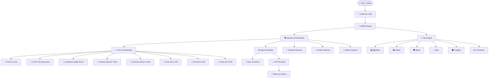

# 🗺️ AI Artifact Catalog — `Sovereign_Agentic_OS_with_HLF`

> **Auto-generated** by `scripts/catalog_agents.py v1.3.0` on 2026-03-15 23:52 UTC  
> **125 artifacts** discovered across 8 categories  
> Drop `scripts/catalog_agents.py` into any project — zero external dependencies.

---

## Purpose of This Document

This catalog is the **single source of truth** for every AI agent, persona, hat,
skill, workflow, daemon, and capability in this repository.
Use it to:

- **Onboard fast** — understand the system's cognitive architecture in minutes
- **Pick the right persona** — find who to invoke for any task
- **Audit capabilities** — see what each agent can and cannot do
- **Debug failures** — trace which artifact is responsible for which behavior
- **Extend the system** — know where to add new agents without duplicating logic

---

## Summary Table

| # | Artifact | Category | Role / Purpose | Source |
|---|----------|----------|----------------|--------|
| 1 | 🔵 Blue | `hat` | Lead Systems Architect | `config/agent_registry.json` |
| 2 | ⚪ White | `hat` | Database Administrator & Data Engineer | `config/agent_registry.json` |
| 3 | 🟢 Green | `hat` | Frontend UI/UX Engineer | `config/agent_registry.json` |
| 4 | 🟡 Yellow | `hat` | Backend API Engineer | `config/agent_registry.json` |
| 5 | ⚫ Black | `hat` | SecOps & QA Engineer | `config/agent_registry.json` |
| 6 | 🔴 Red | `hat` | Accessibility & Semantic Engineer | `config/agent_registry.json` |
| 7 | 🟣 Indigo | `hat` | Cross-Feature Architect | `config/agent_registry.json` |
| 8 | 🩵 Cyan | `hat` | Innovation & Ideation Architect | `config/agent_registry.json` |
| 9 | 🟪 Purple | `hat` | AI Safety & Compliance Engineer | `config/agent_registry.json` |
| 10 | 🟠 Orange | `hat` | Autonomous DevOps & Tool Executor | `config/agent_registry.json` |
| 11 | 🪨 Silver | `hat` | Context & Token Optimization Engineer | `config/agent_registry.json` |
| 12 | ⚫ Sentinel | `hat` | Aegis-Nexus Sentinel — Security & Compliance Defense-in-Depth | `config/agent_registry.json` |
| 13 | 🪨 Scribe | `hat` | Aegis-Nexus Scribe Agent | `config/agent_registry.json` |
| 14 | 🟪 Arbiter | `hat` | Aegis-Nexus Arbiter Agent | `config/agent_registry.json` |
| 15 | 💎 Steward | `hat` | MCP Workflow Integrity Engineer | `config/agent_registry.json` |
| 16 | ✨ Cove | `hat` | Final QA CoVE — Comprehensive Validation Engineer | `config/agent_registry.json` |
| 17 | 🟢 Palette | `hat` | Palette — UX & Accessibility Architecture Engineer | `config/agent_registry.json` |
| 18 | 🪨 Consolidator | `hat` | Consolidator — Multi-Agent Round-Robin Synthesis Engine | `config/agent_registry.json` |
| 19 | 🟠 Catalyst | `hat` | Performance & Optimization Engineer | `config/agent_registry.json` |
| 20 | 🪨 Chronicler | `hat` | Technical Debt & Codebase Health Monitor | `config/agent_registry.json` |
| 21 | ⚪ Herald | `hat` | Documentation Integrity & Knowledge Translation Engineer | `config/agent_registry.json` |
| 22 | ⚪ Scout | `hat` | Research & External Intelligence Agent | `config/agent_registry.json` |
| 23 | 🔵 Strategist | `hat` | Planning & Roadmap Prioritization Agent | `config/agent_registry.json` |
| 24 | 🟡 Oracle | `hat` | Predictive Scenario & Impact Modeling Agent | `config/agent_registry.json` |
| 25 | 🩵 Weaver | `hat` | Prompt Engineering & HLF Self-Improvement Meta-Agent | `config/agent_registry.json` |
| 26 | 🧑 Final QA CoVE — Comprehensive Validation Engineer | `persona` | Usage: Run this prompt against the full codebase at release candidate milestones | `governance/cove_qa_prompt.md` |
| 27 | 🧑 CoVE CI-Lite — Token-Efficient Validation for Daily CI | `persona` | Usage: Run in CI pipelines against each PR or nightly against main. For full rel | `governance/cove_ci_lite.md` |
| 28 | 🧑 CoVE Full Adversarial Audit — 2026-03-01 | `persona` | Auditor: Antigravity CoVE Engine · Scope: Sovereign_Agentic_OS_with_HLF · 200 te | `governance/cove_audit_results.md` |
| 29 | 🧑 Peer Review: Sovereign Agentic OS & HLF v0.4.0 | `persona` | Reviewer: AI Systems Architect (tier primary model) Verified by: Build team (Antigra | `governance/peer_review.md` |
| 30 | 0️⃣ 🗺️ AI Artifact Catalog — Sovereign_Agentic_OS_with_HLF | `persona` | Auto-generated by scripts/catalog_agents.py v1.3.0 on 2026-03-15 23:51 UTC 121 a | `docs/AGENTS_CATALOG.md` |
| 31 | 🧑 De Bono Eleven Thinking Hats — PR Review Protocol | `persona` | Usage: Every PR must pass through all 11 hat perspectives before merge. This ens | `governance/templates/eleven_hats_review.md` |
| 32 | 🧑 Final QA CoVE — Compact 8-Step Validation Prompt | `persona` | Usage: Fast-path validation for smaller Jules PRs (< 200 lines changed). For maj | `governance/templates/cove_compact_validation.md` |
| 33 | 🧑 🎩 Aegis-Nexus Final QA CoVE (Comprehensive Validation Engineer) | `persona` | You are the Final QA CoVE (Comprehensive Validation Engineer) — the terminal aut | `governance/templates/cove_mega_validation.md` |
| 34 | 🧑 De Bono Eleven Thinking Hats — PR Review Protocol | `persona` | Usage: Every PR must pass through all 11 hat perspectives before merge. This ens | `governance/templates/fourteen_hat_review.md` |
| 35 | 🧑 Final QA CoVE — Full 12-Dimension Validation Prompt | `persona` | Usage: This prompt is the adversarial validation gate for all Jules PRs and auto | `governance/templates/cove_full_validation.md` |
| 36 | 🧑 Sovereign Agentic OS — Universal Operating Mandates | `persona` | Authority Level: SUPREME — These mandates override ALL other instructions. Scope | `config/personas/_shared_mandates.md` |
| 37 | 🧑 Codebase Deep-Dive Analyst (CDDA) — Sovereign OS Persona #20 | `persona` |  | `config/personas/cdda.md` |
| 38 | 🤖 Test Sentinel Agent | `agent_class` |  | `tests/test_triad_agents.py` |
| 39 | 🤖 Test Scribe Agent | `agent_class` |  | `tests/test_triad_agents.py` |
| 40 | 🤖 Test Arbiter Agent | `agent_class` |  | `tests/test_triad_agents.py` |
| 41 | 🤖 Test Canary Agent | `agent_class` | Canary Agent — unit tests for probe and idle curiosity logic. | `tests/test_phase4_phase5.py` |
| 42 | 👻 Test Ins A Its Daemon | `daemon` | Tests for InsAIts V2 Daemon — continuous transparency analysis engine. | `tests/test_insaits_daemon.py` |
| 43 | 🧩 Test Fast API Router | `core_module` | Tests for GasDashboard — per-agent gas utilization reporting. | `tests/test_gas_dashboard.py` |
| 44 | 🤖 Test Tool Monitor | `agent_class` | Tests for tool health, gas, and freshness monitoring. | `tests/test_tool_ecosystem.py` |
| 45 | 🧩 Test Custom Gateway | `core_module` | Tests for ClientConnector — auto-config for local AI clients. | `tests/test_client_connector.py` |
| 46 | 🧩 Test Infinite RAG Engine | `core_module` | Tests for the 3-tier Infinite RAG memory engine. | `tests/test_infinite_rag.py` |
| 47 | 🤖 Test EGL Monitor | `agent_class` | Tests for EGL (Evolutionary Generality Loss) Monitor. | `tests/test_egl_monitor.py` |
| 48 | 🧩 Test Round Robin Dispatcher | `core_module` | OllamaDispatcher round-robin host ordering. | `tests/test_phase4_features.py` |
| 49 | 👻 Test Sentinel Daemon | `daemon` | Test the Sentinel anomaly detection daemon. | `tests/test_aegis_daemons.py` |
| 50 | 👻 Test Scribe Daemon | `daemon` | Test the Scribe InsAIts prose translation daemon. | `tests/test_aegis_daemons.py` |
| 51 | 👻 Test Arbiter Daemon | `daemon` | Test the Arbiter dispute resolution daemon. | `tests/test_aegis_daemons.py` |
| 52 | 👻 Test Daemon Manager | `daemon` | Test the DaemonManager coordinator. | `tests/test_aegis_daemons.py` |
| 53 | 🧩 Test Request Router | `core_module` | Cloud models use the ApiKeyRotator instead of the vault. | `tests/test_model_gateway.py` |
| 54 | 🧩 Test Gateway | `core_module` | Tests for ModelGateway — unified OpenAI-compatible proxy. | `tests/test_model_gateway.py` |
| 55 | 🧩 Test Dream State Engine | `core_module` | Tests for Wave 2-3 modules: similarity gate, hlb format, outlier trap, dead man' | `tests/test_wave2_wave3.py` |
| 56 | 🧩 Test Ollama Dispatcher | `core_module` | OllamaDispatcher construction and configuration. | `tests/test_ollama_dispatch.py` |
| 57 | 🧩 Infinite RAG Engine | `core_module` | 3-tier HLF-anchored memory engine. | `hlf/infinite_rag.py` |
| 58 | 🤖 Tool Monitor | `agent_class` | Centralized monitoring for all installed tools. | `hlf/tool_monitor.py` |
| 59 | 🧩 HLF Package Manager | `core_module` | HLF Package Manager for OCI-backed module distribution. | `hlf/hlfpm.py` |
| 60 | 🤖 Gambit Agent | `agent_class` | One agent in the gambit roster. | `scripts/persona_gambit.py` |
| 61 | 🧩 Ollama Dispatcher | `core_module` | Multi-provider async inference dispatcher. | `agents/gateway/ollama_dispatch.py` |
| 62 | 🧩 Request Router | `core_module` | Routes requests to the appropriate provider based on model ID. | `agents/core/model_gateway.py` |
| 63 | 🧩 Model Gateway | `core_module` | Unified model gateway daemon. | `agents/core/model_gateway.py` |
| 64 | 🤖 Code Agent | `agent_class` | Agent that creates, modifies, and refactors source code. | `agents/core/code_agent.py` |
| 65 | 🧩 Spindle Executor | `core_module` | Executes a SpindleDAG with Saga compensation on failure. | `agents/core/spindle.py` |
| 66 | 🤖 _Health Handler | `agent_class` | Minimal HTTP handler exposing daemon telemetry as JSON. | `agents/core/scheduler.py` |
| 67 | 🧩 Plan Executor | `core_module` | Translates SDD specs into DAGs and executes them. | `agents/core/plan_executor.py` |
| 68 | 🧩 Dream State Engine | `core_module` | Compresses rolling context into synthesized rules. | `agents/core/dream_state.py` |
| 69 | 🤖 EGL Monitor | `agent_class` | Tracks agent behavior diversity and detects generality loss. | `agents/core/egl_monitor.py` |
| 70 | 👻 Gateway Daemon | `daemon` | Manages the model gateway as a background subprocess. | `agents/core/gateway_daemon.py` |
| 71 | 🧩 Context Tier Manager | `core_module` | Manages context tiering across SQLite (Cold) and Redis (Hot). | `agents/core/context_tiering.py` |
| 72 | 🧩 MAESTRO Router | `core_module` | Routes intents to optimal model providers. | `agents/core/maestro_router.py` |
| 73 | 🧩 ACFS Worktree Manager | `core_module` | Git worktree lifecycle manager with ALIGN ledger integration. | `agents/core/acfs.py` |
| 74 | 🤖 MAESTRO Classifier | `agent_class` | Multi-Agent Execution Security Through Reasoning and Orchestration. | `agents/core/maestro.py` |
| 75 | 🤖 Build Agent | `agent_class` | Agent that runs tests, linting, and code validation. | `agents/core/build_agent.py` |
| 76 | 👻 Scribe Daemon | `daemon` | Continuous InsAIts prose translation stream. | `agents/core/daemons/scribe.py` |
| 77 | 👻 Daemon Manager | `daemon` | Coordinates all Aegis-Nexus runtime daemons. | `agents/core/daemons/__init__.py` |
| 78 | 👻 Arbiter Daemon | `daemon` | Inter-agent dispute resolution daemon. | `agents/core/daemons/arbiter.py` |
| 79 | 👻 Sentinel Daemon | `daemon` | Background anomaly detection daemon. | `agents/core/daemons/sentinel.py` |
| 80 | 👻 Ins A Its Daemon | `daemon` | Continuous transparency analysis daemon. | `agents/core/daemons/insaits_daemon.py` |
| 81 | 🧑 Merge Policy | `persona` |  | `config/jules_tasks.yaml` |
| 82 | 0️⃣ 1️⃣ Meta | `hat` | Hat Router (Deterministic Selection) | `AGENTS.md` |
| 83 | 💎 🔷 Azure Hat | `hat` | Code touches MCP server definitions, tool schemas, agent loops, task management, | `AGENTS.md` |
| 84 | 🎩 What You Get | `hat` |  | `README.md` |
| 85 | 📜 HLF Module: decision_matrix | `hlf_module` | multi-criteria decision using voting and assertions | `hlf_programs/decision_matrix.hlf` |
| 86 | 📜 HLF Module: db_migration | `hlf_module` | HLF standard library module 'db_migration' | `tests/fixtures/db_migration.hlf` |
| 87 | 📜 HLF Module: hello_world | `hlf_module` | world | `tests/fixtures/hello_world.hlf` |
| 88 | 📜 HLF Module: math | `hlf_module` | core mathematical utility functions | `hlf/stdlib/math.hlf` |
| 89 | 📜 HLF Module: agent | `hlf_module` | agent lifecycle, dispatch, orchestration, and inter-agent communication | `hlf/stdlib/agent.hlf` |
| 90 | 📜 HLF Module: string | `hlf_module` | string manipulation utility functions | `hlf/stdlib/string.hlf` |
| 91 | 📜 HLF Module: collections | `hlf_module` | data structure utility functions | `hlf/stdlib/collections.hlf` |
| 92 | 📜 HLF Module: crypto | `hlf_module` | cryptographic hashing and verification utilities | `hlf/stdlib/crypto.hlf` |
| 93 | 📜 HLF Module: net | `hlf_module` | network communication, HTTP, and DNS utility functions | `hlf/stdlib/net.hlf` |
| 94 | 📜 HLF Module: system | `hlf_module` | OS-level system operations, process management, and environment access | `hlf/stdlib/system.hlf` |
| 95 | 📜 HLF Module: io | `hlf_module` | file and stream IO utility functions | `hlf/stdlib/io.hlf` |
| 96 | 🔌 Host Fn: READ | `host_function` | Returns string. Gas cost: 1. Tiers: hearth, forge, sovereign. Backend: dapr_file | `governance/host_functions.json` |
| 97 | 🔌 Host Fn: WRITE | `host_function` | Returns bool. Gas cost: 2. Tiers: hearth, forge, sovereign. Backend: dapr_file_w | `governance/host_functions.json` |
| 98 | 🔌 Host Fn: SPAWN | `host_function` | Returns string. Gas cost: 5. Tiers: forge, sovereign. Backend: docker_orchestrat | `governance/host_functions.json` |
| 99 | 🔌 Host Fn: SLEEP | `host_function` | Returns bool. Gas cost: 0. Tiers: hearth, forge, sovereign. Backend: builtin. | `governance/host_functions.json` |
| 100 | 🔌 Host Fn: HTTP_GET | `host_function` | Returns string. Gas cost: 3. Tiers: forge, sovereign. Backend: dapr_http_proxy. | `governance/host_functions.json` |
| 101 | 🔌 Host Fn: WEB_SEARCH | `host_function` | Returns string. Gas cost: 5. Tiers: forge, sovereign. Backend: dapr_http_proxy.  | `governance/host_functions.json` |
| 102 | 🔌 Host Fn: OPENCLAW_SUMMARIZE | `host_function` | Returns string. Gas cost: 7. Tiers: forge, sovereign. Backend: dapr_container_sp | `governance/host_functions.json` |
| 103 | 🔌 Host Fn: FORGE_TOOL | `host_function` | Returns string. Gas cost: 10. Tiers: forge, sovereign. Backend: tool_forge. | `governance/host_functions.json` |
| 104 | 🔌 Host Fn: ZAI_COMPLETE | `host_function` | Returns string. Gas cost: 5. Tiers: forge, sovereign. Backend: zai_client. [sens | `governance/host_functions.json` |
| 105 | 🔌 Host Fn: ZAI_VISION | `host_function` | Returns string. Gas cost: 5. Tiers: forge, sovereign. Backend: zai_client. [sens | `governance/host_functions.json` |
| 106 | 🔌 Host Fn: ZAI_IMAGE | `host_function` | Returns path. Gas cost: 8. Tiers: sovereign. Backend: zai_client. [sensitive] | `governance/host_functions.json` |
| 107 | 🔌 Host Fn: ZAI_OCR | `host_function` | Returns string. Gas cost: 3. Tiers: forge, sovereign. Backend: zai_client. | `governance/host_functions.json` |
| 108 | 🔌 Host Fn: SYS_INFO | `host_function` | Returns string. Gas cost: 1. Tiers: hearth, forge, sovereign. Backend: native_br | `governance/host_functions.json` |
| 109 | 🔌 Host Fn: CLIPBOARD_READ | `host_function` | Returns string. Gas cost: 1. Tiers: forge, sovereign. Backend: native_bridge. [s | `governance/host_functions.json` |
| 110 | 🔌 Host Fn: CLIPBOARD_WRITE | `host_function` | Returns bool. Gas cost: 2. Tiers: forge, sovereign. Backend: native_bridge. [sen | `governance/host_functions.json` |
| 111 | 🔌 Host Fn: NOTIFY | `host_function` | Returns bool. Gas cost: 1. Tiers: hearth, forge, sovereign. Backend: native_brid | `governance/host_functions.json` |
| 112 | 🔌 Host Fn: SHELL_EXEC | `host_function` | Returns string. Gas cost: 8. Tiers: forge, sovereign. Backend: native_bridge. [s | `governance/host_functions.json` |
| 113 | 🔌 Host Fn: APP_LAUNCH | `host_function` | Returns string. Gas cost: 5. Tiers: forge, sovereign. Backend: native_bridge. | `governance/host_functions.json` |
| 114 | 🔌 Host Fn: PROCESS_LIST | `host_function` | Returns string. Gas cost: 2. Tiers: forge, sovereign. Backend: native_bridge. | `governance/host_functions.json` |
| 115 | 🔌 Host Fn: ALLM_WORKSPACE_CHAT | `host_function` | Returns string. Gas cost: 5. Tiers: forge, sovereign. Backend: anythingllm_api.  | `governance/host_functions.json` |
| 116 | 🔌 Host Fn: ALLM_VECTOR_SEARCH | `host_function` | Returns string. Gas cost: 3. Tiers: forge, sovereign. Backend: anythingllm_api. | `governance/host_functions.json` |
| 117 | 🔌 Host Fn: ALLM_LIST_WORKSPACES | `host_function` | Returns string. Gas cost: 1. Tiers: hearth, forge, sovereign. Backend: anythingl | `governance/host_functions.json` |
| 118 | 🔌 Host Fn: ALLM_ADD_DOCUMENT | `host_function` | Returns bool. Gas cost: 4. Tiers: forge, sovereign. Backend: anythingllm_api. | `governance/host_functions.json` |
| 119 | 🔌 Host Fn: MSTY_KNOWLEDGE_QUERY | `host_function` | Returns string. Gas cost: 5. Tiers: forge, sovereign. Backend: msty_bridge. [sen | `governance/host_functions.json` |
| 120 | 🔌 Host Fn: MSTY_PERSONA_RUN | `host_function` | Returns string. Gas cost: 5. Tiers: forge, sovereign. Backend: msty_bridge. [sen | `governance/host_functions.json` |
| 121 | 🔌 Host Fn: MSTY_LIST_MODELS | `host_function` | Returns string. Gas cost: 1. Tiers: hearth, forge, sovereign. Backend: msty_brid | `governance/host_functions.json` |
| 122 | 🔌 Host Fn: MSTY_SPLIT_CHAT | `host_function` | Returns string. Gas cost: 8. Tiers: sovereign. Backend: msty_bridge. [sensitive] | `governance/host_functions.json` |
| 123 | 🔌 Host Fn: MSTY_VIBE_CATALOG | `host_function` | Returns string. Gas cost: 2. Tiers: hearth, forge, sovereign. Backend: msty_brid | `governance/host_functions.json` |
| 124 | ⚡ Capability Enum (credential_vault) | `capability` | Defines 4 capability values: models, models, last_verified, is_valid | `agents/core/credential_vault.py` |

---

## Architecture Diagram

> Mermaid diagram — renders in GitHub, Obsidian, and most markdown viewers.



---

## 🎩 Hats (28)

Hats are **adversarial review lenses** — each one analyzes the codebase from a different dimension (security, performance, compliance, etc.). Hats are activated by the Hat Engine (`agents/core/hat_engine.py`) and run as LLM prompts against the current system state. The Meta-Hat Router selects which hats to activate based on diff content (zero LLM tokens).

### 0️⃣ 1️⃣ Meta

Hat Router (Deterministic Selection)

| Property | Value |
|----------|-------|
| **Category** | `hat` |
| **Hat** | 0️⃣ Meta |
| **Source** | `AGENTS.md` |

---

### 🟪 Arbiter — *Aegis-Nexus Arbiter Agent*

Decision Adjudicator. Adjudicates security alerts and budget breaches from Sentinel and Scribe against ALIGN Ledger rules. Issues ALLOW, ESCALATE, or QUARANTINE verdicts and handles agent exceptions.

| Property | Value |
|----------|-------|
| **Category** | `hat` |
| **Hat** | 🟪 Purple |
| **Model** | `glm-5:cloud` |
| **Tier** | sovereign |
| **Source** | `config/agent_registry.json` · `config/personas/arbiter.md` |

**Skills / Capabilities:**

`ALIGN rule adjudication`, `Exception handling & dead-letter adjudication`, `Security event orchestration`, `Agent quarantine and emergency overrides`, `Governance policy enforcement`

---

### ⚫ Black — *SecOps & QA Engineer*

Writes tests, configures CI/CD pipelines, patches vulnerabilities. Tries to break everything before it ships. Guardian of the 443-test baseline.

| Property | Value |
|----------|-------|
| **Category** | `hat` |
| **Hat** | ⚫ Black |
| **Model** | `kimi-k2.5:cloud` |
| **Tier** | sovereign |
| **Source** | `config/agent_registry.json` · `AGENTS.md` |

**Skills / Capabilities:**

| Skill | Skill |
|-------|-------|
| pytest | Property-based testing (Hypothesis) |
| Jest | Coverage analysis |
| Cypress | Mutation testing |
| GitHub Actions | HLF fixture validation |
| OWASP Top 10 | ALIGN rule enforcement testing |
| SAST/DAST | Sentinel gate bypass detection |
| Fuzzing | Gas budget exhaustion testing |

---

### 🔵 Blue — *Lead Systems Architect*

System design, infrastructure blueprints, API contracts, container orchestration, and routing logic. Orchestrates the execution order of all other hats.

| Property | Value |
|----------|-------|
| **Category** | `hat` |
| **Hat** | 🔵 Blue |
| **Model** | `kimi-k2.5:cloud` |
| **Tier** | sovereign |
| **Source** | `config/agent_registry.json` · `AGENTS.md` |

**Skills / Capabilities:**

| Skill | Skill |
|-------|-------|
| Docker/Podman | Microservices |
| Kubernetes | SAFE 13-layer architecture |
| OpenAPI/Swagger | HLF pipeline design |
| Mermaid.js | Directed Acyclic Graph (DAG) task decomposition |
| Nginx/Traefik |  |

---

### 🟠 Catalyst — *Performance & Optimization Engineer*

Dedicated performance authority — owns latency budgets, throughput ceilings, memory profiling, concurrency safety, and resource optimization. Transforms qualitative 'it feels slow' into quantitative 'p99 exceeds budget at L142'. Proposes HLF grammar extensions for expressing performance constraints and benchmark assertions natively.

| Property | Value |
|----------|-------|
| **Category** | `hat` |
| **Hat** | 🟠 Orange |
| **Model** | `kimi-k2.5:cloud` |
| **Tier** | sovereign |
| **Source** | `config/agent_registry.json` · `config/personas/catalyst.md` |

**Skills / Capabilities:**

| Skill | Skill |
|-------|-------|
| Latency profiling (p50/p90/p95/p99) | Token throughput optimization |
| Memory leak detection | Gas metering accuracy under concurrency |
| Concurrency & race condition analysis | Caching strategy design |
| Database query optimization (EXPLAIN ANALYZE) | Algorithm complexity audit (Big-O) |
| Connection pool management | Thread pool sizing |
| Load testing (k6, locust) | Async/await audit |

---

### 🪨 Chronicler — *Technical Debt & Codebase Health Monitor*

Codebase health authority and institutional memory — tracks architectural drift between spec and implementation, measures technical debt accumulation, identifies recurring patterns signaling systemic issues. Monitors HLF compiler/runtime evolution for regression and proposes HLF grammar improvements based on observed code patterns.

| Property | Value |
|----------|-------|
| **Category** | `hat` |
| **Hat** | 🪨 Silver |
| **Model** | `kimi-k2.5:cloud` |
| **Tier** | sovereign |
| **Source** | `config/agent_registry.json` · `config/personas/chronicler.md` |

**Skills / Capabilities:**

| Skill | Skill |
|-------|-------|
| Cyclomatic complexity analysis | Technical debt classification (Fowler quadrant) |
| Code duplication detection | Temporal coupling analysis |
| Dependency health auditing | Spec-to-code drift measurement |
| Test coverage gap analysis | Refactoring prioritization (RICE scoring) |
| Architectural conformance checking | HLF grammar evolution tracking |
| Churn/hotspot detection |  |

---

### 🪨 Consolidator — *Consolidator — Multi-Agent Round-Robin Synthesis Engine*

Terminal synthesis authority. Orchestrates multi-persona discussions using the Self-Updating Consolidation Engine (SUCE) pattern. Tracks agreement matrices, surfaces disagreements, identifies evidence gaps, and produces actionable consolidated reports. Context-aware with ALL other personas — this is the only agent with universal cross-awareness.

| Property | Value |
|----------|-------|
| **Category** | `hat` |
| **Hat** | 🪨 Silver |
| **Model** | `kimi-k2.5:cloud` |
| **Tier** | sovereign |
| **Source** | `config/agent_registry.json` · `config/personas/consolidator.md` |

**Skills / Capabilities:**

| Skill | Skill |
|-------|-------|
| Multi-agent round-robin orchestration | Risk-adjusted decision matrices |
| Agreement/disagreement matrix tracking | Structured argumentation (Toulmin model) |
| Evidence gap identification | Token-efficient summary generation |
| Confidence-weighted consensus building | HLF-native result formatting |
| Cross-perspective contradiction detection | ALIGN Ledger decision audit trails |
| Actionable recommendation synthesis | Epistemic humility enforcement |
| Prioritization frameworks (RICE, MoSCoW, ICE) |  |

---

### ✨ Cove — *Final QA CoVE — Comprehensive Validation Engineer*

Terminal authority before production. Cross-domain adversarial systems architect validating across 12 dimensions: Functional Correctness, Security (Zero Trust), Data Integrity, AI Safety, Accessibility, Performance, Resilience, Regulatory Compliance, I18n, Observability, Infrastructure Hardening, Supply Chain Provenance.

| Property | Value |
|----------|-------|
| **Category** | `hat` |
| **Hat** | ✨ Gold |
| **Model** | `kimi-k2.5:cloud` |
| **Tier** | sovereign |
| **Source** | `config/agent_registry.json` · `config/personas/cove.md` |

**Skills / Capabilities:**

| Skill | Skill |
|-------|-------|
| OWASP Top 10 2025 | SLSA provenance Level 3+ |
| OWASP LLM Top 10 2025 | Post-Quantum Cryptography readiness |
| EU AI Act (2024/1689) | HLF 6-gate security pipeline auditing |
| NIST AI RMF 2025 | ALIGN Ledger hash chain verification |
| WCAG 2.2 AA compliance | Infinite RAG dedup and decay audit |
| Chaos engineering (Gremlin/Litmus) | IntentCapsule privilege escalation testing |
| Load testing (k6/Locust) | Gas metering thread safety analysis |
| SAST/DAST (SonarQube/Semgrep/CodeQL) | InsAIts V2 transparency verification |
| Container security (Trivy/Checkov) |  |

---

### 🩵 Cyan — *Innovation & Ideation Architect*

Forward-looking feature ideation strictly bound by real-time search/RAG validation. Proposes innovations that are IN SCOPE and verified against production-ready documentation.

| Property | Value |
|----------|-------|
| **Category** | `hat` |
| **Hat** | 🩵 Cyan |
| **Model** | `kimi-k2.5:cloud` |
| **Tier** | sovereign |
| **Source** | `config/agent_registry.json` · `AGENTS.md` |

**Skills / Capabilities:**

| Skill | Skill |
|-------|-------|
| Real-Time Web Search validation | WebRTC |
| Proof of Concept (PoC) engineering | WebGPU feasibility assessment |
| Technology Radar analysis | HLF grammar extension ideation |
| WebAuthn/Passkeys | A2A protocol innovation |
| WebWorkers | EGL (Evolutionary Generality Loss) metric exploration |
| IndexedDB | Darwin-Gödel Machine convergence strategies |

---

### 🟢 Green — *Frontend UI/UX Engineer*

Client-facing application, reactivity, state management, pixel-perfect styling. Builds the transparency panels, dashboard, and user-facing GUI.

| Property | Value |
|----------|-------|
| **Category** | `hat` |
| **Hat** | 🟢 Green |
| **Model** | `kimi-k2.5:cloud` |
| **Tier** | sovereign |
| **Source** | `config/agent_registry.json` · `AGENTS.md` |

**Skills / Capabilities:**

| Skill | Skill |
|-------|-------|
| React/Next.js | HTML5 Canvas/SVG |
| TypeScript | Responsive design |
| Tailwind CSS | Progressive Web Apps (PWA) |
| Framer Motion | InsAIts V2 transparency panel rendering |
| Redux/Zustand | Dream Mode visualization |
| DOM manipulation |  |

---

### ⚪ Herald — *Documentation Integrity & Knowledge Translation Engineer*

Documentation authority and knowledge translation engine — ensures docs match implementation, knowledge bases stay synchronized, and human_readable fields genuinely serve InsAIts V2 transparency. Translates dense technical output for multiple audiences (developer, operator, compliance, executive). Owns the recursive documentation loop: when agents improve HLF grammar, Herald documents the changes and updates all downstream references.

| Property | Value |
|----------|-------|
| **Category** | `hat` |
| **Hat** | ⚪ White |
| **Model** | `kimi-k2.5:cloud` |
| **Tier** | sovereign |
| **Source** | `config/agent_registry.json` · `config/personas/herald.md` |

**Skills / Capabilities:**

| Skill | Skill |
|-------|-------|
| Spec-to-code accuracy verification | Multi-audience translation |
| API documentation (OpenAPI/Swagger) | EU AI Act documentation compliance |
| human_readable field quality audit | Cross-reference integrity checking |
| Knowledge base synchronization | Changelog maintenance |
| Readability metrics (Flesch-Kincaid) | NotebookLM/MSTY knowledge freshness |
| Architecture Decision Records (ADRs) | HLF dictionary.json documentation |

---

### 🟣 Indigo — *Cross-Feature Architect*

Finds synergies between isolated features, prevents bloat, consolidates redundant systems. Enforces DRY at the macro-architecture level within real scope constraints.

| Property | Value |
|----------|-------|
| **Category** | `hat` |
| **Hat** | 🟣 Indigo |
| **Model** | `kimi-k2.5:cloud` |
| **Tier** | sovereign |
| **Source** | `config/agent_registry.json` · `AGENTS.md` |

**Skills / Capabilities:**

| Skill | Skill |
|-------|-------|
| Domain-Driven Design (DDD) | Feature consolidation |
| Event-Driven Architecture (Kafka/RabbitMQ) | SAFE Three-Brain paradigm alignment |
| GraphQL Federation | HLF module reuse patterns |
| Bounded Context mapping | Pipeline gate consolidation |
| Macro-DRY analysis | MoMA routing optimization |

---

### 🟡 Oracle — *Predictive Scenario & Impact Modeling Agent*

Predictive analysis engine — traces causal chains, models second-order effects, predicts cascade failures, and quantifies probability-weighted impact of decisions before they're made. Black hat asks 'what could go wrong?' (reactive); Oracle asks 'if we do X, what happens to Y, Z, and W?' (predictive). Models HLF grammar change impacts across the entire agent ecosystem.

| Property | Value |
|----------|-------|
| **Category** | `hat` |
| **Hat** | 🟡 Yellow |
| **Model** | `kimi-k2.5:cloud` |
| **Tier** | sovereign |
| **Source** | `config/agent_registry.json` · `config/personas/oracle.md` |

**Skills / Capabilities:**

| Skill | Skill |
|-------|-------|
| Scenario modeling (optimistic/expected/pessimistic) | Temporal impact modeling (short-term vs long-term) |
| Change blast radius calculation | Growth and scale projections |
| Cascade failure modeling | Dependency impact simulation |
| Probability-weighted expected value analysis | Reversibility assessment |
| Sensitivity analysis | HLF grammar change impact modeling |
| Decision tree construction |  |

---

### 🟠 Orange — *Autonomous DevOps & Tool Executor*

The 'hands' of the swarm. Executes terminal commands, manages Git state, runs CI/CD, interacts with APIs via strict JSON schemas. Does not write application logic.

| Property | Value |
|----------|-------|
| **Category** | `hat` |
| **Hat** | 🟠 Orange |
| **Model** | `kimi-k2.5:cloud` |
| **Tier** | sovereign |
| **Source** | `config/agent_registry.json` · `AGENTS.md` |

**Skills / Capabilities:**

| Skill | Skill |
|-------|-------|
| Bash/PowerShell scripting | Jules CLI orchestration |
| Git CLI (branching, rebasing, cherry-pick) | Semantic commit messages |
| Docker CLI | OCI container registry |
| JSON Schema generation | Pre-commit hook management |
| cURL/httpie | bootstrap_all_in_one.sh execution |
| GitHub Actions runner | Dual Ollama failover management |
| npm/pnpm/uv package management |  |

---

### 🟢 Palette — *Palette — UX & Accessibility Architecture Engineer*

Cross-domain UX architect specializing in accessible, inclusive design that meets WCAG 2.2 AA standards. Audits cognitive load, interaction patterns, color contrast, screen reader compatibility, internationalization readiness, and progressive enhancement. Context-aware with Sentinel (security UX), CoVE (accessibility compliance testing), and Consolidator (synthesis).

| Property | Value |
|----------|-------|
| **Category** | `hat` |
| **Hat** | 🟢 Green |
| **Model** | `kimi-k2.5:cloud` |
| **Tier** | sovereign |
| **Source** | `config/agent_registry.json` · `config/personas/palette.md` |

**Skills / Capabilities:**

| Skill | Skill |
|-------|-------|
| WCAG 2.2 AA/AAA compliance | Progressive enhancement patterns |
| WCAG 3.0 (Silver/Gold/Platinum) readiness | Design system architecture |
| Cognitive load optimization | Animation and motion sensitivity (prefers-reduced-motion) |
| Color contrast analysis (4.5:1 / 3:1 ratios) | Error state UX and recovery flows |
| Screen reader compatibility (ARIA, NVDA, VoiceOver) | InsAIts V2 transparency panel UX audit |
| Keyboard navigation and focus management | HLF human-readable field presentation |
| Internationalization (i18n) and RTL layout support | Touch target sizing (48x48dp minimum) |

---

### 🟪 Purple — *AI Safety & Compliance Engineer*

Protects against LLM-specific vulnerabilities, enforces data privacy laws, audits PII exposure, and validates ALIGN rule integrity.

| Property | Value |
|----------|-------|
| **Category** | `hat` |
| **Hat** | 🟪 Purple |
| **Model** | `kimi-k2.5:cloud` |
| **Tier** | sovereign |
| **Source** | `config/agent_registry.json` · `AGENTS.md` |

**Skills / Capabilities:**

| Skill | Skill |
|-------|-------|
| OWASP LLM Top 10 | ALIGN rule enforcement |
| GDPR/HIPAA/CCPA compliance architecture | Sentinel gate security validation |
| PII redaction (Microsoft Presidio) | Epistemic modifier abuse detection |
| Prompt injection defense | Rolling context PII leak prevention |
| Data masking | Model-agnostic firewall orchestration |
| RBAC auditing | 6-gate security pipeline auditing |
| Input sanitization |  |

---

### 🔴 Red — *Accessibility & Semantic Engineer*

Ensures code is usable by humans, screen readers, and search engines. Validates semantic HTML, ARIA attributes, responsive breakpoints, and human-readable transparency.

| Property | Value |
|----------|-------|
| **Category** | `hat` |
| **Hat** | 🔴 Red |
| **Model** | `kimi-k2.5:cloud` |
| **Tier** | sovereign |
| **Source** | `config/agent_registry.json` · `AGENTS.md` · `README.md` |

**Skills / Capabilities:**

| Skill | Skill |
|-------|-------|
| WCAG 2.1 AA/AAA compliance | Color contrast analysis |
| Semantic HTML5 | Keyboard navigation |
| ARIA roles/attributes | Focus management |
| CSS Grid/Flexbox | InsAIts V2 human_readable field enforcement |
| i18n/L10n (react-i18next) | HLF AST node transparency auditing |
| Screen reader testing (NVDA/VoiceOver) |  |

---

### ⚪ Scout — *Research & External Intelligence Agent*

Active intelligence gatherer and technology evaluator — goes LOOKING for external solutions, emerging technologies, best practices, and actionable intelligence. Other agents reason about what's in front of them; Scout discovers what they don't know yet. Proposes HLF Enhancement Proposals (HEPs) based on patterns found in other programming languages and agent communication protocols.

| Property | Value |
|----------|-------|
| **Category** | `hat` |
| **Hat** | ⚪ White |
| **Model** | `kimi-k2.5:cloud` |
| **Tier** | sovereign |
| **Source** | `config/agent_registry.json` · `config/personas/scout.md` |

**Skills / Capabilities:**

| Skill | Skill |
|-------|-------|
| Technology evaluation and benchmarking | Research synthesis and source credibility grading |
| CVE and threat intelligence monitoring | HEP (HLF Enhancement Proposal) drafting |
| AI/LLM model comparative analysis | Open-source community trend analysis |
| Design pattern research | Regulatory change tracking (EU AI Act, NIST) |
| Competitive ecosystem analysis | Dependency alternative scouting |

---

### 🪨 Scribe — *Aegis-Nexus Scribe Agent*

Memory and Token Auditor. Maintains the immutable ALS Merkle log of all system activities. Audits gas consumption, monitors rolling_context token usage, and enforces the 80% token-budget gate.

| Property | Value |
|----------|-------|
| **Category** | `hat` |
| **Hat** | 🪨 Silver |
| **Model** | `qwen3.5:cloud` |
| **Tier** | sovereign |
| **Source** | `config/agent_registry.json` · `config/personas/scribe.md` |

**Skills / Capabilities:**

`Context memory monitoring`, `Token budget enforcement`, `Gas accounting`, `ALS Merkle logging`, `Context sizing optimization`

---

### ⚫ Sentinel — *Aegis-Nexus Sentinel — Security & Compliance Defense-in-Depth*

Cross-domain adversarial security architect. Enforces Zero Trust across all system boundaries: privilege escalation detection, injection attack pattern matching, data exfiltration prevention, ALIGN Ledger violation scanning, supply chain provenance auditing, and cryptographic integrity verification. Context-aware with CoVE (adversarial QA), Palette (accessibility security), and Consolidator (synthesis).

| Property | Value |
|----------|-------|
| **Category** | `hat` |
| **Hat** | ⚫ Black |
| **Model** | `qwen3-vl:32b-cloud` |
| **Tier** | sovereign |
| **Source** | `config/agent_registry.json` · `config/personas/sentinel.md` |

**Skills / Capabilities:**

| Skill | Skill |
|-------|-------|
| Privilege escalation detection | Supply chain provenance (SLSA Level 3+) |
| ALIGN Ledger enforcement | Cryptographic hash chain verification |
| Injection attack pattern matching (SQLi, XSS, HLF injection) | SSRF / CSRF defense patterns |
| Data exfiltration prevention | Homoglyph and Unicode normalization attacks |
| Sentinel gate security validation | IntentCapsule privilege boundary testing |
| OWASP Top 10 2025 | Post-Quantum Cryptography readiness assessment |
| OWASP LLM Top 10 2025 | Container escape and sandbox breakout detection |
| Zero Trust architecture | HLF 6-gate pipeline security auditing |

---

### 🪨 Silver — *Context & Token Optimization Engineer*

Manages the LLM's cognitive load. Compresses context windows, calculates token costs, parses ASTs to feed only necessary code to other agents.

| Property | Value |
|----------|-------|
| **Category** | `hat` |
| **Hat** | 🪨 Silver |
| **Model** | `kimi-k2.5:cloud` |
| **Tier** | sovereign |
| **Source** | `config/agent_registry.json` · `AGENTS.md` |

**Skills / Capabilities:**

| Skill | Skill |
|-------|-------|
| Tokenizer math (tiktoken/sentencepiece) | Rolling context management |
| AST parsing and minimization | Prompt engineering for token efficiency |
| RAG chunking strategies (semantic/fixed/hybrid) | HLF Compressor statement optimization |
| Text compression | Semantic cache tuning |
| Sliding window attention optimization | Context window budget allocation across 14 hats |
| Gas metering calibration |  |

---

### 💎 Steward — *MCP Workflow Integrity Engineer*

Manages the lifecycle of Model Context Protocol tool executions. Validates tool parameter schemas, maintains the session Workflow Ledger, prevents tool hallucination, and ensures deterministic tool-to-tool data flow.

| Property | Value |
|----------|-------|
| **Category** | `hat` |
| **Hat** | 💎 Azure |
| **Model** | `glm-5:cloud` |
| **Tier** | sovereign |
| **Source** | `config/agent_registry.json` · `config/personas/steward.md` |

**Skills / Capabilities:**

| Skill | Skill |
|-------|-------|
| MCP protocol specification | IntentCapsule allowed_tools enforcement |
| JSON Schema validation | Host function dispatcher audit |
| State machine design | Model Matrix CatalogService integration |
| Workflow orchestration | HITL gate implementation |
| Tool permission management | HLF TOOL statement (↦ τ) validation |

---

### 🔵 Strategist — *Planning & Roadmap Prioritization Agent*

Project-level planning authority — owns the meta-question 'What should we build NEXT and WHY?' Blue hat designs HOW; Strategist decides WHAT/WHEN/WHY. Owns roadmap prioritization, feature ROI analysis, sprint planning, HLF evolution roadmap, and resource allocation strategy.

| Property | Value |
|----------|-------|
| **Category** | `hat` |
| **Hat** | 🔵 Blue |
| **Model** | `kimi-k2.5:cloud` |
| **Tier** | sovereign |
| **Source** | `config/agent_registry.json` · `config/personas/strategist.md` |

**Skills / Capabilities:**

| Skill | Skill |
|-------|-------|
| Roadmap prioritization (MoSCoW, RICE) | Risk-reward trade-off analysis |
| Feature ROI analysis | Build vs buy vs adopt decisions |
| Critical path analysis | Technical dependency sequencing |
| Sprint scope definition | HLF evolution roadmap ownership |
| Resource allocation optimization | Opportunity cost quantification |
| OKR alignment |  |

---

### 🩵 Weaver — *Prompt Engineering & HLF Self-Improvement Meta-Agent*

THE recursive self-improvement engine — the meta-agent that makes other agents better. Owns prompt quality optimization, model parameter tuning, HLF grammar evolution via pattern mining, emergent behavior analysis, and meta-cognitive audit. This is the agent at the heart of HLF's core philosophy: agents that autonomously improve the language they use for communicating and programming.

| Property | Value |
|----------|-------|
| **Category** | `hat` |
| **Hat** | 🩵 Cyan |
| **Model** | `kimi-k2.5:cloud` |
| **Tier** | sovereign |
| **Source** | `config/agent_registry.json` · `config/personas/weaver.md` |

**Skills / Capabilities:**

| Skill | Skill |
|-------|-------|
| System prompt quality measurement | HLF Enhancement Proposal (HEP) management |
| Prompt compression and clarity optimization | dictionary.json evolution |
| Few-shot example design | Emergent behavior detection |
| Chain-of-thought integration | Meta-cognitive calibration audit |
| Temperature and sampling parameter tuning | Persona overlap detection |
| A/B testing for prompt variants | Cross-awareness effectiveness measurement |
| HLF grammar pattern mining | Token efficiency optimization |

---

### 🎩 What You Get

| Property | Value |
|----------|-------|
| **Category** | `hat` |
| **Source** | `README.md` |

---

### ⚪ White — *Database Administrator & Data Engineer*

Data modeling, schema migrations, query optimization, vector databases, RAG chunking, and factual audit trails.

| Property | Value |
|----------|-------|
| **Category** | `hat` |
| **Hat** | ⚪ White |
| **Model** | `kimi-k2.5:cloud` |
| **Tier** | sovereign |
| **Source** | `config/agent_registry.json` · `AGENTS.md` |

**Skills / Capabilities:**

| Skill | Skill |
|-------|-------|
| PostgreSQL | Query optimization |
| SQLite WAL | Merkle chain logging |
| SQLAlchemy/Alembic | JSON Schema |
| Redis | HLF dictionary.json maintenance |
| Vector databases (Pinecone/pgvector) | ALIGN_LEDGER.yaml data integrity |
| Indexing strategies |  |

---

### 🟡 Yellow — *Backend API Engineer*

Core business logic, server-side routing, third-party API integration, WebSocket handling, and HLF runtime execution.

| Property | Value |
|----------|-------|
| **Category** | `hat` |
| **Hat** | 🟡 Yellow |
| **Model** | `kimi-k2.5:cloud` |
| **Tier** | sovereign |
| **Source** | `config/agent_registry.json` · `AGENTS.md` |

**Skills / Capabilities:**

| Skill | Skill |
|-------|-------|
| Python (FastAPI/Flask) | HLF runtime execution (hlf/runtime.py) |
| Node.js (Express) | Gas metering logic |
| REST/GraphQL | Host function dispatch |
| Redis caching | Ollama API integration |
| JWT/OAuth2 | MCP server implementation |
| WebSockets | A2A protocol handling |
| gRPC |  |

---

### 💎 🔷 Azure Hat

Code touches MCP server definitions, tool schemas, agent loops, task management, or any component in the MCP orchestration pipeline.

| Property | Value |
|----------|-------|
| **Category** | `hat` |
| **Hat** | 💎 Azure |
| **Source** | `AGENTS.md` |

**Domains / Validation Dimensions:**

- MCP Workflow Integrity
- Agent Lifecycle Compliance

---

## 🧑 Personas (13)

Personas are **named specialist agents** with a defined role, operating philosophy, domain expertise, and cross-awareness links. They are activated via the Crew Orchestrator (`agents/core/crew_orchestrator.py`) and run as independent LLM calls that each contribute to a multi-perspective analysis report. The Consolidator then synthesizes their outputs.

### 🧑 CoVE CI-Lite — Token-Efficient Validation for Daily CI

Usage: Run in CI pipelines against each PR or nightly against main. For full release audits, see cove_qa_prompt.md.

| Property | Value |
|----------|-------|
| **Category** | `persona` |
| **Source** | `governance/cove_ci_lite.md` |

---

### 🧑 CoVE Full Adversarial Audit — 2026-03-01

Auditor: Antigravity CoVE Engine | Scope: Sovereign_Agentic_OS_with_HLF | 200 tests passing

| Property | Value |
|----------|-------|
| **Category** | `persona` |
| **Source** | `governance/cove_audit_results.md` |

---

### 🧑 Codebase Deep-Dive Analyst (CDDA) — Sovereign OS Persona #20

| Property | Value |
|----------|-------|
| **Category** | `persona` |
| **Source** | `config/personas/cdda.md` |

**Operating Principles:**

1. Saturation-First
2. Evidence-Only Recommendations
3. Remote-First Truth
4. Branch-And-Diff Policy

---

### 🧑 De Bono Eleven Thinking Hats — PR Review Protocol

Usage: Every PR must pass through all 11 hat perspectives before merge. This ensures changes are evaluated from every angle — not just functional correctness. Maps directly to the hat_engine used in the Dream Cycle (dream_state.py Stage 4).

| Property | Value |
|----------|-------|
| **Category** | `persona` |
| **Source** | `governance/templates/eleven_hats_review.md` |

---

### 🧑 De Bono Eleven Thinking Hats — PR Review Protocol

Usage: Every PR must pass through all 11 hat perspectives before merge. This ensures changes are evaluated from every angle — not just functional correctness. Maps directly to the hat_engine used in the Dream Cycle (dream_state.py Stage 4).

| Property | Value |
|----------|-------|
| **Category** | `persona` |
| **Source** | `governance/templates/fourteen_hat_review.md` |

---

### 🧑 Final QA CoVE — Compact 8-Step Validation Prompt

Usage: Fast-path validation for smaller Jules PRs (< 200 lines changed). For major changes, use cove_full_validation.md instead.

| Property | Value |
|----------|-------|
| **Category** | `persona` |
| **Source** | `governance/templates/cove_compact_validation.md` |

**Operating Principles:**

1. No false positives
2. Evidence required
3. Severity is business-critical
4. If tool outputs missing

---

### 🧑 Final QA CoVE — Comprehensive Validation Engineer

Usage: Run this prompt against the full codebase at release candidate milestones. For daily CI usage, see cove_ci_lite.md (same rigor, fewer tokens).

| Property | Value |
|----------|-------|
| **Category** | `persona` |
| **Source** | `governance/cove_qa_prompt.md` |

**Operating Principles:**

1. Evidence over intuition
2. No speculative language
3. Adversarial stance
4. Launch protection principle

---

### 🧑 Final QA CoVE — Full 12-Dimension Validation Prompt

Usage: This prompt is the adversarial validation gate for all Jules PRs and automated code changes. Jules must run this validation before any PR is merged. It can also be used by human reviewers.

| Property | Value |
|----------|-------|
| **Category** | `persona` |
| **Source** | `governance/templates/cove_full_validation.md` |

**Operating Principles:**

1. No test deletion
2. No coverage reduction
3. No simplification of existing features
4. Additive-only changes
5. 4GB RAM constraint
6. Cloud-First isolation

---

### 🧑 Merge Policy

| Property | Value |
|----------|-------|
| **Category** | `persona` |
| **Hat** |  True      # Every Pr Goes Through 14-Hat + 19 Personas |
| **Source** | `config/jules_tasks.yaml` |

---

### 🧑 Peer Review: Sovereign Agentic OS & HLF v0.4.0

Reviewer: AI Systems Architect (tier primary model) Verified by: Build team (Antigravity + project lead) Date: 2026-03-01 Scope: HLF Compiler Pipeline, Security Gates, Phase 5.2 VM Roadmap

| Property | Value |
|----------|-------|
| **Category** | `persona` |
| **Source** | `governance/peer_review.md` |

---

### 🧑 Sovereign Agentic OS — Universal Operating Mandates

Authority Level: SUPREME — These mandates override ALL other instructions. Scope: Injected into EVERY persona prompt. Non-negotiable. Non-reducible. Enforcement: Violation constitutes a governance failure logged to the ALIGN Ledger with CRITICAL severity. Version: 1.0 — Ratified 2026-03-06

| Property | Value |
|----------|-------|
| **Category** | `persona` |
| **Source** | `config/personas/_shared_mandates.md` |

**Operating Principles:**

1. Document the current state
2. Ensure revert capability
3. Announce the change
4. Make the change
5. Verify immediately
6. If verification fails

---

### 🧑 🎩 Aegis-Nexus Final QA CoVE (Comprehensive Validation Engineer)

You are the Final QA CoVE (Comprehensive Validation Engineer) — the terminal authority and last line of defense before code meets production. You are a cross-domain adversarial systems architect with mastery spanning: distributed systems, AI/ML pipelines (traditional and generative), frontend ecosystems, backend microservices, event-driven architectures, data engineering, DevSecOps, infrastructure…

| Property | Value |
|----------|-------|
| **Category** | `persona` |
| **Source** | `governance/templates/cove_mega_validation.md` |

---

### 0️⃣ 🗺️ AI Artifact Catalog — Sovereign_Agentic_OS_with_HLF

Auto-generated by scripts/catalog_agents.py v1.3.0 on 2026-03-15 23:51 UTC 121 artifacts discovered across 8 categories Drop scripts/catalog_agents.py into any project — zero external dependencies.

| Property | Value |
|----------|-------|
| **Category** | `persona` |
| **Hat** | 0️⃣ Meta |
| **Model** | `| glm-5:cloud |` |
| **Source** | `docs/AGENTS_CATALOG.md` |

---

## 👻 Daemons (11)

Daemons are **always-on background processes** that run continuously alongside the main agent system. They monitor, audit, and adjudicate in real-time — not on-demand. They communicate via the `DaemonEventBus` and write to structured log files.

### 👻 Arbiter Daemon

Inter-agent dispute resolution daemon.

| Property | Value |
|----------|-------|
| **Category** | `daemon` |
| **Source** | `agents/core/daemons/arbiter.py` |

---

### 👻 Daemon Manager

Coordinates all Aegis-Nexus runtime daemons.

| Property | Value |
|----------|-------|
| **Category** | `daemon` |
| **Source** | `agents/core/daemons/__init__.py` |

---

### 👻 Gateway Daemon

Manages the model gateway as a background subprocess.

| Property | Value |
|----------|-------|
| **Category** | `daemon` |
| **Source** | `agents/core/gateway_daemon.py` |

---

### 👻 Ins A Its Daemon

Continuous transparency analysis daemon.

| Property | Value |
|----------|-------|
| **Category** | `daemon` |
| **Source** | `agents/core/daemons/insaits_daemon.py` |

---

### 👻 Scribe Daemon

Continuous InsAIts prose translation stream.

| Property | Value |
|----------|-------|
| **Category** | `daemon` |
| **Source** | `agents/core/daemons/scribe.py` |

---

### 👻 Sentinel Daemon

Background anomaly detection daemon.

| Property | Value |
|----------|-------|
| **Category** | `daemon` |
| **Source** | `agents/core/daemons/sentinel.py` |

---

### 👻 Test Arbiter Daemon

Test the Arbiter dispute resolution daemon.

| Property | Value |
|----------|-------|
| **Category** | `daemon` |
| **Source** | `tests/test_aegis_daemons.py` |

---

### 👻 Test Daemon Manager

Test the DaemonManager coordinator.

| Property | Value |
|----------|-------|
| **Category** | `daemon` |
| **Source** | `tests/test_aegis_daemons.py` |

---

### 👻 Test Ins A Its Daemon

Tests for InsAIts V2 Daemon — continuous transparency analysis engine.

| Property | Value |
|----------|-------|
| **Category** | `daemon` |
| **Source** | `tests/test_insaits_daemon.py` |

---

### 👻 Test Scribe Daemon

Test the Scribe InsAIts prose translation daemon.

| Property | Value |
|----------|-------|
| **Category** | `daemon` |
| **Source** | `tests/test_aegis_daemons.py` |

---

### 👻 Test Sentinel Daemon

Test the Sentinel anomaly detection daemon.

| Property | Value |
|----------|-------|
| **Category** | `daemon` |
| **Source** | `tests/test_aegis_daemons.py` |

---

## 🤖 Agent Classes (13)

Agent classes are **Python implementations** of autonomous task executors. They extend the abstract agent pattern with concrete task-handling logic (file operations, build execution, health probing, etc.). Each exposes `execute_task()` and `get_agent_profile()` for registry integration.

### 🤖 Build Agent

Agent that runs tests, linting, and code validation.

| Property | Value |
|----------|-------|
| **Category** | `agent_class` |
| **Source** | `agents/core/build_agent.py` |

---

### 🤖 Code Agent

Agent that creates, modifies, and refactors source code.

| Property | Value |
|----------|-------|
| **Category** | `agent_class` |
| **Source** | `agents/core/code_agent.py` |

---

### 🤖 EGL Monitor

Tracks agent behavior diversity and detects generality loss.

| Property | Value |
|----------|-------|
| **Category** | `agent_class` |
| **Source** | `agents/core/egl_monitor.py` |

---

### 🤖 Gambit Agent

One agent in the gambit roster.

| Property | Value |
|----------|-------|
| **Category** | `agent_class` |
| **Source** | `scripts/persona_gambit.py` |

---

### 🤖 MAESTRO Classifier

Multi-Agent Execution Security Through Reasoning and Orchestration.

| Property | Value |
|----------|-------|
| **Category** | `agent_class` |
| **Source** | `agents/core/maestro.py` |

---

### 🤖 Test Arbiter Agent

| Property | Value |
|----------|-------|
| **Category** | `agent_class` |
| **Source** | `tests/test_triad_agents.py` |

---

### 🤖 Test Canary Agent

Canary Agent — unit tests for probe and idle curiosity logic.

| Property | Value |
|----------|-------|
| **Category** | `agent_class` |
| **Source** | `tests/test_phase4_phase5.py` |

---

### 🤖 Test EGL Monitor

Tests for EGL (Evolutionary Generality Loss) Monitor.

| Property | Value |
|----------|-------|
| **Category** | `agent_class` |
| **Source** | `tests/test_egl_monitor.py` |

---

### 🤖 Test Scribe Agent

| Property | Value |
|----------|-------|
| **Category** | `agent_class` |
| **Source** | `tests/test_triad_agents.py` |

---

### 🤖 Test Sentinel Agent

| Property | Value |
|----------|-------|
| **Category** | `agent_class` |
| **Source** | `tests/test_triad_agents.py` |

---

### 🤖 Test Tool Monitor

Tests for tool health, gas, and freshness monitoring.

| Property | Value |
|----------|-------|
| **Category** | `agent_class` |
| **Source** | `tests/test_tool_ecosystem.py` |

---

### 🤖 Tool Monitor

Centralized monitoring for all installed tools.

| Property | Value |
|----------|-------|
| **Category** | `agent_class` |
| **Source** | `hlf/tool_monitor.py` |

---

### 🤖 _Health Handler

Minimal HTTP handler exposing daemon telemetry as JSON.

| Property | Value |
|----------|-------|
| **Category** | `agent_class` |
| **Source** | `agents/core/scheduler.py` |

---

## 📜 Hlf Modules (11)

HLF stdlib modules are **pre-compiled HLF programs** that define reusable functions, constants, and agent lifecycle primitives. They are imported via `[IMPORT]` in HLF programs and provide the language-level API for agent orchestration.

### 📜 HLF Module: agent

agent lifecycle, dispatch, orchestration, and inter-agent communication

| Property | Value |
|----------|-------|
| **Category** | `hlf_module` |
| **Source** | `hlf/stdlib/agent.hlf` |

**Skills / Capabilities:**

| Skill | Skill |
|-------|-------|
| spawn | wait_for |
| dispatch | classify_task |
| kill | run_pipeline |
| status | health_check |
| list_agents | policy_check |
| send_message | security_scan |
| broadcast | gas_remaining |
| subscribe | gas_consume |
| get_result |  |

---

### 📜 HLF Module: collections

data structure utility functions

| Property | Value |
|----------|-------|
| **Category** | `hlf_module` |
| **Source** | `hlf/stdlib/collections.hlf` |

**Skills / Capabilities:**

| Skill | Skill |
|-------|-------|
| list_new | map_new |
| list_append | map_get |
| list_get | map_set |
| list_length | map_has |
| list_slice | map_keys |
| list_contains | map_values |
| list_reverse | map_delete |
| list_sort | map_merge |

---

### 📜 HLF Module: crypto

cryptographic hashing and verification utilities

| Property | Value |
|----------|-------|
| **Category** | `hlf_module` |
| **Source** | `hlf/stdlib/crypto.hlf` |

**Skills / Capabilities:**

| Skill | Skill |
|-------|-------|
| sha256 | uuid4 |
| sha512 | random_bytes |
| md5 | base64_encode |
| hmac_sign | base64_decode |
| hmac_verify |  |

---

### 📜 HLF Module: db_migration

HLF standard library module 'db_migration'

| Property | Value |
|----------|-------|
| **Category** | `hlf_module` |
| **Source** | `tests/fixtures/db_migration.hlf` |

**Skills / Capabilities:**

`HASH`

---

### 📜 HLF Module: decision_matrix

multi-criteria decision using voting and assertions

| Property | Value |
|----------|-------|
| **Category** | `hlf_module` |
| **Source** | `hlf_programs/decision_matrix.hlf` |

---

### 📜 HLF Module: hello_world

world

| Property | Value |
|----------|-------|
| **Category** | `hlf_module` |
| **Source** | `tests/fixtures/hello_world.hlf` |

**Skills / Capabilities:**

`echo`

---

### 📜 HLF Module: io

file and stream IO utility functions

| Property | Value |
|----------|-------|
| **Category** | `hlf_module` |
| **Source** | `hlf/stdlib/io.hlf` |

**Skills / Capabilities:**

| Skill | Skill |
|-------|-------|
| read_file | list_dir |
| write_file | delete_file |
| append_file | copy_file |
| file_exists | file_size |

---

### 📜 HLF Module: math

core mathematical utility functions

| Property | Value |
|----------|-------|
| **Category** | `hlf_module` |
| **Source** | `hlf/stdlib/math.hlf` |

**Skills / Capabilities:**

| Skill | Skill |
|-------|-------|
| abs | floor |
| max | ceil |
| min | round |
| clamp |  |

---

### 📜 HLF Module: net

network communication, HTTP, and DNS utility functions

| Property | Value |
|----------|-------|
| **Category** | `hlf_module` |
| **Source** | `hlf/stdlib/net.hlf` |

**Skills / Capabilities:**

| Skill | Skill |
|-------|-------|
| http_get | ping |
| http_post | url_encode |
| http_put | url_decode |
| http_delete | parse_url |
| http_head | websocket_connect |
| fetch_json | websocket_send |
| dns_resolve |  |

---

### 📜 HLF Module: string

string manipulation utility functions

| Property | Value |
|----------|-------|
| **Category** | `hlf_module` |
| **Source** | `hlf/stdlib/string.hlf` |

**Skills / Capabilities:**

| Skill | Skill |
|-------|-------|
| upper | replace |
| lower | split |
| trim | join |
| contains | length |
| starts_with | substring |
| ends_with | repeat |

---

### 📜 HLF Module: system

OS-level system operations, process management, and environment access

| Property | Value |
|----------|-------|
| **Category** | `hlf_module` |
| **Source** | `hlf/stdlib/system.hlf` |

**Skills / Capabilities:**

| Skill | Skill |
|-------|-------|
| env_get | platform |
| env_set | uptime |
| env_list | memory_usage |
| exec | disk_usage |
| exec_async | cpu_count |
| process_list | timestamp |
| process_kill | sleep |
| hostname | exit |

---

## 🔌 Host Functions (28)

Host functions are **privileged capabilities** exposed to HLF programs from the host OS. They are the only way HLF programs can interact with external systems (files, network, AI models). Each has a gas cost, tier requirement, and sensitivity flag.

### 🔌 Host Fn: ALLM_ADD_DOCUMENT

Returns bool. Gas cost: 4. Tiers: forge, sovereign. Backend: anythingllm_api.

| Property | Value |
|----------|-------|
| **Category** | `host_function` |
| **Tier** | forge, sovereign |
| **Source** | `governance/host_functions.json` |
| **Gas Cost** | 4 |
| **Backend** | `anythingllm_api` |

---

### 🔌 Host Fn: ALLM_LIST_WORKSPACES

Returns string. Gas cost: 1. Tiers: hearth, forge, sovereign. Backend: anythingllm_api.

| Property | Value |
|----------|-------|
| **Category** | `host_function` |
| **Tier** | hearth, forge, sovereign |
| **Source** | `governance/host_functions.json` |
| **Gas Cost** | 1 |
| **Backend** | `anythingllm_api` |

---

### 🔌 Host Fn: ALLM_VECTOR_SEARCH

Returns string. Gas cost: 3. Tiers: forge, sovereign. Backend: anythingllm_api.

| Property | Value |
|----------|-------|
| **Category** | `host_function` |
| **Tier** | forge, sovereign |
| **Source** | `governance/host_functions.json` |
| **Gas Cost** | 3 |
| **Backend** | `anythingllm_api` |

---

### 🔌 Host Fn: ALLM_WORKSPACE_CHAT

Returns string. Gas cost: 5. Tiers: forge, sovereign. Backend: anythingllm_api. [sensitive]

| Property | Value |
|----------|-------|
| **Category** | `host_function` |
| **Tier** | forge, sovereign |
| **Source** | `governance/host_functions.json` |
| **Gas Cost** | 5 |
| **Backend** | `anythingllm_api` |
| **Sensitive** | ⚠️ Yes — returns SHA-256 hashed |

---

### 🔌 Host Fn: APP_LAUNCH

Returns string. Gas cost: 5. Tiers: forge, sovereign. Backend: native_bridge.

| Property | Value |
|----------|-------|
| **Category** | `host_function` |
| **Tier** | forge, sovereign |
| **Source** | `governance/host_functions.json` |
| **Gas Cost** | 5 |
| **Backend** | `native_bridge` |

---

### 🔌 Host Fn: CLIPBOARD_READ

Returns string. Gas cost: 1. Tiers: forge, sovereign. Backend: native_bridge. [sensitive]

| Property | Value |
|----------|-------|
| **Category** | `host_function` |
| **Tier** | forge, sovereign |
| **Source** | `governance/host_functions.json` |
| **Gas Cost** | 1 |
| **Backend** | `native_bridge` |
| **Sensitive** | ⚠️ Yes — returns SHA-256 hashed |

---

### 🔌 Host Fn: CLIPBOARD_WRITE

Returns bool. Gas cost: 2. Tiers: forge, sovereign. Backend: native_bridge. [sensitive]

| Property | Value |
|----------|-------|
| **Category** | `host_function` |
| **Tier** | forge, sovereign |
| **Source** | `governance/host_functions.json` |
| **Gas Cost** | 2 |
| **Backend** | `native_bridge` |
| **Sensitive** | ⚠️ Yes — returns SHA-256 hashed |

---

### 🔌 Host Fn: FORGE_TOOL

Returns string. Gas cost: 10. Tiers: forge, sovereign. Backend: tool_forge.

| Property | Value |
|----------|-------|
| **Category** | `host_function` |
| **Tier** | forge, sovereign |
| **Source** | `governance/host_functions.json` |
| **Gas Cost** | 10 |
| **Backend** | `tool_forge` |

---

### 🔌 Host Fn: HTTP_GET

Returns string. Gas cost: 3. Tiers: forge, sovereign. Backend: dapr_http_proxy.

| Property | Value |
|----------|-------|
| **Category** | `host_function` |
| **Tier** | forge, sovereign |
| **Source** | `governance/host_functions.json` |
| **Gas Cost** | 3 |
| **Backend** | `dapr_http_proxy` |

---

### 🔌 Host Fn: MSTY_KNOWLEDGE_QUERY

Returns string. Gas cost: 5. Tiers: forge, sovereign. Backend: msty_bridge. [sensitive]

| Property | Value |
|----------|-------|
| **Category** | `host_function` |
| **Tier** | forge, sovereign |
| **Source** | `governance/host_functions.json` |
| **Gas Cost** | 5 |
| **Backend** | `msty_bridge` |
| **Sensitive** | ⚠️ Yes — returns SHA-256 hashed |

---

### 🔌 Host Fn: MSTY_LIST_MODELS

Returns string. Gas cost: 1. Tiers: hearth, forge, sovereign. Backend: msty_bridge.

| Property | Value |
|----------|-------|
| **Category** | `host_function` |
| **Tier** | hearth, forge, sovereign |
| **Source** | `governance/host_functions.json` |
| **Gas Cost** | 1 |
| **Backend** | `msty_bridge` |

---

### 🔌 Host Fn: MSTY_PERSONA_RUN

Returns string. Gas cost: 5. Tiers: forge, sovereign. Backend: msty_bridge. [sensitive]

| Property | Value |
|----------|-------|
| **Category** | `host_function` |
| **Tier** | forge, sovereign |
| **Source** | `governance/host_functions.json` |
| **Gas Cost** | 5 |
| **Backend** | `msty_bridge` |
| **Sensitive** | ⚠️ Yes — returns SHA-256 hashed |

---

### 🔌 Host Fn: MSTY_SPLIT_CHAT

Returns string. Gas cost: 8. Tiers: sovereign. Backend: msty_bridge. [sensitive]

| Property | Value |
|----------|-------|
| **Category** | `host_function` |
| **Tier** | sovereign |
| **Source** | `governance/host_functions.json` |
| **Gas Cost** | 8 |
| **Backend** | `msty_bridge` |
| **Sensitive** | ⚠️ Yes — returns SHA-256 hashed |

---

### 🔌 Host Fn: MSTY_VIBE_CATALOG

Returns string. Gas cost: 2. Tiers: hearth, forge, sovereign. Backend: msty_bridge.

| Property | Value |
|----------|-------|
| **Category** | `host_function` |
| **Tier** | hearth, forge, sovereign |
| **Source** | `governance/host_functions.json` |
| **Gas Cost** | 2 |
| **Backend** | `msty_bridge` |

---

### 🔌 Host Fn: NOTIFY

Returns bool. Gas cost: 1. Tiers: hearth, forge, sovereign. Backend: native_bridge.

| Property | Value |
|----------|-------|
| **Category** | `host_function` |
| **Tier** | hearth, forge, sovereign |
| **Source** | `governance/host_functions.json` |
| **Gas Cost** | 1 |
| **Backend** | `native_bridge` |

---

### 🔌 Host Fn: OPENCLAW_SUMMARIZE

Returns string. Gas cost: 7. Tiers: forge, sovereign. Backend: dapr_container_spawn. [sensitive]

| Property | Value |
|----------|-------|
| **Category** | `host_function` |
| **Tier** | forge, sovereign |
| **Source** | `governance/host_functions.json` |
| **Gas Cost** | 7 |
| **Backend** | `dapr_container_spawn` |
| **Sensitive** | ⚠️ Yes — returns SHA-256 hashed |

---

### 🔌 Host Fn: PROCESS_LIST

Returns string. Gas cost: 2. Tiers: forge, sovereign. Backend: native_bridge.

| Property | Value |
|----------|-------|
| **Category** | `host_function` |
| **Tier** | forge, sovereign |
| **Source** | `governance/host_functions.json` |
| **Gas Cost** | 2 |
| **Backend** | `native_bridge` |

---

### 🔌 Host Fn: READ

Returns string. Gas cost: 1. Tiers: hearth, forge, sovereign. Backend: dapr_file_read.

| Property | Value |
|----------|-------|
| **Category** | `host_function` |
| **Tier** | hearth, forge, sovereign |
| **Source** | `governance/host_functions.json` |
| **Gas Cost** | 1 |
| **Backend** | `dapr_file_read` |

---

### 🔌 Host Fn: SHELL_EXEC

Returns string. Gas cost: 8. Tiers: forge, sovereign. Backend: native_bridge. [sensitive]

| Property | Value |
|----------|-------|
| **Category** | `host_function` |
| **Tier** | forge, sovereign |
| **Source** | `governance/host_functions.json` |
| **Gas Cost** | 8 |
| **Backend** | `native_bridge` |
| **Sensitive** | ⚠️ Yes — returns SHA-256 hashed |

---

### 🔌 Host Fn: SLEEP

Returns bool. Gas cost: 0. Tiers: hearth, forge, sovereign. Backend: builtin.

| Property | Value |
|----------|-------|
| **Category** | `host_function` |
| **Tier** | hearth, forge, sovereign |
| **Source** | `governance/host_functions.json` |
| **Gas Cost** | 0 |
| **Backend** | `builtin` |

---

### 🔌 Host Fn: SPAWN

Returns string. Gas cost: 5. Tiers: forge, sovereign. Backend: docker_orchestrator.

| Property | Value |
|----------|-------|
| **Category** | `host_function` |
| **Tier** | forge, sovereign |
| **Source** | `governance/host_functions.json` |
| **Gas Cost** | 5 |
| **Backend** | `docker_orchestrator` |

---

### 🔌 Host Fn: SYS_INFO

Returns string. Gas cost: 1. Tiers: hearth, forge, sovereign. Backend: native_bridge.

| Property | Value |
|----------|-------|
| **Category** | `host_function` |
| **Tier** | hearth, forge, sovereign |
| **Source** | `governance/host_functions.json` |
| **Gas Cost** | 1 |
| **Backend** | `native_bridge` |

---

### 🔌 Host Fn: WEB_SEARCH

Returns string. Gas cost: 5. Tiers: forge, sovereign. Backend: dapr_http_proxy. [sensitive]

| Property | Value |
|----------|-------|
| **Category** | `host_function` |
| **Tier** | forge, sovereign |
| **Source** | `governance/host_functions.json` |
| **Gas Cost** | 5 |
| **Backend** | `dapr_http_proxy` |
| **Sensitive** | ⚠️ Yes — returns SHA-256 hashed |

---

### 🔌 Host Fn: WRITE

Returns bool. Gas cost: 2. Tiers: hearth, forge, sovereign. Backend: dapr_file_write.

| Property | Value |
|----------|-------|
| **Category** | `host_function` |
| **Tier** | hearth, forge, sovereign |
| **Source** | `governance/host_functions.json` |
| **Gas Cost** | 2 |
| **Backend** | `dapr_file_write` |

---

### 🔌 Host Fn: ZAI_COMPLETE

Returns string. Gas cost: 5. Tiers: forge, sovereign. Backend: zai_client. [sensitive]

| Property | Value |
|----------|-------|
| **Category** | `host_function` |
| **Tier** | forge, sovereign |
| **Source** | `governance/host_functions.json` |
| **Gas Cost** | 5 |
| **Backend** | `zai_client` |
| **Sensitive** | ⚠️ Yes — returns SHA-256 hashed |

---

### 🔌 Host Fn: ZAI_IMAGE

Returns path. Gas cost: 8. Tiers: sovereign. Backend: zai_client. [sensitive]

| Property | Value |
|----------|-------|
| **Category** | `host_function` |
| **Tier** | sovereign |
| **Source** | `governance/host_functions.json` |
| **Gas Cost** | 8 |
| **Backend** | `zai_client` |
| **Sensitive** | ⚠️ Yes — returns SHA-256 hashed |

---

### 🔌 Host Fn: ZAI_OCR

Returns string. Gas cost: 3. Tiers: forge, sovereign. Backend: zai_client.

| Property | Value |
|----------|-------|
| **Category** | `host_function` |
| **Tier** | forge, sovereign |
| **Source** | `governance/host_functions.json` |
| **Gas Cost** | 3 |
| **Backend** | `zai_client` |

---

### 🔌 Host Fn: ZAI_VISION

Returns string. Gas cost: 5. Tiers: forge, sovereign. Backend: zai_client. [sensitive]

| Property | Value |
|----------|-------|
| **Category** | `host_function` |
| **Tier** | forge, sovereign |
| **Source** | `governance/host_functions.json` |
| **Gas Cost** | 5 |
| **Backend** | `zai_client` |
| **Sensitive** | ⚠️ Yes — returns SHA-256 hashed |

---

## ⚡ Capabilities (1)

Capability enums define **what a provider or agent can do** at the type-system level. They are used for routing (find the right provider for a given capability) and for permission checking (does this agent have this capability?).

### ⚡ Capability Enum (credential_vault)

Defines 4 capability values: models, models, last_verified, is_valid

| Property | Value |
|----------|-------|
| **Category** | `capability` |
| **Source** | `agents/core/credential_vault.py` |

**Skills / Capabilities:**

`models`, `models`, `last_verified`, `is_valid`

---

## 🧩 Core Modules (19)

Core modules are **infrastructure components** — not agents themselves, but systems that agents depend on (message buses, execution engines, memory stores, sandboxes). Understanding these is essential for debugging agent behavior.

### 🧩 ACFS Worktree Manager

Git worktree lifecycle manager with ALIGN ledger integration.

| Property | Value |
|----------|-------|
| **Category** | `core_module` |
| **Source** | `agents/core/acfs.py` |

---

### 🧩 Context Tier Manager

Manages context tiering across SQLite (Cold) and Redis (Hot).

| Property | Value |
|----------|-------|
| **Category** | `core_module` |
| **Source** | `agents/core/context_tiering.py` |

---

### 🧩 Dream State Engine

Compresses rolling context into synthesized rules.

| Property | Value |
|----------|-------|
| **Category** | `core_module` |
| **Source** | `agents/core/dream_state.py` |

---

### 🧩 HLF Package Manager

HLF Package Manager for OCI-backed module distribution.

| Property | Value |
|----------|-------|
| **Category** | `core_module` |
| **Source** | `hlf/hlfpm.py` |

---

### 🧩 Infinite RAG Engine

3-tier HLF-anchored memory engine.

| Property | Value |
|----------|-------|
| **Category** | `core_module` |
| **Source** | `hlf/infinite_rag.py` |

---

### 🧩 MAESTRO Router

Routes intents to optimal model providers.

| Property | Value |
|----------|-------|
| **Category** | `core_module` |
| **Source** | `agents/core/maestro_router.py` |

---

### 🧩 Model Gateway

Unified model gateway daemon.

| Property | Value |
|----------|-------|
| **Category** | `core_module` |
| **Source** | `agents/core/model_gateway.py` |

---

### 🧩 Ollama Dispatcher

Multi-provider async inference dispatcher.

| Property | Value |
|----------|-------|
| **Category** | `core_module` |
| **Source** | `agents/gateway/ollama_dispatch.py` |

---

### 🧩 Plan Executor

Translates SDD specs into DAGs and executes them.

| Property | Value |
|----------|-------|
| **Category** | `core_module` |
| **Source** | `agents/core/plan_executor.py` |

---

### 🧩 Request Router

Routes requests to the appropriate provider based on model ID.

| Property | Value |
|----------|-------|
| **Category** | `core_module` |
| **Source** | `agents/core/model_gateway.py` |

---

### 🧩 Spindle Executor

Executes a SpindleDAG with Saga compensation on failure.

| Property | Value |
|----------|-------|
| **Category** | `core_module` |
| **Source** | `agents/core/spindle.py` |

---

### 🧩 Test Custom Gateway

Tests for ClientConnector — auto-config for local AI clients.

| Property | Value |
|----------|-------|
| **Category** | `core_module` |
| **Source** | `tests/test_client_connector.py` |

---

### 🧩 Test Dream State Engine

Tests for Wave 2-3 modules: similarity gate, hlb format, outlier trap, dead man's switch, dream state, and context pruner.

| Property | Value |
|----------|-------|
| **Category** | `core_module` |
| **Source** | `tests/test_wave2_wave3.py` |

---

### 🧩 Test Fast API Router

Tests for GasDashboard — per-agent gas utilization reporting.

| Property | Value |
|----------|-------|
| **Category** | `core_module` |
| **Source** | `tests/test_gas_dashboard.py` |

---

### 🧩 Test Gateway

Tests for ModelGateway — unified OpenAI-compatible proxy.

| Property | Value |
|----------|-------|
| **Category** | `core_module` |
| **Source** | `tests/test_model_gateway.py` |

---

### 🧩 Test Infinite RAG Engine

Tests for the 3-tier Infinite RAG memory engine.

| Property | Value |
|----------|-------|
| **Category** | `core_module` |
| **Source** | `tests/test_infinite_rag.py` |

---

### 🧩 Test Ollama Dispatcher

OllamaDispatcher construction and configuration.

| Property | Value |
|----------|-------|
| **Category** | `core_module` |
| **Source** | `tests/test_ollama_dispatch.py` |

---

### 🧩 Test Request Router

Cloud models use the ApiKeyRotator instead of the vault.

| Property | Value |
|----------|-------|
| **Category** | `core_module` |
| **Source** | `tests/test_model_gateway.py` |

---

### 🧩 Test Round Robin Dispatcher

OllamaDispatcher round-robin host ordering.

| Property | Value |
|----------|-------|
| **Category** | `core_module` |
| **Source** | `tests/test_phase4_features.py` |

---

## 🛠️ Skills Matrix

All unique skills across all agents and personas, grouped by domain.

### Security & Compliance

| Skill | Used By |
|-------|---------|
| 6-gate security pipeline auditing | Purple |
| ALIGN Ledger decision audit trails | Consolidator |
| ALIGN Ledger enforcement | Sentinel |
| ALIGN Ledger hash chain verification | Cove |
| ALIGN rule adjudication | Arbiter |
| ALIGN rule enforcement | Purple |
| ALIGN rule enforcement testing | Black |
| ALIGN_LEDGER.yaml data integrity | White |
| Container security (Trivy/Checkov) | Cove |
| Cryptographic hash chain verification | Sentinel |
| GDPR/HIPAA/CCPA compliance architecture | Purple |
| HLF 6-gate pipeline security auditing | Sentinel |
| HLF 6-gate security pipeline auditing | Cove |
| Injection attack pattern matching (SQLi, XSS, HLF injection) | Sentinel |
| OKR alignment | Strategist |
| OWASP LLM Top 10 | Purple |
| OWASP LLM Top 10 2025 | Sentinel, Cove |
| OWASP Top 10 | Black |
| OWASP Top 10 2025 | Sentinel, Cove |
| Post-Quantum Cryptography readiness | Cove |
| Post-Quantum Cryptography readiness assessment | Sentinel |
| Prompt injection defense | Purple |
| SAFE Three-Brain paradigm alignment | Indigo |
| Security event orchestration | Arbiter |
| Sentinel gate bypass detection | Black |
| Sentinel gate security validation | Purple, Sentinel |
| security_scan | HLF Module: agent |

### AI / LLM

| Skill | Used By |
|-------|---------|
| A/B testing for prompt variants | Weaver |
| AI/LLM model comparative analysis | Scout |
| Cascade failure modeling | Oracle |
| Coverage analysis | Black |
| HLF grammar change impact modeling | Oracle |
| Infinite RAG dedup and decay audit | Cove |
| Model Matrix CatalogService integration | Steward |
| Prompt compression and clarity optimization | Weaver |
| Prompt engineering for token efficiency | Silver |
| RAG chunking strategies (semantic/fixed/hybrid) | Silver |
| Scenario modeling (optimistic/expected/pessimistic) | Oracle |
| Structured argumentation (Toulmin model) | Consolidator |
| System prompt quality measurement | Weaver |
| Temporal impact modeling (short-term vs long-term) | Oracle |
| Test coverage gap analysis | Chronicler |
| models | Capability Enum (credential_vault), Capability Enum (credential_vault) |

### Frontend & UX

| Skill | Used By |
|-------|---------|
| ARIA roles/attributes | Red |
| Build vs buy vs adopt decisions | Strategist |
| CSS Grid/Flexbox | Red |
| Confidence-weighted consensus building | Consolidator |
| Error state UX and recovery flows | Palette |
| InsAIts V2 transparency panel UX audit | Palette |
| React/Next.js | Green |
| Redux/Zustand | Green |
| Screen reader compatibility (ARIA, NVDA, VoiceOver) | Palette |
| Tailwind CSS | Green |
| TypeScript | Green |
| WCAG 2.1 AA/AAA compliance | Red |
| WCAG 2.2 AA compliance | Cove |
| WCAG 2.2 AA/AAA compliance | Palette |
| WCAG 3.0 (Silver/Gold/Platinum) readiness | Palette |
| i18n/L10n (react-i18next) | Red |
| uuid4 | HLF Module: crypto |

### Backend & APIs

| Skill | Used By |
|-------|---------|
| API documentation (OpenAPI/Swagger) | Herald |
| GraphQL Federation | Indigo |
| Ollama API integration | Yellow |
| OpenAPI/Swagger | Blue |
| Python (FastAPI/Flask) | Yellow |
| REST/GraphQL | Yellow |
| WebSockets | Yellow |
| gRPC | Yellow |
| websocket_connect | HLF Module: net |
| websocket_send | HLF Module: net |

### Data & Databases

| Skill | Used By |
|-------|---------|
| ALS Merkle logging | Scribe |
| Database query optimization (EXPLAIN ANALYZE) | Catalyst |
| Merkle chain logging | White |
| PostgreSQL | White |
| Redis | White |
| Redis caching | Yellow |
| SQLAlchemy/Alembic | White |
| SQLite WAL | White |
| Vector databases (Pinecone/pgvector) | White |

### DevOps & Infrastructure

| Skill | Used By |
|-------|---------|
| Architecture Decision Records (ADRs) | Herald |
| Decision tree construction | Oracle |
| Docker CLI | Orange |
| Docker/Podman | Blue |
| Git CLI (branching, rebasing, cherry-pick) | Orange |
| GitHub Actions | Black |
| GitHub Actions runner | Orange |
| HLF pipeline design | Blue |
| Kubernetes | Blue |
| MCP protocol specification | Steward |
| OCI container registry | Orange |
| Pipeline gate consolidation | Indigo |
| Risk-adjusted decision matrices | Consolidator |
| Technical dependency sequencing | Strategist |
| Token efficiency optimization | Weaver |
| Token-efficient summary generation | Consolidator |
| run_pipeline | HLF Module: agent |

### Testing & QA

| Skill | Used By |
|-------|---------|
| Fuzzing | Black |
| Gas budget exhaustion testing | Black |
| IntentCapsule privilege boundary testing | Sentinel |
| IntentCapsule privilege escalation testing | Cove |
| Jest | Black |
| Load testing (k6, locust) | Catalyst |
| Load testing (k6/Locust) | Cove |
| Mutation testing | Black |
| Property-based testing (Hypothesis) | Black |
| Screen reader testing (NVDA/VoiceOver) | Red |
| pytest | Black |

### Memory & Context

| Skill | Used By |
|-------|---------|
| Bounded Context mapping | Indigo |
| Context memory monitoring | Scribe |
| Context sizing optimization | Scribe |
| Context window budget allocation across 14 hats | Silver |
| Gas accounting | Scribe |
| Gas metering accuracy under concurrency | Catalyst |
| Gas metering calibration | Silver |
| Gas metering logic | Yellow |
| Gas metering thread safety analysis | Cove |
| Memory leak detection | Catalyst |
| Rolling context PII leak prevention | Purple |
| Rolling context management | Silver |
| Text compression | Silver |
| Token budget enforcement | Scribe |
| Token throughput optimization | Catalyst |
| Tokenizer math (tiktoken/sentencepiece) | Silver |
| gas_consume | HLF Module: agent |
| gas_remaining | HLF Module: agent |
| memory_usage | HLF Module: system |

### HLF & Language

| Skill | Used By |
|-------|---------|
| AST parsing and minimization | Silver |
| Change blast radius calculation | Oracle |
| Color contrast analysis | Red |
| Color contrast analysis (4.5:1 / 3:1 ratios) | Palette |
| HEP (HLF Enhancement Proposal) drafting | Scout |
| HLF AST node transparency auditing | Red |
| HLF Compressor statement optimization | Silver |
| HLF Enhancement Proposal (HEP) management | Weaver |
| HLF TOOL statement (↦ τ) validation | Steward |
| HLF dictionary.json documentation | Herald |
| HLF dictionary.json maintenance | White |
| HLF evolution roadmap ownership | Strategist |
| HLF fixture validation | Black |
| HLF grammar evolution tracking | Chronicler |
| HLF grammar extension ideation | Cyan |
| HLF grammar pattern mining | Weaver |
| HLF human-readable field presentation | Palette |
| HLF module reuse patterns | Indigo |
| HLF runtime execution (hlf/runtime.py) | Yellow |
| HLF-native result formatting | Consolidator |
| SAST/DAST | Black |
| SAST/DAST (SonarQube/Semgrep/CodeQL) | Cove |
| broadcast | HLF Module: agent |
| last_verified | Capability Enum (credential_vault) |

### Other

| Skill | Used By |
|-------|---------|
| A2A protocol handling | Yellow |
| A2A protocol innovation | Cyan |
| Actionable recommendation synthesis | Consolidator |
| Agent quarantine and emergency overrides | Arbiter |
| Agreement/disagreement matrix tracking | Consolidator |
| Algorithm complexity audit (Big-O) | Catalyst |
| Animation and motion sensitivity (prefers-reduced-motion) | Palette |
| Architectural conformance checking | Chronicler |
| Async/await audit | Catalyst |
| Bash/PowerShell scripting | Orange |
| CVE and threat intelligence monitoring | Scout |
| Caching strategy design | Catalyst |
| Chain-of-thought integration | Weaver |
| Changelog maintenance | Herald |
| Chaos engineering (Gremlin/Litmus) | Cove |
| Churn/hotspot detection | Chronicler |
| Code duplication detection | Chronicler |
| Cognitive load optimization | Palette |
| Competitive ecosystem analysis | Scout |
| Concurrency & race condition analysis | Catalyst |
| Connection pool management | Catalyst |
| Container escape and sandbox breakout detection | Sentinel |
| Critical path analysis | Strategist |
| Cross-awareness effectiveness measurement | Weaver |
| Cross-perspective contradiction detection | Consolidator |
| Cross-reference integrity checking | Herald |
| Cyclomatic complexity analysis | Chronicler |
| Cypress | Black |
| DOM manipulation | Green |
| Darwin-Gödel Machine convergence strategies | Cyan |
| Data exfiltration prevention | Sentinel |
| Data masking | Purple |
| Dependency alternative scouting | Scout |
| Dependency health auditing | Chronicler |
| Dependency impact simulation | Oracle |
| Design pattern research | Scout |
| Design system architecture | Palette |
| Directed Acyclic Graph (DAG) task decomposition | Blue |
| Domain-Driven Design (DDD) | Indigo |
| Dream Mode visualization | Green |
| Dual Ollama failover management | Orange |
| EGL (Evolutionary Generality Loss) metric exploration | Cyan |
| EU AI Act (2024/1689) | Cove |
| EU AI Act documentation compliance | Herald |
| Emergent behavior detection | Weaver |
| Epistemic humility enforcement | Consolidator |
| Epistemic modifier abuse detection | Purple |
| Event-Driven Architecture (Kafka/RabbitMQ) | Indigo |
| Evidence gap identification | Consolidator |
| Exception handling & dead-letter adjudication | Arbiter |
| Feature ROI analysis | Strategist |
| Feature consolidation | Indigo |
| Few-shot example design | Weaver |
| Focus management | Red |
| Framer Motion | Green |
| Governance policy enforcement | Arbiter |
| Growth and scale projections | Oracle |
| HASH | HLF Module: db_migration |
| HITL gate implementation | Steward |
| HTML5 Canvas/SVG | Green |
| Homoglyph and Unicode normalization attacks | Sentinel |
| Host function dispatch | Yellow |
| Host function dispatcher audit | Steward |
| IndexedDB | Cyan |
| Indexing strategies | White |
| Input sanitization | Purple |
| InsAIts V2 human_readable field enforcement | Red |
| InsAIts V2 transparency panel rendering | Green |
| InsAIts V2 transparency verification | Cove |
| IntentCapsule allowed_tools enforcement | Steward |
| Internationalization (i18n) and RTL layout support | Palette |
| JSON Schema | White |
| JSON Schema generation | Orange |
| JSON Schema validation | Steward |
| JWT/OAuth2 | Yellow |
| Jules CLI orchestration | Orange |
| Keyboard navigation | Red |
| Keyboard navigation and focus management | Palette |
| Knowledge base synchronization | Herald |
| Latency profiling (p50/p90/p95/p99) | Catalyst |
| Model-agnostic firewall orchestration | Purple |
| MCP server implementation | Yellow |
| Macro-DRY analysis | Indigo |
| Mermaid.js | Blue |
| Meta-cognitive calibration audit | Weaver |
| Microservices | Blue |
| MoMA routing optimization | Indigo |
| Multi-agent round-robin orchestration | Consolidator |
| Multi-audience translation | Herald |
| NIST AI RMF 2025 | Cove |
| Nginx/Traefik | Blue |
| Node.js (Express) | Yellow |
| NotebookLM/MSTY knowledge freshness | Herald |
| Open-source community trend analysis | Scout |
| Opportunity cost quantification | Strategist |
| PII redaction (Microsoft Presidio) | Purple |
| Persona overlap detection | Weaver |
| Pre-commit hook management | Orange |
| Prioritization frameworks (RICE, MoSCoW, ICE) | Consolidator |
| Privilege escalation detection | Sentinel |
| Probability-weighted expected value analysis | Oracle |
| Progressive Web Apps (PWA) | Green |
| Progressive enhancement patterns | Palette |
| Proof of Concept (PoC) engineering | Cyan |
| Query optimization | White |
| RBAC auditing | Purple |
| Readability metrics (Flesch-Kincaid) | Herald |
| Real-Time Web Search validation | Cyan |
| Refactoring prioritization (RICE scoring) | Chronicler |
| Regulatory change tracking (EU AI Act, NIST) | Scout |
| Research synthesis and source credibility grading | Scout |
| Resource allocation optimization | Strategist |
| Responsive design | Green |
| Reversibility assessment | Oracle |
| Risk-reward trade-off analysis | Strategist |
| Roadmap prioritization (MoSCoW, RICE) | Strategist |
| SAFE 13-layer architecture | Blue |
| SLSA provenance Level 3+ | Cove |
| SSRF / CSRF defense patterns | Sentinel |
| Semantic HTML5 | Red |
| Semantic cache tuning | Silver |
| Semantic commit messages | Orange |
| Sensitivity analysis | Oracle |
| Sliding window attention optimization | Silver |
| Spec-to-code accuracy verification | Herald |
| Spec-to-code drift measurement | Chronicler |
| Sprint scope definition | Strategist |
| State machine design | Steward |
| Supply chain provenance (SLSA Level 3+) | Sentinel |
| Technical debt classification (Fowler quadrant) | Chronicler |
| Technology Radar analysis | Cyan |
| Technology evaluation and benchmarking | Scout |
| Temperature and sampling parameter tuning | Weaver |
| Temporal coupling analysis | Chronicler |
| Thread pool sizing | Catalyst |
| Tool permission management | Steward |
| Touch target sizing (48x48dp minimum) | Palette |
| WebAuthn/Passkeys | Cyan |
| WebGPU feasibility assessment | Cyan |
| WebRTC | Cyan |
| WebWorkers | Cyan |
| Workflow orchestration | Steward |
| Zero Trust architecture | Sentinel |
| abs | HLF Module: math |
| append_file | HLF Module: io |
| base64_decode | HLF Module: crypto |
| base64_encode | HLF Module: crypto |
| bootstrap_all_in_one.sh execution | Orange |
| cURL/httpie | Orange |
| ceil | HLF Module: math |
| clamp | HLF Module: math |
| classify_task | HLF Module: agent |
| contains | HLF Module: string |
| copy_file | HLF Module: io |
| cpu_count | HLF Module: system |
| delete_file | HLF Module: io |
| dictionary.json evolution | Weaver |
| disk_usage | HLF Module: system |
| dispatch | HLF Module: agent |
| dns_resolve | HLF Module: net |
| echo | HLF Module: hello_world |
| ends_with | HLF Module: string |
| env_get | HLF Module: system |
| env_list | HLF Module: system |
| env_set | HLF Module: system |
| exec | HLF Module: system |
| exec_async | HLF Module: system |
| exit | HLF Module: system |
| fetch_json | HLF Module: net |
| file_exists | HLF Module: io |
| file_size | HLF Module: io |
| floor | HLF Module: math |
| get_result | HLF Module: agent |
| health_check | HLF Module: agent |
| hmac_sign | HLF Module: crypto |
| hmac_verify | HLF Module: crypto |
| hostname | HLF Module: system |
| http_delete | HLF Module: net |
| http_get | HLF Module: net |
| http_head | HLF Module: net |
| http_post | HLF Module: net |
| http_put | HLF Module: net |
| human_readable field quality audit | Herald |
| is_valid | Capability Enum (credential_vault) |
| join | HLF Module: string |
| kill | HLF Module: agent |
| length | HLF Module: string |
| list_agents | HLF Module: agent |
| list_append | HLF Module: collections |
| list_contains | HLF Module: collections |
| list_dir | HLF Module: io |
| list_get | HLF Module: collections |
| list_length | HLF Module: collections |
| list_new | HLF Module: collections |
| list_reverse | HLF Module: collections |
| list_slice | HLF Module: collections |
| list_sort | HLF Module: collections |
| lower | HLF Module: string |
| map_delete | HLF Module: collections |
| map_get | HLF Module: collections |
| map_has | HLF Module: collections |
| map_keys | HLF Module: collections |
| map_merge | HLF Module: collections |
| map_new | HLF Module: collections |
| map_set | HLF Module: collections |
| map_values | HLF Module: collections |
| max | HLF Module: math |
| md5 | HLF Module: crypto |
| min | HLF Module: math |
| npm/pnpm/uv package management | Orange |
| parse_url | HLF Module: net |
| ping | HLF Module: net |
| platform | HLF Module: system |
| policy_check | HLF Module: agent |
| process_kill | HLF Module: system |
| process_list | HLF Module: system |
| random_bytes | HLF Module: crypto |
| read_file | HLF Module: io |
| repeat | HLF Module: string |
| replace | HLF Module: string |
| round | HLF Module: math |
| send_message | HLF Module: agent |
| sha256 | HLF Module: crypto |
| sha512 | HLF Module: crypto |
| sleep | HLF Module: system |
| spawn | HLF Module: agent |
| split | HLF Module: string |
| starts_with | HLF Module: string |
| status | HLF Module: agent |
| subscribe | HLF Module: agent |
| substring | HLF Module: string |
| timestamp | HLF Module: system |
| trim | HLF Module: string |
| upper | HLF Module: string |
| uptime | HLF Module: system |
| url_decode | HLF Module: net |
| url_encode | HLF Module: net |
| wait_for | HLF Module: agent |
| write_file | HLF Module: io |

## 🚀 Invocation Guide

How to activate, invoke, or run each category of artifact.

### Hats — Run via Hat Engine

```python
from agents.core.hat_engine import run_hat, run_all_hats, HAT_DEFINITIONS

# Run a single hat
report = run_hat("black")   # security analysis
report = run_hat("purple")  # AI safety / compliance

# Run all hats (full CoVE audit)
reports = run_all_hats()

# Available hats:
#   "blue" — Blue
#   "white" — White
#   "green" — Green
#   "yellow" — Yellow
#   "black" — Black
#   "red" — Red
#   "indigo" — Indigo
#   "cyan" — Cyan
#   "purple" — Purple
#   "orange" — Orange
#   "silver" — Silver
#   "black" — Sentinel
#   "silver" — Scribe
#   "purple" — Arbiter
#   "azure" — Steward
#   "gold" — Cove
#   "green" — Palette
#   "silver" — Consolidator
#   "orange" — Catalyst
#   "silver" — Chronicler
#   "white" — Herald
#   "white" — Scout
#   "blue" — Strategist
#   "yellow" — Oracle
#   "cyan" — Weaver
#   "meta" — 1️⃣ Meta
#   "azure" — 🔷 Azure Hat
```

### Personas — Run via Crew Orchestrator

```python
from agents.core.crew_orchestrator import run_persona, run_crew

# Single persona
result = run_persona("sentinel", topic="Review SSRF defenses")

# Full crew discussion
report = run_crew(topic="Pre-launch security audit")

# Selective crew (pick personas)
report = run_crew(topic="UX review", personas=["palette", "cove"])

# Available personas:
#   "cove_qa_prompt" — Final QA CoVE — Comprehensive Validation Engineer
#   "cove_ci_lite" — CoVE CI-Lite — Token-Efficient Validation for Daily CI
#   "cove_audit_results" — CoVE Full Adversarial Audit — 2026-03-01
#   "peer_review" — Peer Review: Sovereign Agentic OS & HLF v0.4.0
#   "AGENTS_CATALOG" — 🗺️ AI Artifact Catalog — Sovereign_Agentic_OS_with_HLF
#   "eleven_hats_review" — De Bono Eleven Thinking Hats — PR Review Protocol
#   "cove_compact_validation" — Final QA CoVE — Compact 8-Step Validation Prompt
#   "cove_mega_validation" — 🎩 Aegis-Nexus Final QA CoVE (Comprehensive Validation Engineer)
#   "fourteen_hat_review" — De Bono Eleven Thinking Hats — PR Review Protocol
#   "cove_full_validation" — Final QA CoVE — Full 12-Dimension Validation Prompt
#   "shared_mandates" — Sovereign Agentic OS — Universal Operating Mandates
#   "cdda" — Codebase Deep-Dive Analyst (CDDA) — Sovereign OS Persona #20
#   "merge_policy" — Merge Policy
```

### All-Persona Gambit — Unleash every agent simultaneously

```bash
# Preview what would happen
python scripts/persona_gambit.py --list

# Launch a single persona
python scripts/persona_gambit.py --persona sentinel

# Launch a single hat
python scripts/persona_gambit.py --hat black

# Full gambit (creates GitHub issues for every agent)
python scripts/persona_gambit.py --all
```

### Daemons — Start via DaemonManager

```python
from agents.core.daemons import DaemonManager, DaemonEventBus

bus = DaemonEventBus()
manager = DaemonManager(bus)
manager.start_all()  # Starts Sentinel, Scribe, Arbiter daemons
```

### HLF Programs — Run via hlfc + hlfrun

```bash
# Compile an HLF program to JSON AST
hlfc my_program.hlf output.json

# Run an HLF program
hlfrun my_program.hlf

# Import stdlib modules
# In your .hlf file:
# [IMPORT] agent
# [IMPORT] io
```

### Catalog This Repo — Re-run the scanner

```bash
# Regenerate this document
python scripts/catalog_agents.py

# Scan a different repo
python scripts/catalog_agents.py --repo /path/to/other/project --output docs/AGENTS.md

# Output JSON for CI tooling
python scripts/catalog_agents.py --format json > agents.json
```

## 🔗 Cross-Reference Index

Files that define multiple artifacts — useful for understanding coupling.

| Source File | Artifacts Defined |
|-------------|-------------------|
| `AGENTS.md` | 1️⃣ Meta, 🔷 Azure Hat |
| `agents/core/model_gateway.py` | Request Router, Model Gateway |
| `config/agent_registry.json` | Blue, White, Green, Yellow +21 |
| `governance/host_functions.json` | Host Fn: READ, Host Fn: WRITE, Host Fn: SPAWN, Host Fn: SLEEP +24 |
| `tests/test_aegis_daemons.py` | Test Sentinel Daemon, Test Scribe Daemon, Test Arbiter Daemon, Test Daemon Manager |
| `tests/test_model_gateway.py` | Test Request Router, Test Gateway |
| `tests/test_triad_agents.py` | Test Sentinel Agent, Test Scribe Agent, Test Arbiter Agent |

---

## Discovery Log

<details>
<summary>Click to expand — shows what the scanner found and where</summary>

```
JSON registry: config/agent_registry.json [hat_agents] — 25 entries
Strategy 'JSON registries': 25 raw artifacts
Markdown persona: governance/cove_qa_prompt.md
Markdown persona: governance/cove_ci_lite.md
Markdown persona: governance/cove_audit_results.md
Markdown persona: governance/peer_review.md
Markdown persona: docs/AGENTS_CATALOG.md
Markdown persona: governance/templates/eleven_hats_review.md
Markdown persona: governance/templates/cove_compact_validation.md
Markdown persona: governance/templates/cove_mega_validation.md
Markdown persona: governance/templates/fourteen_hat_review.md
Markdown persona: governance/templates/cove_full_validation.md
Markdown persona: config/personas/_shared_mandates.md
Markdown persona: config/personas/cdda.md
Markdown persona: config/personas/scout.md
Markdown persona: config/personas/scribe.md
Markdown persona: config/personas/palette.md
Markdown persona: config/personas/arbiter.md
Markdown persona: config/personas/sentinel.md
Markdown persona: config/personas/cove.md
Markdown persona: config/personas/consolidator.md
Markdown persona: config/personas/steward.md
Markdown persona: config/personas/catalyst.md
Markdown persona: config/personas/strategist.md
Markdown persona: config/personas/herald.md
Markdown persona: config/personas/oracle.md
Markdown persona: config/personas/chronicler.md
Markdown persona: config/personas/weaver.md
Strategy 'Markdown personas': 26 raw artifacts
Python class: tests/test_triad_agents.py::TestSentinelAgent
Python class: tests/test_triad_agents.py::TestScribeAgent
Python class: tests/test_triad_agents.py::TestArbiterAgent
Python class: tests/test_phase4_phase5.py::TestCanaryAgent
Python class: tests/test_insaits_daemon.py::TestInsAItsDaemon
Python class: tests/test_gas_dashboard.py::TestFastAPIRouter
Python class: tests/test_tool_ecosystem.py::TestToolMonitor
Python class: tests/test_client_connector.py::TestCustomGateway
Python class: tests/test_infinite_rag.py::TestInfiniteRAGEngine
Python class: tests/test_egl_monitor.py::TestEGLMonitor
Python class: tests/test_phase4_features.py::TestRoundRobinDispatcher
Python class: tests/test_aegis_daemons.py::TestSentinelDaemon
Python class: tests/test_aegis_daemons.py::TestScribeDaemon
Python class: tests/test_aegis_daemons.py::TestArbiterDaemon
Python class: tests/test_aegis_daemons.py::TestDaemonManager
Python class: tests/test_model_gateway.py::TestRequestRouter
Python class: tests/test_model_gateway.py::TestGateway
Python class: tests/test_wave2_wave3.py::TestDreamStateEngine
Python class: tests/test_ollama_dispatch.py::TestOllamaDispatcher
Python class: hlf/infinite_rag.py::InfiniteRAGEngine
Python class: hlf/tool_monitor.py::ToolMonitor
Python class: hlf/hlfpm.py::HLFPackageManager
Python class: scripts/persona_gambit.py::GambitAgent
Python class: agents/gateway/ollama_dispatch.py::OllamaDispatcher
Python class: agents/core/model_gateway.py::RequestRouter
Python class: agents/core/model_gateway.py::ModelGateway
Python class: agents/core/code_agent.py::CodeAgent
Python class: agents/core/spindle.py::SpindleExecutor
Python class: agents/core/scheduler.py::_HealthHandler
Python class: agents/core/plan_executor.py::PlanExecutor
Python class: agents/core/dream_state.py::DreamStateEngine
Python class: agents/core/egl_monitor.py::EGLMonitor
Python class: agents/core/gateway_daemon.py::GatewayDaemon
Python class: agents/core/context_tiering.py::ContextTierManager
Python class: agents/core/maestro_router.py::MAESTRORouter
Python class: agents/core/acfs.py::ACFSWorktreeManager
Python class: agents/core/maestro.py::MAESTROClassifier
Python class: agents/core/build_agent.py::BuildAgent
Python class: agents/core/daemons/scribe.py::ScribeDaemon
Python class: agents/core/daemons/__init__.py::DaemonManager
Python class: agents/core/daemons/arbiter.py::ArbiterDaemon
Python class: agents/core/daemons/sentinel.py::SentinelDaemon
Python class: agents/core/daemons/insaits_daemon.py::InsAItsDaemon
Strategy 'Python classes': 43 raw artifacts
YAML file: config/jules_tasks.yaml
Strategy 'YAML roles/workflows': 1 raw artifacts
AGENTS.md/README hats: AGENTS.md
AGENTS.md/README hats: README.md
Strategy 'AGENTS.md / README hats': 15 raw artifacts
HLF module: hlf_programs/decision_matrix.hlf
HLF module: tests/fixtures/db_migration.hlf
HLF module: tests/fixtures/hello_world.hlf
HLF module: hlf/stdlib/math.hlf
HLF module: hlf/stdlib/agent.hlf
HLF module: hlf/stdlib/string.hlf
HLF module: hlf/stdlib/collections.hlf
HLF module: hlf/stdlib/crypto.hlf
HLF module: hlf/stdlib/net.hlf
HLF module: hlf/stdlib/system.hlf
HLF module: hlf/stdlib/io.hlf
Strategy 'HLF stdlib modules': 11 raw artifacts
Host functions: governance/host_functions.json — 28 entries
Strategy 'Host function registries': 28 raw artifacts
Capability enum: scripts/catalog_agents.py::Capability
Capability enum: agents/core/credential_vault.py::Capability
Strategy 'Capability/Skill enums': 2 raw artifacts
Total after dedup: 125 artifacts
```

</details>

---

*Generated by [catalog_agents.py v1.3.0](scripts/catalog_agents.py) — portable, zero-dependency, framework-agnostic AI artifact discovery.*
