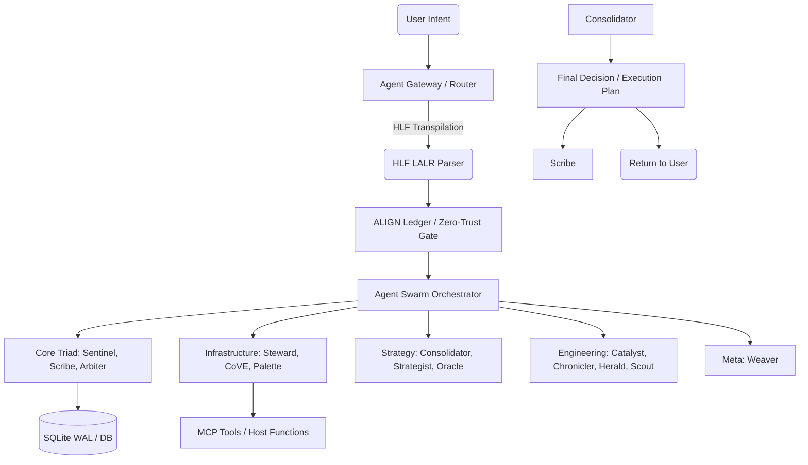
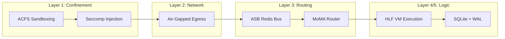

# The Sovereign Agentic OS: Unified Truth Document
> Version: 1.0 (Auto-Generated by Jules, Aegis-Nexus Review Agent)
> Date: 2026-03-10

This document serves as the single source of truth for the Sovereign Agentic OS ecosystem, detailing the 14-Hat system, 19 Named Personas, OS orchestration layers, external tool integrations, divergences, and the User Experience perspective.

## 1. Core Architecture: The 14-Hat System (Aegis-Nexus CoVE v3.0)

The Hieroglyphic Logic Framework (HLF) orchestrates agents via the Aegis-Nexus system, mapping 14 distinct "Hats" to validation dimensions.

### 🔴 Red Hat — Fail-States & Chaos
*   **Focus**: Cascading failures, service crashes, database locking, single points of failure, race conditions.
*   **Trigger**: Code touches error handling, exception paths, database operations, service boundaries, retry logic, or shared state.

### ⚫ Black Hat — Security Exploits & Zero Trust (MANDATORY)
*   **Focus**: Prompt injection, ALIGN bypass, data exfiltration, privilege escalation, path traversal, credential exposure.
*   **Trigger**: ALWAYS on PRs. Code touches auth, user input, file I/O, network calls, config, or agent operations.

### ⚪ White Hat — Efficiency & Data Integrity
*   **Focus**: Token waste, gas budgets, unnecessary LLM calls, context sizes, DB bloat, memory leaks.
*   **Trigger**: Code touches LLM calls, database queries, loops, data processing, or memory-heavy operations.

### 🟡 Yellow Hat — Synergies & Strategic Value
*   **Focus**: Cross-component synergies, hidden powers, 10x improvements, reuse opportunities.
*   **Trigger**: Code adds new features or modifies existing components that could benefit from cross-component integration.

### 🟢 Green Hat — Evolution & Missing Mechanisms
*   **Focus**: Missing operational wiring, growth paths, emergent behaviors, evolution readiness.
*   **Trigger**: Code adds new capabilities, extends architecture, or modifies core systems.

### 🔵 Blue Hat — Process & Observability (MANDATORY)
*   **Focus**: Internal consistency, spec completeness, documentation accuracy, test coverage gaps.
*   **Trigger**: ALWAYS on PRs. Checks internal consistency.

### 🟣 Indigo Hat — Cross-Feature Architecture
*   **Focus**: Pipeline consolidation, redundant components, macro-level DRY violations, gate fusion.
*   **Trigger**: Code modifies multiple files or components, refactors, or adds integration points.

### 🩵 Cyan Hat — Innovation & AI/ML Validation
*   **Focus**: Forward-looking features, HLF extensions, technology validation, feasibility checks.
*   **Trigger**: Code introduces new patterns, experimental features, or technology choices.

### 🟪 Purple Hat — AI Safety & Compliance (MANDATORY)
*   **Focus**: OWASP LLM Top 10, ALIGN rule coverage, epistemic modifier abuse, PII leakage.
*   **Trigger**: ALWAYS on PRs. Code touches agent behavior, LLM prompts, epistemic modifiers, or data handling.

### 🟠 Orange Hat — DevOps & Infrastructure
*   **Focus**: CI/CD pipeline health, Docker configuration, Git hygiene, deployment gaps.
*   **Trigger**: Code touches CI/CD, Docker, deployment configs, scripts, or Git workflows.

### 🪨 Silver Hat — Context & Token Optimization
*   **Focus**: Token budgets, gas formula efficiency, context window utilization, prompt compression.
*   **Trigger**: Code touches prompt construction, context building, or token-sensitive operations.

### 💎 Azure Hat — MCP Workflow Integrity
*   **Focus**: Tool schema validation, workflow ledger completeness, HITL gates, tool hallucination prevention, state machine enforcement.
*   **Trigger**: Code touches MCP tool definitions, tool execution, workflow ledgers, or tool parameter schemas.

### ✨ Gold Hat — CoVE Terminal Authority (MANDATORY)
*   **Focus**: Final QA pass across all 12 dimensions.
*   **Trigger**: ALWAYS on PRs (runs last).

### 0️⃣ Context Budget Protocol
*   **Focus**: Token allocation & circuit breakers. Meta-routing (50 tokens), Code diff (2048 tokens).

---

## 2. The 19 Named Personas & Orchestration

The system categorizes 19 distinct agents mapping to these hats.

### Core Triad (Daemon Layer)
1.  **SENTINEL (⚫ Black)**: Security & Compliance Defense-in-Depth. Cross-Aware: CoVE, Palette, Consolidator.
2.  **SCRIBE (🪨 Silver)**: Memory & Token Auditor / ALS Merkle Logger. Cross-Aware: Consolidator, Sentinel, Arbiter, Catalyst.
3.  **ARBITER (🟪 Purple)**: Decision Adjudicator (ALLOW/ESCALATE/QUARANTINE). Cross-Aware: Sentinel, Scribe, Consolidator, Weaver.

### Infrastructure Personas
4.  **STEWARD (💎 Azure)**: MCP Workflow Integrity Engineer.
5.  **CoVE (✨ Gold)**: Final QA — 12-Dimension Adversarial Validation.
6.  **PALETTE (🟢 Green)**: UX & Accessibility Architecture (WCAG 2.2 AA). Cross-Aware: Sentinel, CoVE, Consolidator.

### Synthesis & Strategy
7.  **CONSOLIDATOR (🪨 Silver)**: Multi-Agent Round-Robin Synthesis (SUCE pattern). Cross-Aware: ALL personas.
8.  **STRATEGIST (🔵 Blue)**: Planning & Roadmap Prioritization. Cross-Aware: ALL.
9.  **ORACLE (🟡 Yellow)**: Predictive Scenario & Impact Modeling. Cross-Aware: ALL.

### Engineering Specialists
10. **CATALYST (🟠 Orange)**: Performance & Optimization (p50/p90/p99 latency). Cross-Aware: CoVE, Sentinel, Scribe, Consolidator.
11. **CHRONICLER (🪨 Silver)**: Technical Debt & Codebase Health Monitor. Cross-Aware: CoVE, Consolidator, Catalyst, Herald.
12. **HERALD (⚪ White)**: Documentation Integrity & Knowledge Translation. Cross-Aware: Palette, CoVE, Consolidator, Chronicler.
13. **SCOUT (⚪ White)**: Research & External Intelligence Gatherer. Cross-Aware: ALL.

### Meta-Level
14. **WEAVER (🩵 Cyan)**: Prompt Engineering & HLF Self-Improvement Meta-Agent. Cross-Aware: ALL.

*(Note: The remaining 5 personas are dynamic extensions within the Hat mapping, handling localized tasks like frontend reactive state or API contracts).*

### Orchestration Flow (Mindmap representation)

### Universal Mandates
All personas must adhere to the **Anti-Reductionism Protocol**: "Never simplify, reduce, weaken, or delete to make something work. The correct response to difficulty is UNDERSTANDING, not REMOVAL."

---

## 3. External Tool Integrations & MCP Design

### Unified Ecosystem Overview
External applications integrate via **HLF host functions** (`CALL_HOST` opcode) routed through `agents/core/host_function_dispatcher.py`, not as unmediated plugins.

*   **Project Janus**: RAG pipeline input (archival)
*   **SearXng_MCP**: Private search backend
*   **LOLLMS / MSTY / AnythingLLM**: Connected via local HTTP (default ports like 9600, 11434, 3001) exposing `generate`, `rag_query`, etc.
*   **ZAI API Integrations**: Web Search MCP, Web Reader MCP, Zread MCP, Vision MCP

### Divergence: The Discord MCP Conflict
**Conflict Identified**: Documentation and plans mention a "Discord MCP Integration", but current implementation utilizes a direct REST API client (`agents/core/discord_client.py`) rather than wrapping Discord via the Model Context Protocol (MCP).
**Why it matters**: Direct REST clients bypass the `Steward` (Azure Hat) MCP workflow integrity checks and standard HLF `mcp.call` routing.
**Proposed Solution**: Refactor `discord_client.py` into a formal MCP server (e.g., `discord-mcp-server`), launch it via `gui/tray_manager.py`, and register its tools (`discord.send_message`, `discord.create_channel`) so they flow through the standard `Steward` -> `Arbiter` -> `Scribe` audit trail.

---

## 4. Sovereign OS: Levels, Layers, and Workflows

### Flow Details
*   **Level 1 (ACFS & Security)**: Read-only binds, strict seccomp profiles, and namespace confinement for execution nodes.
*   **Level 2 (ASB & Router)**: The Agentic Service Bus handles HTTP/WS ingest, converts English to HLF, checks Redis token buckets (Gas Limits), and uses MoMA (Mixture of Model Agents) to route based on complexity (e.g., Qwen-VL for visual, Qwen-Max for symbolic).
*   **Level 3 (HLF VM & Database)**: Execution using SQLite in WAL mode with `PRAGMA busy_timeout=5000;` for concurrent multi-agent DB access.

---

## 5. Demo Page & Dashboard Assessment

### Current State
*   **Location**: `docs/index.html` and GitHub Pages demo.
*   **Features**: Displays the HLF Translation Pipeline, Live Commits, PRs, CI status, and Jules update cadence. Dual Ollama (failover/round-robin) architecture is visualized.
*   **Out of Date Elements**:
    1. The README recently suffered a corruption and needs restoring/updating with the Unified Ecosystem Integration note.
    2. The GUI representation in `docs/index.html` hardcodes certain UI elements that may drift from the actual Streamlit output (`gui/app.py`).

### User's Point of View (POV)
From a user's perspective, running Sovereign OS looks like this:
1.  **Ingest**: User types natural language: "Review the seccomp files for vulnerabilities."
2.  **Translate**: Gateway transpiles to HLF: `[INTENT] Analyze /security/seccomp.json [CONSTRAINTS] read-only ...`
3.  **Swarm**: Jules awakens. Sentinel grabs the file, CoVE structures the audit, Arbiter approves the security scan.
4.  **Observe**: The user watches the Streamlit GUI Cognitive SOC panel. They see tokens burning (Gas Dashboard), agents passing messages via Redis, and the ALIGN ledger verifying safety.
5.  **Output**: The Consolidator returns a compressed HLF payload, translated back into a rich English security report for the user.

---

## 6. Immediate Next Steps & Future Goals

1.  **Refactor Janus Integration**: Pull `Project_Janus` out of `sovereign_mcp_server.py` and into an isolated subprocess managed by `gui/tray_manager.py`.
2.  **Discord MCP Unification**: Wrap the existing Discord client into a formal MCP server for unified governance.
3.  **Complete RAG Pipeline**: Wire Janus, ChronosGraph, and BrowserOS_Guides into the SQLite/Vector hybrid RAG.
4.  **README Fix**: Restore the corrupted `README.md` and insert the new Planned roadmap text for Unified Ecosystems.
