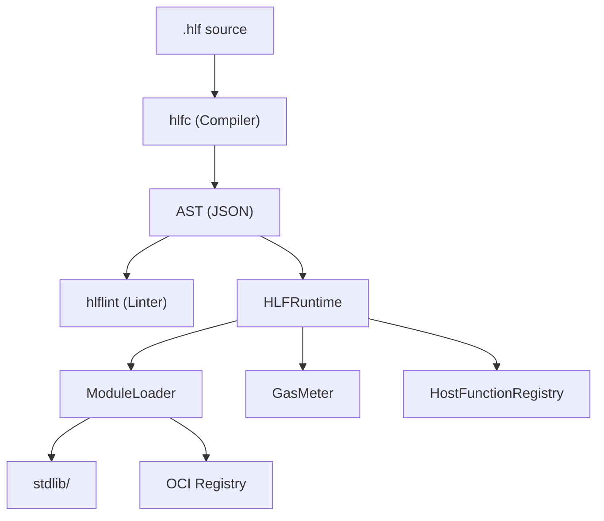

# HLF — Hieroglyphic Logic Framework

**Version 0.4.0** | [GitHub](https://github.com/Grumpified-OGGVCT/Sovereign_Agentic_OS_with_HLF)

HLF is a deterministic, human-legible instruction language designed for sovereign AI agent systems. It replaces unstructured natural-language prompts with a formally specified, machine-verifiable syntax featuring:

- **Deterministic parsing** via LALR(1) grammar
- **4-pass compilation**: Parse → Environment → Expansion → ALIGN Validation
- **Gas metering** for bounded execution
- **Module system** with OCI distribution
- **Unicode glyphs** for operational semantics

---

## Quick Start

```hlf
[HLF-v2]
[SET] greeting = "Hello"
[INTENT] greet "world"
[RESULT] 0 "success"
Ω
```

### Compile and Run

```bash
# Compile to AST
python -m hlf.hlfc program.hlf

# Lint for style issues
python -m hlf.hlflint program.hlf

# Run in the interactive REPL
python -m hlf.hlfsh

# Format code
python -m hlf.hlffmt program.hlf
```

---

## Architecture Overview



---

## Project Status

| Component | Status | Tests |
|-----------|--------|-------|
| Compiler (`hlfc`) | ✅ Production | 50+ |
| Linter (`hlflint`) | ✅ Production | 30+ |
| Runtime (`HLFRuntime`) | ✅ Production | 80+ |
| REPL (`hlfsh`) | ✅ Production | 27 |
| LSP (`hlflsp`) | ✅ Production | 29 |
| Package Manager (`hlfpm`) | ✅ Production | 27 |
| Test Harness (`hlftest`) | ✅ Production | 23 |
| Bytecode VM | ✅ Production | 40+ |
| **Total Test Suite** | **1,406 passing** | **0 failures** |

---

## Navigation

- [Language Reference](language-reference.md) — Tags, glyphs, grammar, and semantics
- [Standard Library](stdlib.md) — Built-in modules (math, string, io, crypto, collections)
- [CLI Tools](cli-tools.md) — Compiler, linter, formatter, REPL, package manager, test harness
